# AI Growth Engine: Employee Sales & Marketing Automation
## Application Blueprint: PART 2 (Batch 2.3), Business Rules Catalogue, Roles and Permissions (RBAC/ABAC), State Machines

| Field | Value |
|---|---|
| Document | Part 2, Batch 3 of 5 |
| Version | 1.0 · 27 Nov 2026 |
| Baseline | BRD, FRD, Parts 0, 0A (DEC-001…065), 1, 2.1, 2.2 |
| Roles applied | BSA (lead), Security & Compliance, Data Architect, Principal Engineer, QA Lead |

**Enforcement locations used below:** **PDP** = Policy Decision Point (deterministic service called at plan time and at dispatch, RECOMMENDATION-012) · **SVC** = domain service/model validation inside a DB transaction · **DB** = database constraint, RLS or trigger · **UI** = client-side guidance only (never sufficient alone) · **WRK** = worker/adapter at execution.

**Configurability:** **Fixed** = cannot be changed by tenants (legal or safety invariant). **Policy** = versioned, tenant/startup-configurable through CA-CONFIG. Tightening is self-service; loosening needs founder approval (DEC-038).

---

## 2.25 Business rules catalogue (BRL)

Each rule gives: ID · rule · condition → action · exceptions · source · enforced in · configurability. Rules are the primary input for decision-table and boundary tests in Part 6.

### 2.25.1 BRL-TEN: Tenancy, scope and identity

| ID | Rule | Condition → action | Exceptions | Source | Enforced | Config |
|---|---|---|---|---|---|---|
| BRL-TEN-01 | Scope comes from membership | Every request: derive product, tenant, startup and role from the authenticated membership. Ignore browser-supplied IDs except as a *requested* scope, then validate | None | BRD §2 | SVC, PDP | Fixed |
| BRL-TEN-02 | Product audience | Token audience ≠ `growth-engine`, or client ≠ the surface's client → 401 | None | BRD §1–2; DEC-058 | SVC | Fixed |
| BRL-TEN-03 | Tenant isolation | Every operational row carries `tenant_id` and `startup_id` (composite FK). RLS denies rows outside the session scope; cross-tenant joins prohibited | Platform metadata tables with explicit alternative scope (FRD §5) | FRD §5; B-TENANT | DB, SVC | Fixed |
| BRL-TEN-04 | Unauthorized object | Object exists but outside scope → **uniform 404** (or 403 where enumeration is harmless); never reveal existence | None | FRD §5 | SVC | Fixed |
| BRL-TEN-05 | Portfolio read-only | Scope spans more than one startup → GET only; any mutation → 409 `SELECT_SINGLE_STARTUP` | None | BRD §1; DEC-055 | SVC, UI | Fixed |
| BRL-TEN-06 | Cross-tenant aggregation prohibited | No query, export, dashboard or AI context may combine tenants | Platform billing metadata (non-confidential counts) | DEC-065 | SVC, DB | Fixed |
| BRL-TEN-07 | Membership expiry | Membership past expiry → access denied at next request; sessions revoked within 60 s | None | FRD §16.2 A002 | SVC | Policy (expiry dates) |
| BRL-TEN-08 | MFA for privileged roles | Roles R01, R02, R08–R12 and any approver role require MFA (TOTP minimum, WebAuthn recommended) for session establishment and step-up for approvals | Break-glass account with dual control | FRD OPT-01-01; DEC-019 | SVC | Fixed (method Policy) |
| BRL-TEN-09 | Support access | Platform support sees tenant content only with an approved SupportAccessGrant: scope, read-only default, ≤ 72 h, audited, visible to the tenant | Security incident under documented emergency procedure (post-hoc notice ≤ 24 h) | BRD §1; DEC-056 | SVC | Policy (≤ 72 h cap fixed) |
| BRL-TEN-10 | Domain mapping | A verified custom domain maps to exactly one tenant/startup; unverified or unknown host → 404 | Platform default subdomain | BRD §9 | SVC | Fixed |
| BRL-TEN-11 | Template-based startup creation | New standard startups are created only from an approved template and capability profile; no code change | Custom integrations go through change request | BRD §1.1, §17.1 | SVC | Policy |
| BRL-TEN-12 | No fundraising capability | No entity, route, filter or role related to investors/fundraising may exist | None | BRD §1; DEC-002 | Build check (CI) | Fixed |

### 2.25.2 BRL-ELG: Eligibility, consent, suppression, jurisdiction, caps

> **Erratum v1.2 (E-V-17):** superseded by promotional window 09:00–21:00 recipient local time unless a stricter rule pack applies (DEC-777). See Part 11.23c.

| ID | Rule | Condition → action | Exceptions | Source | Enforced | Config |
|---|---|---|---|---|---|---|
| BRL-ELG-01 | Fail closed | Eligibility Unknown → **no send**; task created with reason | None | M24 | PDP | Fixed |
| BRL-ELG-02 | Opt-out absolute | Suppression in scope (channel × purpose × startup, or global) → block all scoped sends; cancel queued and scheduled items immediately | Legally required transactional notices (e.g. invoice, contract notice) if lawful and flagged *transactional* | M04 | PDP, WRK | Fixed |
| BRL-ELG-03 | Verified ≠ consent | Verified contact channel does not grant permission; lawful basis must be separately recorded | None | M19 | PDP | Fixed |
| BRL-ELG-04 | Score ≠ permission | Opportunity score never influences eligibility | None | BRD §4; M17 | PDP | Fixed |
| BRL-ELG-05 | Jurisdiction rule pack | Recipient jurisdiction resolved (organization/contact country). Apply pack: India, EU/EEA/UK, US, UAE/SG/AU per DEC-029. Unknown or non-listed jurisdiction → outbound denied | Inbound replies within an existing conversation | DEC-029 | PDP | Policy (packs versioned; adding a jurisdiction requires Legal approval) |
| BRL-ELG-06 | EU/UK cold email | Allowed only to role-based or professionally published business addresses, with a recorded legitimate-interest assessment and one-click opt-out; no WhatsApp/SMS cold outreach | Opt-in contacts | DEC-029 | PDP | Fixed |
| BRL-ELG-07 | WhatsApp opt-in and window | Business-initiated WhatsApp requires recorded opt-in and an approved template. Free-form messages only within the provider's customer-service window (verify current Meta rules) | None | M31 | PDP, WRK | Fixed |
| BRL-ELG-08 | Quiet hours | No outbound messages in recipient local time outside the policy window (default 09:00–19:00, Monday–Saturday; India public holidays configurable); deferred to the next window | Transactional notices; meeting reminders ≤ 2 h before a meeting the recipient booked | M28; FRD §16.2 A039 | PDP | Policy |
| BRL-ELG-09 | Frequency caps | Per recipient across **all** workflows: default max 2 marketing touches per 7 days and 6 per 30 days per channel; max 1 first-touch per organization per 7 days per startup | Replies to the recipient's own inbound message | A039, A111 | PDP | Policy (tighten free; loosen with approval) |
| BRL-ELG-10 | Reply halts generic sequence | Any substantive inbound reply → cancel pending generic sequence steps for that relationship | Explicit "continue" decision by owner | BRD §5 WF-06; M28 | WRK | Fixed |
| BRL-ELG-11 | Complaint containment | Complaint received → suppress the complainant; open a compliance incident. If the campaign complaint rate exceeds threshold (default 0.1% or 3 complaints/24 h) → pause campaign | None | M57 | PDP, WRK | Policy (threshold) |
| BRL-ELG-12 | Bounce handling | Hard bounce → suppress channel address; soft bounce ×3 in 7 days → suppress 30 days | None | M26 | WRK | Policy |
| BRL-ELG-13 | No minors outreach | Contact with age band < 18 or school-learner flag → outbound to the learner blocked; only guardian/institution channels with verified consent | None | BRD §5; DEC-030 | PDP | Fixed |
| BRL-ELG-14 | Health-data exclusion | Messages, audiences and ad events must not use health conditions or patient attributes | None | M37, M50 | PDP, SVC | Fixed |
| BRL-ELG-15 | Rejected leads never contacted | Opportunity rejected in review → excluded from every channel | Re-qualification by review with new evidence | M20 | PDP | Fixed |
| BRL-ELG-16 | Post-loss re-contact | Lost deal → no re-contact unless the lost-deal policy allows and ≥ the cooling period (default 90 days) | Customer-initiated contact | M51 | PDP | Policy |
| BRL-ELG-17 | Referral third parties | Referred person cannot be enrolled in outreach until their own consent or lawful basis is recorded | None | M42 | PDP | Fixed |
| BRL-ELG-18 | Recheck at dispatch | Every eligibility rule is re-evaluated at execution; plan-time result is not trusted | None | BRD §1.2 | PDP, WRK | Fixed |

### 2.25.3 BRL-SRC: Sources, evidence and provenance

| ID | Rule | Condition → action | Exceptions | Source | Enforced | Config |
|---|---|---|---|---|---|---|
| BRL-SRC-01 | Approved sources only | Fetch only from Source records with active permission, purpose and licence; unapproved URL/host → blocked and logged | None | M07 | WRK | Fixed |
| BRL-SRC-02 | Expiry stops collection | Permission expired → stop scheduled collection; existing evidence marked "source expired" | None | M07 | WRK | Fixed |
| BRL-SRC-03 | Provenance mandatory | Evidence must store URL, retrieved date, published/observed date, licence/permission revision, content hash, confidence; missing rights → quarantine | None | OPT-11-01 | SVC | Fixed |
| BRL-SRC-04 | No private scraping | No login-walled, private group or personal-profile collection; robots and terms respected | Licensed API data within its licence | M18, M31, M33 | WRK | Fixed |
| BRL-SRC-05 | No guessed contacts | Email patterns may not be inferred or generated | None | M18 | SVC | Fixed |
| BRL-SRC-06 | Freshness | Evidence older than the freshness SLA (default 90 days; tenders 7 days) → "stale"; derived scores recomputed or flagged | None | A017 | WRK | Policy |
| BRL-SRC-07 | Untrusted content | Page text is data, never instructions; extraction prompts isolate it; instruction-like text is flagged | None | M12 | SVC (AI) | Fixed |
| BRL-SRC-08 | Organization merge safety | Merge only when domain + (location or legal ID) match, or a reviewer approves; merges are reversible within 30 days | None | M13 | SVC | Policy |
| BRL-SRC-09 | Search budget bounds | Research run stops when its reserved search/extraction budget is consumed; result marked partial | None | OPT-04-01 | WRK | Policy |
| BRL-SRC-10 | Comparative claims | Competitor information is internal only; never published as a comparative claim without approved evidence | None | M59 | SVC | Fixed |

### 2.25.4 BRL-SCR: Scoring and qualification

| ID | Rule | Condition → action | Exceptions | Source | Enforced | Config |
|---|---|---|---|---|---|---|
| BRL-SCR-01 | Score formula | score = round(100 × Σ wᵢcᵢ / Σ w_known); weights fit .25, evidence .25, intent .20, readiness .15, timing .15 | Weights changeable via approved scoring version (sum must equal 1.00) | BRD §4; DEC-011 | SVC | Policy (versioned) |
| BRL-SCR-02 | Unknown score | Known weight < 0.60 → "Unknown – review required"; no band | None | DEC-011 | SVC | Fixed |
| BRL-SCR-03 | Bands | ≥ 75 priority review; 50–74 research/nurture; < 50 archive/review | Thresholds per approved version | BRD §4 | SVC | Policy |
| BRL-SCR-04 | Readiness gate | Only offerings in *Approved and Available* state can contribute fit; others excluded with reason | None | M16, M66 | SVC | Fixed |
| BRL-SCR-05 | Inference labelling | Needs/signals derived by inference carry `inferred` and cannot be set to `confirmed` without evidence and reviewer | None | M15 | SVC | Fixed |
| BRL-SCR-06 | Qualified definition | Qualified = verified need + approved offering fit + eligible contact + accountable owner; de-duplicated per organization × offering × startup | None | BRD §12.1, §13.1 | SVC | Fixed |
| BRL-SCR-07 | Autonomy gate for qualification | Precision on benchmark < 90% → qualification remains L1 (human accept each); ≥ 90% with ≥ 200 labelled items → L2 allowed | Signal classification exit gate at 80% (Wave 1) | DEC-001 | PDP | Fixed thresholds |
| BRL-SCR-08 | Recalculation | Score recalculated on new evidence, evidence expiry, offering change or scoring version change; history retained | None | M17 | WRK | Fixed |
| BRL-SCR-09 | Override | Manual priority override requires a reason and is audited; never changes eligibility | None | A019 | SVC | Fixed |

### 2.25.5 BRL-AI: AI use

| ID | Rule | Condition → action | Exceptions | Source | Enforced | Config |
|---|---|---|---|---|---|---|
| BRL-AI-01 | Gateway only | All model calls go through the gateway with scope, purpose, prompt version, cost reservation | None | M08; FR-OP001 | SVC | Fixed |
| BRL-AI-02 | Schema validation | Outputs validated against JSON schema; invalid → repair retry ≤ 2, then Tier 3 | None | M08 | SVC | Policy (retries) |
| BRL-AI-03 | Grounding | Factual claims must cite approved knowledge or evidence IDs; uncited claims removed or blocked | None | M03, M25 | SVC | Fixed |
| BRL-AI-04 | Abstain | Confidence below task threshold or no evidence → abstain and route to human | None | FRD §12.2 | SVC | Policy (thresholds) |
| BRL-AI-05 | Prohibited content | No invented relationships, diagnoses, medical advice, guarantees, binding commitments, competitor disparagement | None | M25, M32 | SVC (guardrail) | Fixed |
| BRL-AI-06 | Data classification routing | Restricted data → Anthropic primary only (with contractual protections); never Tier 2 free models; redaction before any Tier 2 call of Internal data | Tier 2 entirely disabled per tenant by default | DEC-007 | SVC | Fixed (tenant opt-in for Tier 2) |
| BRL-AI-07 | No AI consequential action | AI cannot approve, sign, submit, pay, change price/terms or alter permissions | None | BRD §5; DEC-064 | PDP | Fixed |
| BRL-AI-08 | Budget | Call denied if agent, tenant or global budget would be exceeded; 80% alert, 100% hard stop | Founder emergency top-up (audited) | M53; DEC-008 | SVC | Policy |
| BRL-AI-09 | Evaluation gate | Prompt/model change deploys only when regression suite passes thresholds | None | M54 | CI | Fixed |
| BRL-AI-10 | Logging | Inputs/outputs logged redacted, 90-day retention, linked to correlation ID | None | DEC-028 | SVC | Fixed |
| BRL-AI-11 | Public assistant scope | Website assistant answers only from approved public knowledge; clinical, legal, pricing-negotiation and complaint topics → human handover | None | M32 | SVC | Fixed |
| BRL-AI-12 | Copilot scope | Copilot reads only what the user can read; drafts only | None | DEC-035 | SVC | Fixed |

### 2.25.6 BRL-APR: Approvals and separation of duties

| ID | Rule | Condition → action | Exceptions | Source | Enforced | Config |
|---|---|---|---|---|---|---|
| BRL-APR-01 | Author ≠ approver | The creator of a version cannot approve it | None | FRD §16.2 A051, A108 | SVC | Fixed |
| BRL-APR-02 | Hash-bound approval | Approval references the exact content/price/terms/plan hash; any change voids it | None | BRD §5; FRD §8.1 | SVC | Fixed |
| BRL-APR-03 | Approval expiry | Approvals expire (defaults: content 90 days, quotes = validity, campaign = end date, plan = 30 days) | None | FRD §16.2 | SVC | Policy |
| BRL-APR-04 | Discount thresholds | 0 < d ≤ 10% → Sales Manager (R03-lead or R02); 10 < d ≤ 20% → Startup Head; d > 20% or margin < floor (default 25%) → Founder + Finance | None | DEC-038 | PDP | Policy |
| BRL-APR-05 | Legal terms | Any non-standard term or template deviation → Legal approval | None | DEC-038 | PDP | Fixed |
| BRL-APR-06 | High-value / cross-border | Contract value ≥ ₹10 lakh (or equivalent) or cross-border → Founder + Legal | None | DEC-038 | PDP | Policy (threshold) |
| BRL-APR-07 | Finance maker-checker | Payment verification and invoice approval require two different Finance users | None | BRD §2; DEC-038 | SVC | Fixed |
| BRL-APR-08 | Rejection reason | Rejections and overrides require a reason code + text | None | A051, A066 | SVC | Fixed |
| BRL-APR-09 | Delegation | Approvers may delegate for ≤ 14 days to a user with an equal or higher role in the same scope; audited | None | [RECOMMENDATION-020] | SVC | Policy |
| BRL-APR-10 | Approval SLA and escalation | Pending approvals escalate after SLA (default 1 business day) to the next approver level; never auto-approve | None | A106 | WRK | Policy |
| BRL-APR-11 | Self-approval prohibited for loosening | Policy loosening (e.g. higher caps) needs Founder approval; tightening is immediate | None | DEC-038 | PDP | Fixed |

### 2.25.7 BRL-SEQ: Sequences and follow-up

| ID | Rule | Condition → action | Exceptions | Source | Enforced | Config |
|---|---|---|---|---|---|---|
| BRL-SEQ-01 | Eligible enrolment only | Enrol only contacts passing PDP; re-check before each step | None | M28 | PDP | Fixed |
| BRL-SEQ-02 | Stop conditions | Stop on: reply, opt-out, complaint, bounce, meeting booked, stage change to Won/Lost, manual stop, max attempts | None | M28; A039 | WRK | Fixed (list); Policy (max attempts default 3) |
| BRL-SEQ-03 | Single active generic sequence | One active generic sequence per relationship per startup; conflicts go to A111 | Transactional sequences (onboarding) | A111 | SVC | Fixed |
| BRL-SEQ-04 | Pinned revision | A running enrolment keeps its sequence revision; edits apply to new enrolments only | Emergency stop | A112 | SVC | Fixed |
| BRL-SEQ-05 | Interval minimum | Minimum 2 business days between touches on the same channel | Recipient-requested follow-up time | A039 | PDP | Policy |

### 2.25.8 BRL-MTG: Meetings

| ID | Rule | Condition → action | Source | Enforced | Config |
|---|---|---|---|---|---|
| BRL-MTG-01 | Only verified free slots offered (from calendar provider free/busy); never invented availability | M29 | WRK | Fixed |
| BRL-MTG-02 | Slot hold for 15 minutes during booking; conflict on confirm → re-offer | M29 | SVC | Policy |
| BRL-MTG-03 | Times stored UTC; displayed in both parties' timezones | FRD §2 | SVC | Fixed |
| BRL-MTG-04 | Buffer between meetings (default 15 min) and work-hours window per calendar | A041 | SVC | Policy |
| BRL-MTG-05 | "Held" requires owner confirmation or provider attendance evidence; booked ≠ held | KPI-06 | SVC | Fixed |
| BRL-MTG-06 | Reminders 24 h and 1 h before (eligible channels only); stop on cancellation | A063 | WRK | Policy |

### 2.25.9 BRL-MKT: Marketing, claims and spend

| ID | Rule | Condition → action | Source | Enforced | Config |
|---|---|---|---|---|---|
| BRL-MKT-01 | Content may use only approved, unexpired claims; unsupported claim → cannot be approved or published | M34 | SVC | Fixed |
| BRL-MKT-02 | Planned/unavailable offerings cannot appear in content, ads, pages or outreach | M66, M02 | SVC | Fixed |
| BRL-MKT-03 | Management claims (e.g. traction figures) require evidence and the "management claim" label unless independently verified | BRD §8 | SVC | Fixed |
| BRL-MKT-04 | Campaign launch requires approved campaign hash + approved budget reservation + suppression applied at execution | M38 | PDP | Fixed |
| BRL-MKT-05 | Ad spend: daily and monthly caps; at 100% → pause via provider; anomaly (> 150% of expected daily) → pause + alert | M39 | WRK | Policy |
| BRL-MKT-06 | No health events, minors' data or sensitive attributes to ad platforms or pixels; first-party analytics only for health-related pages | M37 | SVC | Fixed |
| BRL-MKT-07 | Social: no automated DMs; publishing only to authorized owned accounts | M35 | WRK | Fixed |
| BRL-MKT-08 | SEO metrics only from authorized sources; never fabricated or edited | M36 | SVC | Fixed |
| BRL-MKT-09 | Testimonials/case studies require documented consent of the subject | W09 | SVC | Fixed |
| BRL-MKT-10 | Experiments use approved cohorts/holdouts; stop if opt-out or complaint rate degrades beyond baseline + 50% | OPT-12-04 | WRK | Policy |

### 2.25.10 BRL-BID: Bids and tenders

| ID | Rule | Source | Enforced | Config |
|---|---|---|---|---|
| BRL-BID-01 | Deadline stored in UTC with the portal's timezone; submission blocked at or after (deadline − buffer); default buffer 24 h | FRD §12.1; DEC-053 | SVC | Policy (buffer ≥ 2 h) |
| BRL-BID-02 | Mandatory eligibility checklist (capability, certifications, financial criteria, geography, documents) must all pass or have an approved waiver before "Bid" decision | BRD §11 | SVC | Policy (checklist template) |
| BRL-BID-03 | Bid/no-bid decision by Startup Head; submission approval by Startup Head after proposal/quote approvals | DEC-038 | PDP | Fixed |
| BRL-BID-04 | Submission is performed by a human outside the system; the system records evidence (portal reference, timestamp, receipt hash) | DEC-053 | SVC | Fixed |
| BRL-BID-05 | "Awarded" requires award proof (document/portal notice) attached and verified | BRD §5 | SVC | Fixed |
| BRL-BID-06 | Owned-portfolio routing: external AI/software project bids belong to AppNAI; other startups need the capability grant | DEC-052 | SVC | Policy |

### 2.25.11 BRL-QTE: Quotes and pricing

| ID | Rule | Source | Enforced | Config |
|---|---|---|---|---|
| BRL-QTE-01 | Unit prices come from the approved price version snapshot; manual price → treated as a discount/exception | M44 | SVC | Fixed |
| BRL-QTE-02 | Line total = ROUND_HALF_UP(qty × unit price × (1 − discount%), 2); document total = Σ rounded lines + tax lines | DEC-027; FR-DM-01 | SVC | Fixed |
| BRL-QTE-03 | Tax: intra-state CGST+SGST, inter-state IGST, export zero-rated with LUT, per HSN/SAC and TaxProfile (verify rates) | DEC-027 | SVC | Policy (rates) |
| BRL-QTE-04 | Currency per quote; no mixing; FX not applied to quote totals | DEC-027 | SVC | Fixed |
| BRL-QTE-05 | Validity: default 30 days; expired quote cannot be accepted | A067 | SVC | Policy |
| BRL-QTE-06 | Any change after approval creates a new revision and voids approvals | BRL-APR-02 | SVC | Fixed |
| BRL-QTE-07 | Quantity/unit validation per SKU (allowed units, min/max order) | A105 | SVC | Policy |

### 2.25.12 BRL-CTR: Contracts

> **Erratum v1.2 (E-V-02):** superseded by payments and bid submission allowed only under a bounded mandate; AI still never signs contracts or sets prices autonomously (DEC-779/780/781). See Part 11.23c.

| ID | Rule | Source | Enforced | Config |
|---|---|---|---|---|
| BRL-CTR-01 | Contracts are generated only from approved templates; deviations flagged for Legal | M46 | SVC | Fixed |
| BRL-CTR-02 | Signed version SHA-256 hash stored; must equal the legally approved hash | M46 | SVC | Fixed |
| BRL-CTR-03 | Signer authority recorded for both parties; portal token alone is not authorization | W24 | SVC | Fixed |
| BRL-CTR-04 | AI never signs; e-sign requests are dispatched only after legal approval | M46; DEC-023 | PDP | Fixed |
| BRL-CTR-05 | Contract dates drive renewal notice (default 60 days before expiry) | A080 | WRK | Policy |

### 2.25.13 BRL-ORD: Orders and fulfilment

| ID | Rule | Source | Enforced | Config |
|---|---|---|---|---|
| BRL-ORD-01 | Order has direction (Sell/Buy) and lines (SKU/service, unit, quantity, price revision) | BRD §5 | SVC | Fixed |
| BRL-ORD-02 | Cumulative fulfilled quantity ≤ ordered quantity per line; excess rejected (no automatic over-delivery tolerance unless policy sets ≤ 2%) | FR-DM-03 | SVC | Policy (tolerance) |
| BRL-ORD-03 | Fulfilment events idempotent by event key | FR-DM-03 | DB | Fixed |
| BRL-ORD-04 | Sell orders reserve available quantity on approval; release on cancel/expiry | DEC-045 | SVC | Fixed |
| BRL-ORD-05 | Acceptance by counterparty (or deemed acceptance after policy period, default 7 days) creates receivable/payable | BRD §5 | WRK | Policy |
| BRL-ORD-06 | Receivables and payables are separate ledgers; never netted automatically | BRD §11 | SVC | Fixed |

### 2.25.14 BRL-FIN: Payments, ledgers, closure

| ID | Rule | Source | Enforced | Config |
|---|---|---|---|---|
| BRL-FIN-01 | Closure policy per opportunity type: contract types → Won-Contracted on verified signed contract; order types → Paid on verified payment or accepted delivery per terms | DEC-054 | SVC | Policy (type mapping) |
| BRL-FIN-02 | Payment events deduplicated by (provider account, payment ID); replay → no effect | M47 | DB | Fixed |
| BRL-FIN-03 | Verification checks amount, currency, payer legal entity, invoice reference; mismatch → discrepancy case | M47 | SVC | Fixed |
| BRL-FIN-04 | Partial payments allocated; deal "Paid" only when allocations = invoice total | AP-04 | SVC | Fixed |
| BRL-FIN-05 | Ledgers append-only; corrections via reversing entries with reason | FRD §5 | DB | Fixed |
| BRL-FIN-06 | Revenue reports use verified ledger entries only; forecasts never mixed | M52, M60 | SVC | Fixed |
| BRL-FIN-07 | No storage of card data or bank credentials; payment instructions show verified, expiring details only | W26; DEC-022 | SVC | Fixed |
| BRL-FIN-08 | Commercial receipts exclude SaaS fees and procurement payments | BRD §13.1 | SVC | Fixed |

### 2.25.15 BRL-LCY: Lifecycle, onboarding and renewal

| ID | Rule | Source | Enforced | Config |
|---|---|---|---|---|
| BRL-LCY-01 | Onboarding template chosen by offering; mandatory tasks block handoff | M48 | SVC | Policy |
| BRL-LCY-02 | No patient/clinical data copied into onboarding or handoff records | M48 | SVC | Fixed |
| BRL-LCY-03 | Renewal risk scoring excludes medical/health attributes | M50 | SVC | Fixed |
| BRL-LCY-04 | Partner deployment and phygital/insurer pilots require readiness approval before any deployment claim | M49, M63, M65 | PDP | Fixed |
| BRL-LCY-05 | Insurance pilots organization-level only; no individual profiling or underwriting | M63 | SVC | Fixed |
| BRL-LCY-06 | Licensing: only approved API capabilities may be offered or provisioned | M64 | PDP | Fixed |

### 2.25.16 BRL-PUB: Publication

| ID | Rule | Source | Enforced | Config |
|---|---|---|---|---|
| BRL-PUB-01 | Publish only an Approved revision whose hash matches the approval | FRD §8.1 | SVC | Fixed |
| BRL-PUB-02 | Publish/unpublish/rollback is an atomic pointer swap + tenant-keyed cache purge | BRD §9 | SVC | Fixed |
| BRL-PUB-03 | Previews require Admin auth + expiring grant (default 24 h) + `noindex` | BRD §9 | SVC | Policy |
| BRL-PUB-04 | Public assets separately approved and malware-scanned | BRD §9 | WRK | Fixed |
| BRL-PUB-05 | Portal content never included in public snapshots or CDN caches | BRD §9 | SVC | Fixed |
| BRL-PUB-06 | Accessibility check (automated WCAG 2.2 AA) must pass or carry an approved waiver | A057; RECOMMENDATION-001 | CI/SVC | Fixed |

### 2.25.17 BRL-AUT: Automation and autonomy

| ID | Rule | Source | Enforced | Config |
|---|---|---|---|---|
| BRL-AUT-01 | Autonomy caps (DEC-064): money movement unsupported; quotes, discounts, contracts, legal terms, bid submissions ≤ L1; publishing/campaigns L1 approval then L2 dispatch; routine replies from approved FAQ, eligible follow-ups, reminders up to L3 | DEC-064 | PDP | Fixed |
| BRL-AUT-02 | Workflows use only approved node types; no code nodes; no secrets in configuration | A113; DEC-051 | SVC | Fixed |
| BRL-AUT-03 | Running executions pin workflow revision; config changes apply to new runs | A112 | SVC | Fixed |
| BRL-AUT-04 | Simulation produces zero live effects; simulated records are flagged and excluded from KPIs | BRD §1.2 | SVC | Fixed |
| BRL-AUT-05 | Emergency stop (tenant, startup, workflow or channel scope) blocks new external calls within 60 s; resumption requires role + policy recheck | M55 | PDP | Fixed |
| BRL-AUT-06 | Runaway prevention: max steps per run (default 50), max retries per step (3), max concurrent runs per startup (default 20), max actions per relationship per day (default 3) | Part 7 | WRK | Policy |
| BRL-AUT-07 | Retry only for transient failures before submission; uncertain → reconcile first | FRD §11.1 | WRK | Fixed |
| BRL-AUT-08 | Webhook/trigger events verified (signature), scoped, and deduplicated within the dedup window; sandbox replay never causes live effects | A109 | SVC | Fixed |
| BRL-AUT-09 | Conflicting actions on the same relationship (e.g. two workflows messaging) are held and resolved by priority rules: compliance > transactional > sales > marketing | A111 | WRK | Policy (order fixed for compliance first) |
| BRL-AUT-10 | Missed scheduled runs recover once; further misses alert | OPT-04-01 | WRK | Fixed |

### 2.25.18 BRL-PRV: Privacy and retention

| ID | Rule | Source | Enforced | Config |
|---|---|---|---|---|
| BRL-PRV-01 | Identity verification proportionate to request before access/deletion | M56 | SVC | Fixed |
| BRL-PRV-02 | Legal deadline tracked (verify DPDP response timelines); escalation at 70% of deadline | M56 | WRK | Policy |
| BRL-PRV-03 | Deletion keeps minimal suppression hash so outreach is never re-enabled | M56 | SVC | Fixed |
| BRL-PRV-04 | Legal hold overrides deletion; data restricted, not deleted | DEC-028 | SVC | Fixed |
| BRL-PRV-05 | Retention schedule per data class (DEC-028) enforced by nightly purge job with audit | DEC-028 | WRK | Policy (with Legal approval) |
| BRL-PRV-06 | Data minimization at intake: only schema-allowed fields stored; free-text scanned for sensitive data (health, government IDs) and redacted | BRD §5 | SVC | Fixed |
| BRL-PRV-07 | Exports: classification-aware redaction, expiring links (default 72 h), approval for Restricted data | A103 | SVC | Policy |

### 2.25.19 BRL-SVC: SaaS service

| ID | Rule | Source | Enforced | Config |
|---|---|---|---|---|
| BRL-SVC-01 | No provisioning before verified administrator authority and platform approval | W32; FRD §16.3 | SVC | Fixed |
| BRL-SVC-02 | Applicant draft isolated, expiring (30 days), cannot mutate any active startup | FRD §16.3 | SVC | Fixed |
| BRL-SVC-03 | Entitlements enforced before metered actions; over quota → block (or approved overage) | OPT-20-02 | PDP | Policy |
| BRL-SVC-04 | Usage metering append-only; 100% reconciled to invoice lines | OPT-20-02 | SVC | Fixed |
| BRL-SVC-05 | Trial: no billable or external paid action beyond trial quota; expiry → read-only + export | AP-09 | PDP | Policy (trial length default 14 days) |
| BRL-SVC-06 | Suspension stops automation and sending; data retained per schedule; reactivation restores configuration | WF-14 | WRK | Fixed |
| BRL-SVC-07 | Credits/adjustments append-only with reason | BRD §6 | SVC | Fixed |

**Rule count:** TEN 12 · ELG 18 · SRC 10 · SCR 9 · AI 12 · APR 11 · SEQ 5 · MTG 6 · MKT 10 · BID 6 · QTE 7 · CTR 5 · ORD 6 · FIN 8 · LCY 6 · PUB 6 · AUT 10 · PRV 7 · SVC 7 = **162 business rules**.

[RECOMMENDATION-020] Approval delegation (BRL-APR-09) is added for continuity during leave. It is bounded and audited.

---

## 2.26 Roles and permissions

### 2.26.1 System roles

| Role | Name | Persona | Surface | Scope type | Notes |
|---|---|---|---|---|---|
| R01 | Founder / Portfolio Owner | P01 | Admin | Tenant (all startups); mutations per selected startup | Highest business approver |
| R02 | Startup Head | P02 | Admin | Assigned startup(s) | Bid/discount/proposal approver |
| R03 | Growth Manager | P03 | Admin | Assigned startup + team/accounts | Sub-role **R03L Sales Lead** approves discounts ≤ 10% |
| R04 | Research Analyst | P04 | Admin | Assigned startup | Discovery and review |
| R05 | Marketing Specialist | P05 | Admin | Assigned startup | Author only; sub-role **R05L Marketing Lead** approves content/campaigns |
| R06 | Bid Manager | P06 | Admin | AppNAI or capability-granted startups | Bid desk |
| R07 | Order Coordinator | P07 | Admin | OrganicSpec or capability-granted startups | Order desk |
| R08 | Finance Maker | P08 | Admin | Assigned startups | First verification |
| R09 | Finance Checker | P08 | Admin | Assigned startups | Second verification; cannot hold R08 on the same item |
| R10 | Legal / Compliance / DPO | P09 | Admin | Tenant (read), approvals per startup | Claims, legal, privacy, compliance |
| R11 | Automation Lead | P10 | Admin (Automation) | Tenant or assigned startups | Configure workflows; cannot loosen caps |
| R12 | Tenant Administrator | P11 | Admin (Automation) | Own tenant | Users, templates, plans; not a business approver |
| R13 | Platform Support | P12 | Admin (Ops) | Platform metadata; tenant content only via grant | Time-bound grants |
| R14 | Platform Billing | P12 | Admin (Ops) | Billing metadata all tenants | No business content |
| R15 | Auditor (read-only) | n/a | Admin | Tenant read-only, incl. audit | [RECOMMENDATION-021] For internal audit and legal review |
| R16 | External Customer / Supplier | P14 | Portal | Own records via object grants | Field-minimized |
| R17 | SaaS Client Applicant / Admin | P13 | Website → Admin of own tenant | Application draft; after provisioning becomes R12 of own tenant | |
| R18 | Anonymous Visitor | P15 | Public | Published snapshots; intake | Rate-limited |
| R19 | Service Identity | P16 | Internal | Per-service least privilege | No browser access |
| R20 | AI Agent Identity | P16 | Internal | Tool registry scopes per agent (Part 7) | Never holds approval permissions |

### 2.26.2 Permission legend

**V** view · **C** create/draft · **E** edit own drafts · **A** approve (per thresholds) · **X** execute/dispatch an external action (subject to PDP) · **S** configure/settings · **—** no access · *(own)* only own records · *(assigned)* only assigned accounts/teams · *(grant)* only via time-bound grant · *(meta)* metadata only.

### 2.26.3 RBAC matrix by screen group

| Screen group | Screens | R01 | R02 | R03 | R04 | R05 | R06 | R07 | R08 | R09 | R10 | R11 | R12 | R13 | R14 | R15 |
|---|---|---|---|---|---|---|---|---|---|---|---|---|---|---|---|---|
| Identity and users | A001–A003 | V | V | V | V | V | V | V | V | V | V | V | V S | V(meta) | V(meta) | V |
| User and role admin | A002 | V | V(startup) | — | — | — | — | — | — | — | V | — | V C E S | — | — | V |
| Tenancy and templates | A099, A100, A112 | V A | V | — | — | — | — | — | — | — | V | V | V C E S | V(meta) | V(meta) | V |
| Offering catalogue | A004, A005, A097 | V A | V C E A | V | V | V | V | V | V | V | V A(claims) | V | V | — | — | V |
| Knowledge documents | A006 | V A | V C E A | V | V C | V C | V C | V C | V | V | V A | — | — | — | — | V |
| Launch approval | A098 | V A | V C | — | — | — | — | — | V | V | V A | — | — | — | — | V |
| Consent and policies | A007 | V A | V | V | V | V | V | V | — | — | V C E A S | V | — | — | — | V |
| Integrations | A008, A036, A041, A044, A053 | V A | V | V | V | V | V | V | — | — | V | V C E S | V S | V(meta) | — | V |
| Audit and jobs | A009 | V | V | — | — | — | — | — | — | — | V | V X(retry) | V | V(meta) | — | V |
| Sources | A010, A049, A086 | V A | V | V | V C E | V | V | V | — | — | V A | V | — | — | — | V |
| AI config and quality | A011, A084 | V A | V | — | V | — | — | — | — | — | V | V C E S | — | V(meta) | — | V |
| Costs and budgets | A012 | V A S | V | — | — | — | — | — | V | V | — | V S(tighten) | V | — | V(meta) | V |
| Privacy queue | A013 | V | — | — | — | — | — | — | — | — | V C E A X | — | — | — | — | V |
| Health and incidents | A014, A090 | V A | V | — | — | — | — | — | — | — | V | V E | V | V E(meta) | — | V |
| Discovery and research | A015–A021, A023, A048, A085 | V | V A | V | V C E X | V | V(AppNAI) | V | — | — | V | V | — | — | — | V |
| Qualification and contacts | A022, A024–A028 | V | V A | V | V C E A | — | V | V | — | — | V | — | — | — | — | V |
| CRM and Customer 360 | A029–A032 | V | V C E A | V C E(assigned) | V | V | V C E | V C E | V | V | V | — | — | — | — | V |
| Workflows and automation | A033, A102, A109–A111, A113 | V A X(stop) | V A X(stop) | V | — | — | — | — | — | — | V X(stop) | V C E S X(stop) | V | V(meta) | — | V |
| Outreach and inbox | A034, A035, A037, A045 | V | V A | V C E X(assigned) | — | V | V C E X | V C E X | — | — | V | — | — | — | — | V |
| Sequences and policies | A038, A039, A063, A080 | V | V A | V C E X | — | V C | V C | V C | — | — | V S | V S | — | — | — | V |
| Meetings | A040 | V | V | V C E X(own) | — | — | V C E X | V C E X | — | — | — | — | — | — | — | V |
| Dashboards | A042, A043, A082, A087, A089 | V A | V | V(own team) | V(limited) | V(limited) | V | V | V | V | V | V | — | — | — | V |
| Omnichannel and chat | A046 | V | V A | V | — | V | — | — | — | — | V A | V S | — | — | — | V |
| Compliance incidents | A047 | V | V | — | — | — | — | — | — | — | V C E A X | V | — | — | — | V |
| Content and social | A050–A053 | V A | V A | V | — | V C E | — | — | — | — | V A(claims) | — | — | — | — | V |
| SEO | A054, A055 | V | V | — | — | V C E | — | — | — | — | — | — | — | — | — | V |
| Landing pages and website | A056, A057, A107, A108 | V A | V A | — | — | V C E | — | — | — | — | V A(privacy) | — | V S(domain) | — | — | V |
| Campaigns and ads | A058–A061 | V A | V A | V | — | V C E | — | — | V(spend) | — | V | — | — | — | — | V |
| Events and referrals | A062, A064 | V | V A | V C | — | V C E | — | — | — | — | V | — | — | — | — | V |
| Proposals and quotes | A065–A068 | V A | V C E A | V C E A(≤10% if R03L) | — | — | V C E | V C E | V A(margin) | — | V | — | — | — | — | V |
| Negotiation | A069, A070 | V A | V A | V C E | — | — | V C E | V C E | V | — | V A | — | — | — | — | V |
| Contracts | A071, A072 | V A | V C E | V C | — | — | V C | V C | V | — | V A X(e-sign request) | — | — | — | — | V |
| Payments and closure | A073, A074 | V | V | V(assigned) | — | — | V | V | V C E A(maker) | V A(checker) | — | — | — | — | — | V |
| Onboarding and renewal | A075–A081 | V | V A | V C E X | — | — | V C E | V C E | V | — | — | — | — | — | — | V |
| Revenue settings | A083, A088 | V A | V | — | — | — | — | — | V C E S | V A | — | — | — | — | — | V |
| Expansion pilots | A091–A096 | V A | V C E | V | — | — | — | — | V | — | V A | — | — | — | — | V |
| Subscriptions and billing | A101 | V A | — | — | — | — | — | — | V | V | — | — | V | — | V C E S | V |
| Import/export | A103 | V A | V C | V C(import own) | V C | — | — | — | V C | — | V A(Restricted) | — | V C | — | — | V |
| Bid desk | A104 | V A | V A | V | V | — | V C E X(record) | — | V | — | V A(legal) | — | — | — | — | V |
| Order desk | A105 | V A | V A | V | — | — | — | V C E X | V | V | — | — | — | — | — | V |
| Action centre | A106 | V(own) | V(own) | V(own) | V(own) | V(own) | V(own) | V(own) | V(own) | V(own) | V(own) | V(own) | V(own) | V(own) | V(own) | V(own) |
| Copilot | (panel) | V | V | V | V | V | V | V | V | V | V | V | — | — | — | V |

**External surfaces:**

| Screen group | R16 External customer | R17 SaaS applicant/client | R18 Anonymous | R19/R20 Service/AI |
|---|---|---|---|---|
| W01–W11, W30 public pages and chat | V | V | V | — |
| W12–W20 intake forms | C | C | C (rate-limited) | — |
| W21 registration/login | C (self) | C (self) | C (register) | — |
| W22–W28 portal | V C E (own; grants) | — | — | — |
| W29 preferences/opt-out | E (own) | E (own) | E (signed token) | — |
| W31 SaaS plans | V | V | V | — |
| W32 application | — | C E (own draft) | C (start) | — |
| W33 onboarding wizard | — | C E (own draft) | — | AI drafts only (R20) |
| W34 service portal | — | V C (own tenant) | — | — |
| Internal APIs, webhooks | — | — | — | X (scoped, signed) |

### 2.26.4 ABAC policies (attribute rules layered on RBAC)

| ID | Policy | Attributes used | Effect |
|---|---|---|---|
| ABAC-01 | Scope match | subject.tenant, subject.startup_grants, resource.tenant_id, resource.startup_id | Deny if not in subject scope (BRL-TEN-03) |
| ABAC-02 | Assignment | subject.id, subject.team, resource.owner_id, resource.team_id, role | R03/R06/R07 edit only assigned records; view team records per startup setting |
| ABAC-03 | Separation of duties | subject.id vs resource.created_by / maker_id | Deny approve if subject authored (BRL-APR-01) or acted as maker (BRL-APR-07) |
| ABAC-04 | Threshold authority | action.discount_pct, action.amount, action.cross_border, subject.approval_limits | Deny approve above subject limit (BRL-APR-04/06) |
| ABAC-05 | Data classification | resource.classification (Public/Internal/Confidential/Restricted), subject.clearance | Restricted fields (personal contact data, children's data, financial evidence) visible only to roles with need: R03 (assigned), R08/R09, R10 |
| ABAC-06 | Portfolio mode | request.scope_cardinality > 1 | Read-only (BRL-TEN-05) |
| ABAC-07 | Time-bound grant | grant.expires_at, grant.scope, grant.approved_by | Support/delegation access only within window (BRL-TEN-09, BRL-APR-09) |
| ABAC-08 | Capability profile | startup.capabilities ∋ {bid_desk, order_desk, whatsapp, ads, …} | Screen/action available only if capability enabled |
| ABAC-09 | Object grant (portal) | grant.subject_id, grant.object_id, grant.expires_at, grant.actions | External user acts only on granted objects (CA-PORTAL) |
| ABAC-10 | Channel entitlement | tenant.plan.entitlements, budget.remaining | Deny metered actions outside entitlement (BRL-SVC-03) |
| ABAC-11 | MFA freshness | session.mfa_at | Approvals require MFA within the last 12 h (step-up otherwise) |
| ABAC-12 | Environment | request.environment | Production external actions only from production service identities; staging uses sandbox adapters |

### 2.26.5 Field-level security (examples, enforced in serializers)

| Data | Visible to | Masked for |
|---|---|---|
| Contact personal email/phone | R03 (assigned), R04, R06, R07 (assigned), R10, R01/R02 | Others: masked (`a***@domain`) |
| Guardian and learner details | R10, assigned EduVerse staff | All others hidden |
| Bank/payment evidence files | R08, R09, R10 | All others |
| Cost per agent/provider | R01, R08, R11, R14 | Others see totals only |
| Credential references | R11, R12 | Never the secret value for anyone (BRL/NFR-004) |
| Audit IP addresses | R10, R13 (meta), R15 | Others |

---

## 2.27 State machines

Conventions: states in **CamelCase**; guards in brackets; every transition is audited; terminal states marked with `[*]`. Illegal transitions → 409 `INVALID_TRANSITION` (M21).

### 2.27.1 Lead

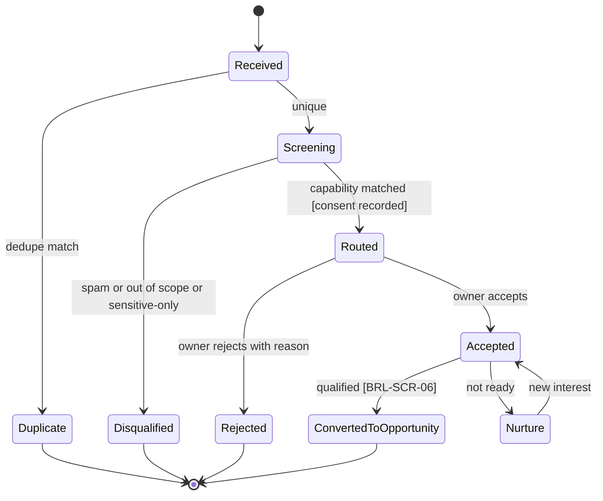
```mermaid
stateDiagram-v2
  [*] --> Received
  Received --> Duplicate : dedupe match
  Received --> Screening : unique
  Screening --> Disqualified : spam or out of scope or sensitive-only
  Screening --> Routed : capability matched [consent recorded]
  Routed --> Accepted : owner accepts
  Routed --> Rejected : owner rejects with reason
  Accepted --> ConvertedToOpportunity : qualified [BRL-SCR-06]
  Accepted --> Nurture : not ready
  Nurture --> Accepted : new interest
  Duplicate --> [*]
  Disqualified --> [*]
  Rejected --> [*]
  ConvertedToOpportunity --> [*]
```

### 2.27.2 Opportunity (research and qualification)

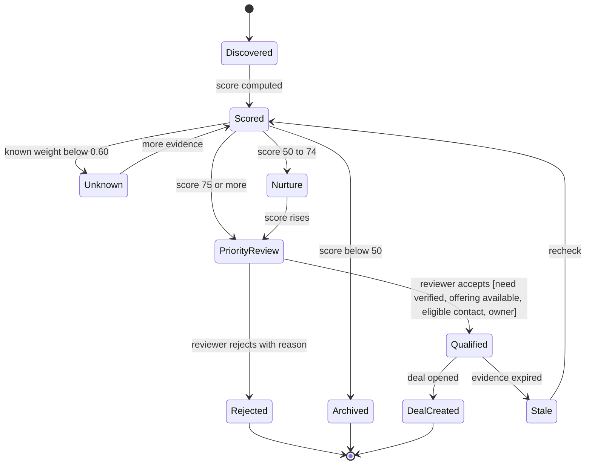
```mermaid
stateDiagram-v2
  [*] --> Discovered
  Discovered --> Scored : score computed
  Scored --> Unknown : known weight below 0.60
  Unknown --> Scored : more evidence
  Scored --> PriorityReview : score 75 or more
  Scored --> Nurture : score 50 to 74
  Scored --> Archived : score below 50
  PriorityReview --> Qualified : reviewer accepts [need verified, offering available, eligible contact, owner]
  PriorityReview --> Rejected : reviewer rejects with reason
  Nurture --> PriorityReview : score rises
  Qualified --> DealCreated : deal opened
  Qualified --> Stale : evidence expired
  Stale --> Scored : recheck
  Rejected --> [*]
  Archived --> [*]
  DealCreated --> [*]
```

### 2.27.3 Deal (configurable pipeline; default commercial template)

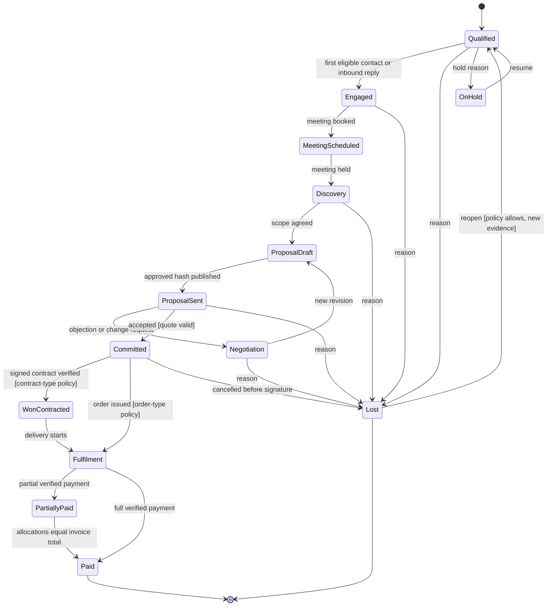
```mermaid
stateDiagram-v2
  [*] --> Qualified
  Qualified --> Engaged : first eligible contact or inbound reply
  Engaged --> MeetingScheduled : meeting booked
  MeetingScheduled --> Discovery : meeting held
  Discovery --> ProposalDraft : scope agreed
  ProposalDraft --> ProposalSent : approved hash published
  ProposalSent --> Negotiation : objection or change request
  Negotiation --> ProposalDraft : new revision
  ProposalSent --> Committed : accepted [quote valid]
  Committed --> WonContracted : signed contract verified [contract-type policy]
  Committed --> Fulfilment : order issued [order-type policy]
  WonContracted --> Fulfilment : delivery starts
  Fulfilment --> PartiallyPaid : partial verified payment
  PartiallyPaid --> Paid : allocations equal invoice total
  Fulfilment --> Paid : full verified payment
  Paid --> [*]
  Qualified --> Lost : reason
  Engaged --> Lost : reason
  Discovery --> Lost : reason
  ProposalSent --> Lost : reason
  Negotiation --> Lost : reason
  Committed --> Lost : cancelled before signature
  Lost --> Qualified : reopen [policy allows, new evidence]
  Lost --> [*]
  Qualified --> OnHold : hold reason
  OnHold --> Qualified : resume
```

**Vertical variants (FR-CSM-01):** *Project bid* uses the Bid machine (2.27.4) feeding `Committed`. *Healthcare pilot* inserts `PilotProposed → PilotApproved → PilotRunning → PilotEvaluated` between Discovery and Committed. *Education enrolment* uses `Registered → Enrolled → Delivering → Completed`. *Product purchase/sale* skips MeetingScheduled/Discovery and goes Quote → Order (2.27.8). *Service/training* uses Order with service lines.

### 2.27.4 Bid / tender

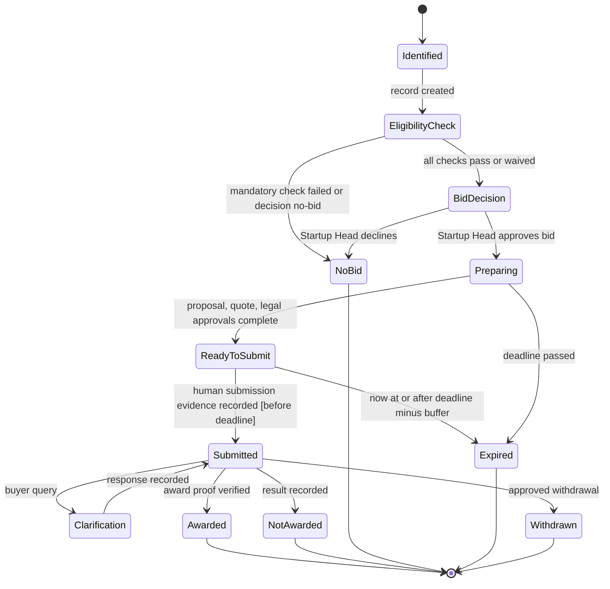
```mermaid
stateDiagram-v2
  [*] --> Identified
  Identified --> EligibilityCheck : record created
  EligibilityCheck --> NoBid : mandatory check failed or decision no-bid
  EligibilityCheck --> BidDecision : all checks pass or waived
  BidDecision --> NoBid : Startup Head declines
  BidDecision --> Preparing : Startup Head approves bid
  Preparing --> ReadyToSubmit : proposal, quote, legal approvals complete
  ReadyToSubmit --> Expired : now at or after deadline minus buffer
  Preparing --> Expired : deadline passed
  ReadyToSubmit --> Submitted : human submission evidence recorded [before deadline]
  Submitted --> Clarification : buyer query
  Clarification --> Submitted : response recorded
  Submitted --> Awarded : award proof verified
  Submitted --> NotAwarded : result recorded
  Submitted --> Withdrawn : approved withdrawal
  Awarded --> [*]
  NotAwarded --> [*]
  NoBid --> [*]
  Expired --> [*]
  Withdrawn --> [*]
```

### 2.27.5 Proposal and quote (versioned document)

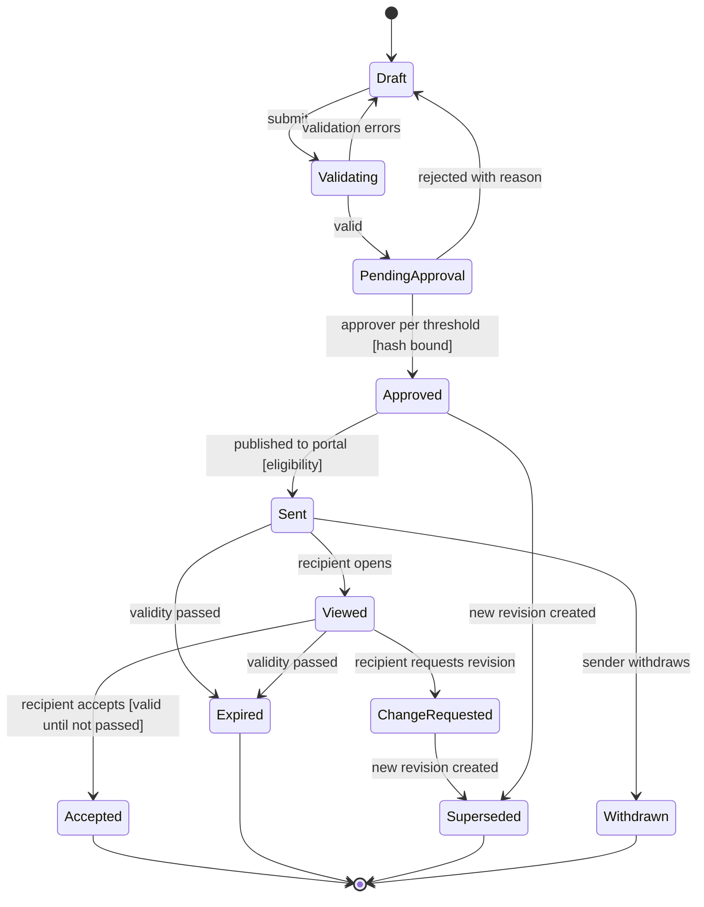
```mermaid
stateDiagram-v2
  [*] --> Draft
  Draft --> Validating : submit
  Validating --> Draft : validation errors
  Validating --> PendingApproval : valid
  PendingApproval --> Draft : rejected with reason
  PendingApproval --> Approved : approver per threshold [hash bound]
  Approved --> Sent : published to portal [eligibility]
  Sent --> Viewed : recipient opens
  Viewed --> Accepted : recipient accepts [valid until not passed]
  Viewed --> ChangeRequested : recipient requests revision
  Sent --> Expired : validity passed
  Viewed --> Expired : validity passed
  ChangeRequested --> Superseded : new revision created
  Approved --> Superseded : new revision created
  Sent --> Withdrawn : sender withdraws
  Accepted --> [*]
  Expired --> [*]
  Superseded --> [*]
  Withdrawn --> [*]
```

### 2.27.6 Contract / MoU

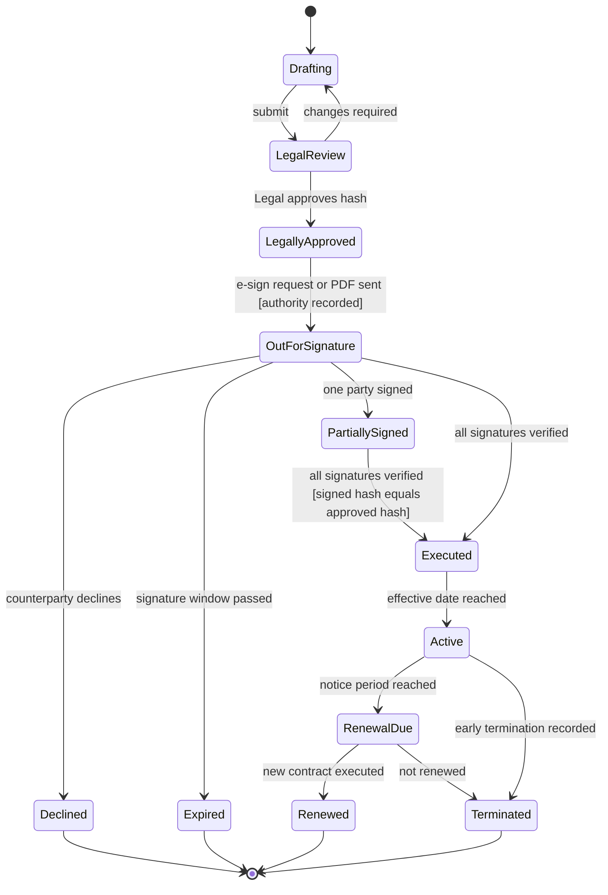
```mermaid
stateDiagram-v2
  [*] --> Drafting
  Drafting --> LegalReview : submit
  LegalReview --> Drafting : changes required
  LegalReview --> LegallyApproved : Legal approves hash
  LegallyApproved --> OutForSignature : e-sign request or PDF sent [authority recorded]
  OutForSignature --> PartiallySigned : one party signed
  PartiallySigned --> Executed : all signatures verified [signed hash equals approved hash]
  OutForSignature --> Executed : all signatures verified
  OutForSignature --> Declined : counterparty declines
  OutForSignature --> Expired : signature window passed
  Executed --> Active : effective date reached
  Active --> RenewalDue : notice period reached
  RenewalDue --> Renewed : new contract executed
  RenewalDue --> Terminated : not renewed
  Active --> Terminated : early termination recorded
  Declined --> [*]
  Expired --> [*]
  Renewed --> [*]
  Terminated --> [*]
```

### 2.27.7 Payment and invoice

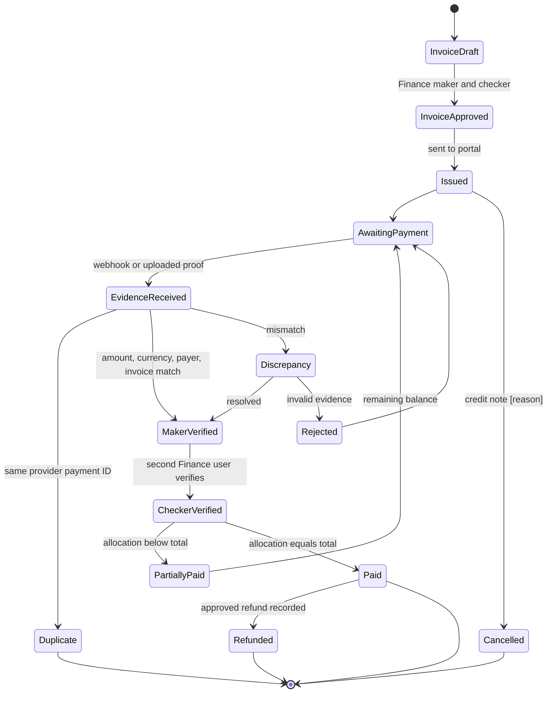
```mermaid
stateDiagram-v2
  [*] --> InvoiceDraft
  InvoiceDraft --> InvoiceApproved : Finance maker and checker
  InvoiceApproved --> Issued : sent to portal
  Issued --> AwaitingPayment
  AwaitingPayment --> EvidenceReceived : webhook or uploaded proof
  EvidenceReceived --> Duplicate : same provider payment ID
  EvidenceReceived --> MakerVerified : amount, currency, payer, invoice match
  EvidenceReceived --> Discrepancy : mismatch
  Discrepancy --> MakerVerified : resolved
  Discrepancy --> Rejected : invalid evidence
  MakerVerified --> CheckerVerified : second Finance user verifies
  CheckerVerified --> PartiallyPaid : allocation below total
  CheckerVerified --> Paid : allocation equals total
  PartiallyPaid --> AwaitingPayment : remaining balance
  Issued --> Cancelled : credit note [reason]
  Paid --> Refunded : approved refund recorded
  Duplicate --> [*]
  Rejected --> AwaitingPayment
  Paid --> [*]
  Cancelled --> [*]
  Refunded --> [*]
```

### 2.27.8 Order and fulfilment

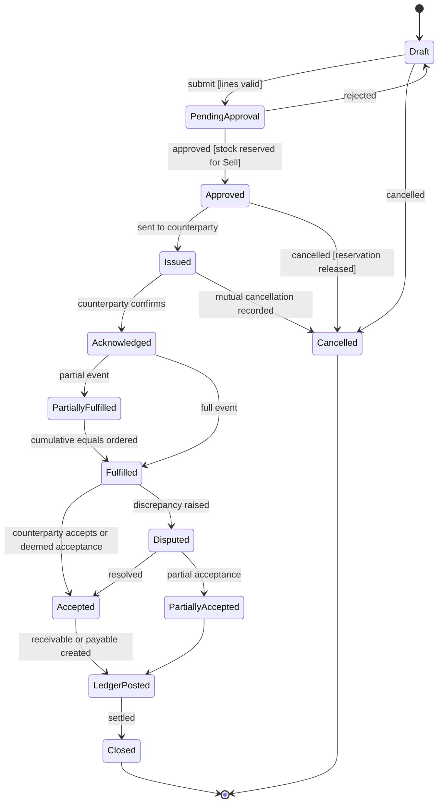
```mermaid
stateDiagram-v2
  [*] --> Draft
  Draft --> PendingApproval : submit [lines valid]
  PendingApproval --> Draft : rejected
  PendingApproval --> Approved : approved [stock reserved for Sell]
  Approved --> Issued : sent to counterparty
  Issued --> Acknowledged : counterparty confirms
  Acknowledged --> PartiallyFulfilled : partial event
  PartiallyFulfilled --> Fulfilled : cumulative equals ordered
  Acknowledged --> Fulfilled : full event
  Fulfilled --> Accepted : counterparty accepts or deemed acceptance
  Fulfilled --> Disputed : discrepancy raised
  Disputed --> Accepted : resolved
  Disputed --> PartiallyAccepted : partial acceptance
  Accepted --> LedgerPosted : receivable or payable created
  LedgerPosted --> Closed : settled
  Draft --> Cancelled : cancelled
  Approved --> Cancelled : cancelled [reservation released]
  Issued --> Cancelled : mutual cancellation recorded
  PartiallyAccepted --> LedgerPosted
  Closed --> [*]
  Cancelled --> [*]
```

### 2.27.9 Outbound message (any channel)

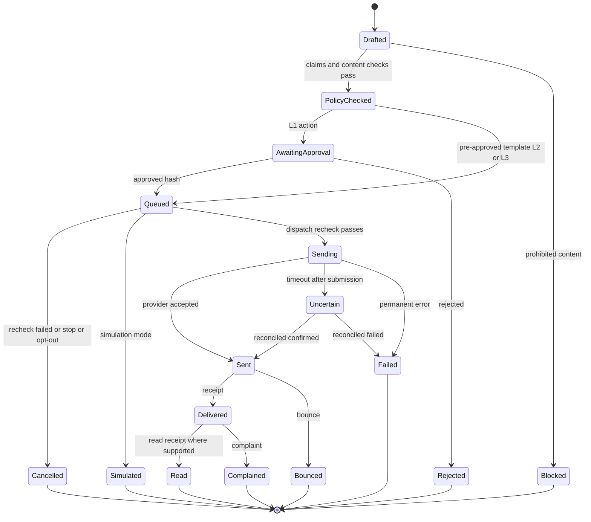
```mermaid
stateDiagram-v2
  [*] --> Drafted
  Drafted --> PolicyChecked : claims and content checks pass
  Drafted --> Blocked : prohibited content
  PolicyChecked --> AwaitingApproval : L1 action
  PolicyChecked --> Queued : pre-approved template L2 or L3
  AwaitingApproval --> Queued : approved hash
  AwaitingApproval --> Rejected : rejected
  Queued --> Cancelled : recheck failed or stop or opt-out
  Queued --> Simulated : simulation mode
  Queued --> Sending : dispatch recheck passes
  Sending --> Sent : provider accepted
  Sending --> Uncertain : timeout after submission
  Sending --> Failed : permanent error
  Uncertain --> Sent : reconciled confirmed
  Uncertain --> Failed : reconciled failed
  Sent --> Delivered : receipt
  Sent --> Bounced : bounce
  Delivered --> Read : read receipt where supported
  Delivered --> Complained : complaint
  Blocked --> [*]
  Rejected --> [*]
  Cancelled --> [*]
  Simulated --> [*]
  Failed --> [*]
  Bounced --> [*]
  Complained --> [*]
  Read --> [*]
```

### 2.27.10 Sequence enrolment

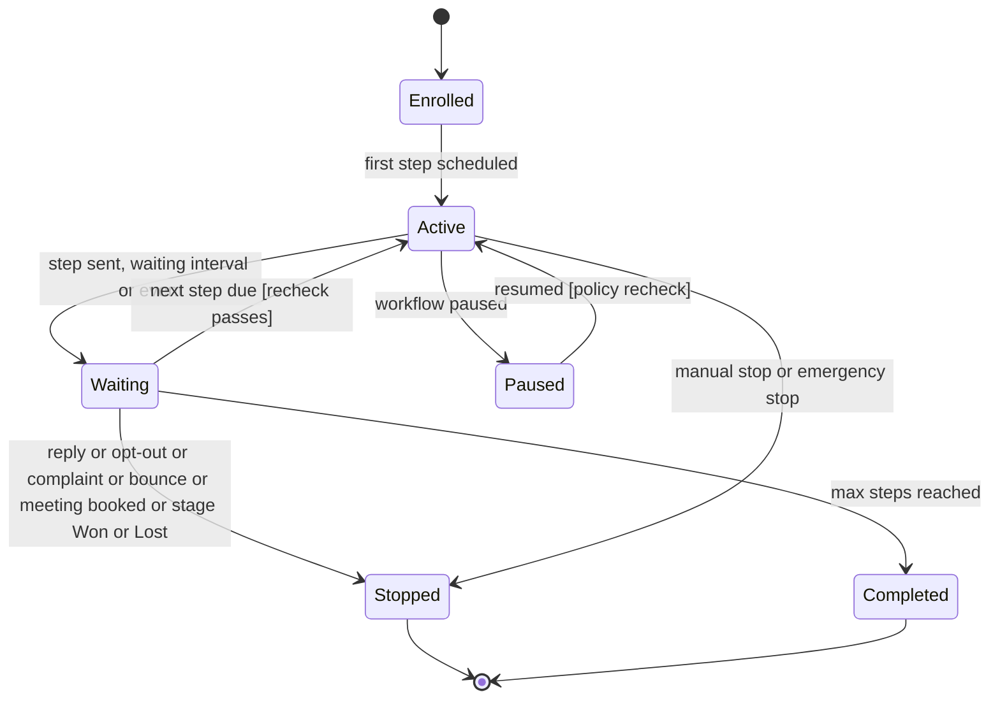
```mermaid
stateDiagram-v2
  [*] --> Enrolled
  Enrolled --> Active : first step scheduled
  Active --> Waiting : step sent, waiting interval or event
  Waiting --> Active : next step due [recheck passes]
  Waiting --> Stopped : reply or opt-out or complaint or bounce or meeting booked or stage Won or Lost
  Active --> Stopped : manual stop or emergency stop
  Active --> Paused : workflow paused
  Paused --> Active : resumed [policy recheck]
  Waiting --> Completed : max steps reached
  Stopped --> [*]
  Completed --> [*]
```

### 2.27.11 Meeting

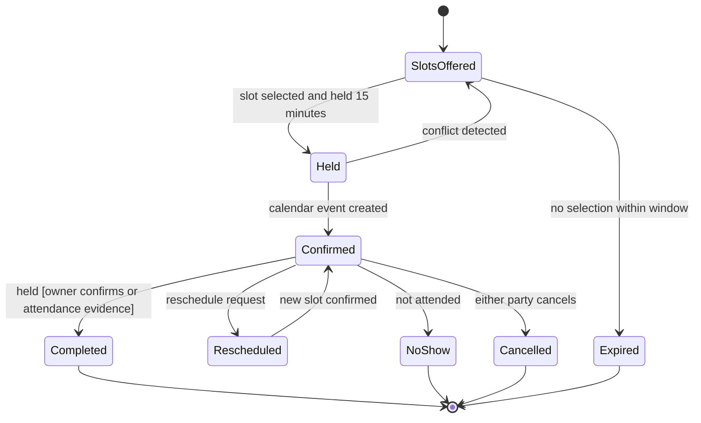
```mermaid
stateDiagram-v2
  [*] --> SlotsOffered
  SlotsOffered --> Held : slot selected and held 15 minutes
  Held --> SlotsOffered : conflict detected
  Held --> Confirmed : calendar event created
  SlotsOffered --> Expired : no selection within window
  Confirmed --> Rescheduled : reschedule request
  Rescheduled --> Confirmed : new slot confirmed
  Confirmed --> Cancelled : either party cancels
  Confirmed --> Completed : held [owner confirms or attendance evidence]
  Confirmed --> NoShow : not attended
  Completed --> [*]
  NoShow --> [*]
  Cancelled --> [*]
  Expired --> [*]
```

### 2.27.12 Content / publication / landing page (FR-PUB-01)

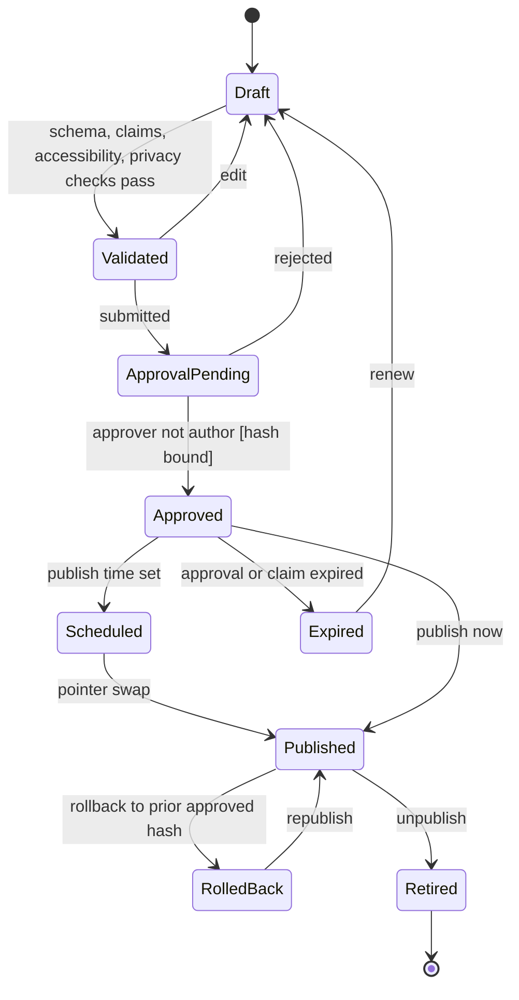
```mermaid
stateDiagram-v2
  [*] --> Draft
  Draft --> Validated : schema, claims, accessibility, privacy checks pass
  Validated --> Draft : edit
  Validated --> ApprovalPending : submitted
  ApprovalPending --> Draft : rejected
  ApprovalPending --> Approved : approver not author [hash bound]
  Approved --> Scheduled : publish time set
  Scheduled --> Published : pointer swap
  Approved --> Published : publish now
  Published --> RolledBack : rollback to prior approved hash
  RolledBack --> Published : republish
  Published --> Retired : unpublish
  Approved --> Expired : approval or claim expired
  Expired --> Draft : renew
  Retired --> [*]
```

### 2.27.13 Campaign

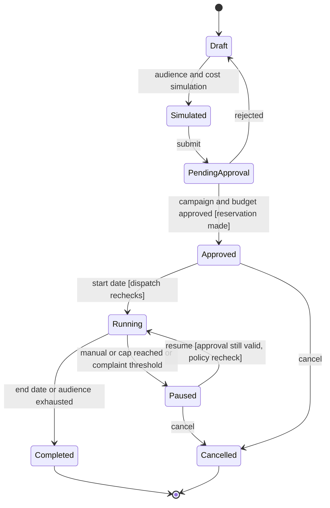
```mermaid
stateDiagram-v2
  [*] --> Draft
  Draft --> Simulated : audience and cost simulation
  Simulated --> PendingApproval : submit
  PendingApproval --> Draft : rejected
  PendingApproval --> Approved : campaign and budget approved [reservation made]
  Approved --> Running : start date [dispatch rechecks]
  Running --> Paused : manual or cap reached or complaint threshold
  Paused --> Running : resume [approval still valid, policy recheck]
  Running --> Completed : end date or audience exhausted
  Paused --> Cancelled : cancel
  Approved --> Cancelled : cancel
  Completed --> [*]
  Cancelled --> [*]
```

### 2.27.14 Workflow run and step

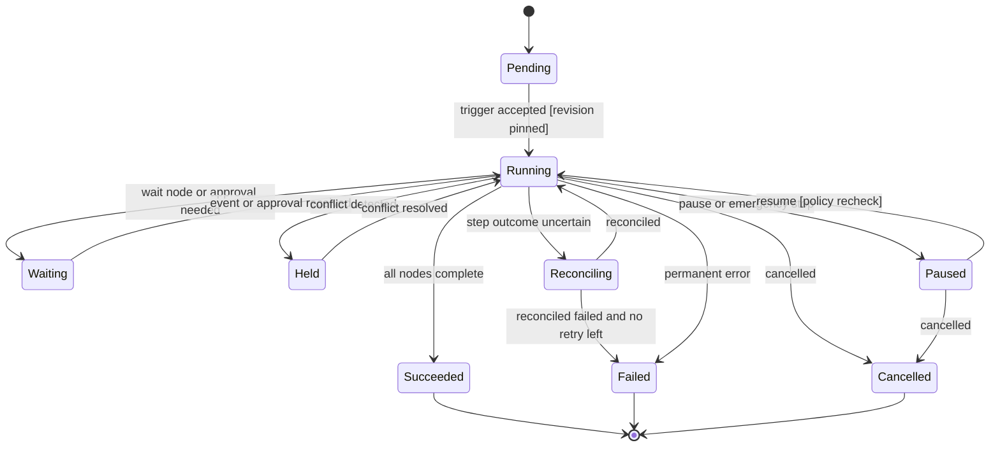
```mermaid
stateDiagram-v2
  [*] --> Pending
  Pending --> Running : trigger accepted [revision pinned]
  Running --> Waiting : wait node or approval needed
  Waiting --> Running : event or approval received
  Running --> Held : conflict detected
  Held --> Running : conflict resolved
  Running --> Paused : pause or emergency stop
  Paused --> Running : resume [policy recheck]
  Running --> Reconciling : step outcome uncertain
  Reconciling --> Running : reconciled
  Reconciling --> Failed : reconciled failed and no retry left
  Running --> Succeeded : all nodes complete
  Running --> Failed : permanent error
  Running --> Cancelled : cancelled
  Paused --> Cancelled : cancelled
  Succeeded --> [*]
  Failed --> [*]
  Cancelled --> [*]
```

### 2.27.15 Autonomous plan

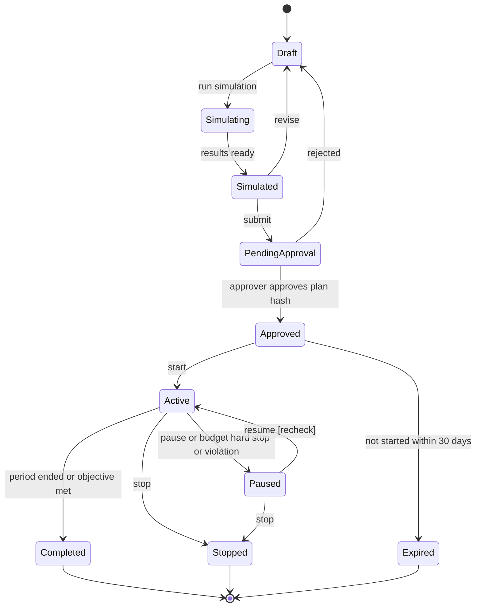
```mermaid
stateDiagram-v2
  [*] --> Draft
  Draft --> Simulating : run simulation
  Simulating --> Simulated : results ready
  Simulated --> Draft : revise
  Simulated --> PendingApproval : submit
  PendingApproval --> Approved : approver approves plan hash
  PendingApproval --> Draft : rejected
  Approved --> Active : start
  Active --> Paused : pause or budget hard stop or violation
  Paused --> Active : resume [recheck]
  Active --> Completed : period ended or objective met
  Active --> Stopped : stop
  Paused --> Stopped : stop
  Approved --> Expired : not started within 30 days
  Completed --> [*]
  Stopped --> [*]
  Expired --> [*]
```

### 2.27.16 Tenant / startup lifecycle

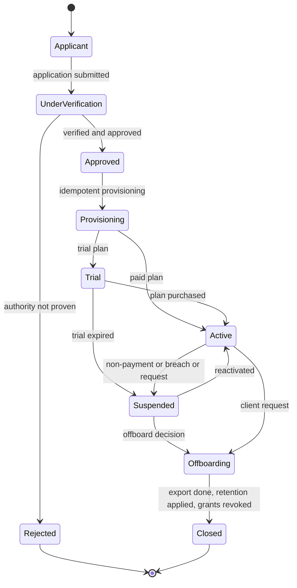
```mermaid
stateDiagram-v2
  [*] --> Applicant
  Applicant --> UnderVerification : application submitted
  UnderVerification --> Rejected : authority not proven
  UnderVerification --> Approved : verified and approved
  Approved --> Provisioning : idempotent provisioning
  Provisioning --> Trial : trial plan
  Provisioning --> Active : paid plan
  Trial --> Active : plan purchased
  Trial --> Suspended : trial expired
  Active --> Suspended : non-payment or breach or request
  Suspended --> Active : reactivated
  Suspended --> Offboarding : offboard decision
  Active --> Offboarding : client request
  Offboarding --> Closed : export done, retention applied, grants revoked
  Rejected --> [*]
  Closed --> [*]
```

Owned startups enter directly at `Provisioning` (no applicant step).

### 2.27.17 Privacy request

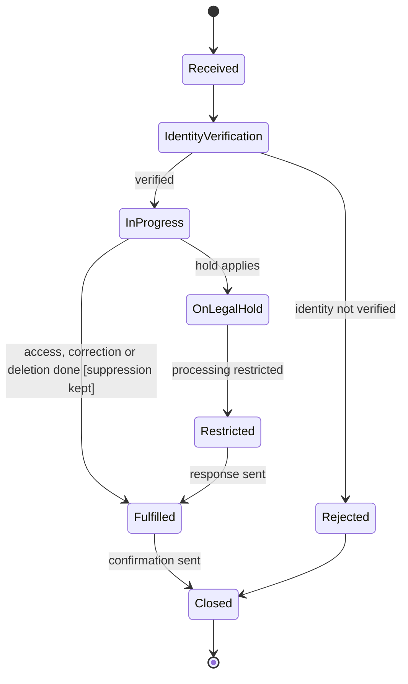
```mermaid
stateDiagram-v2
  [*] --> Received
  Received --> IdentityVerification
  IdentityVerification --> Rejected : identity not verified
  IdentityVerification --> InProgress : verified
  InProgress --> OnLegalHold : hold applies
  OnLegalHold --> Restricted : processing restricted
  InProgress --> Fulfilled : access, correction or deletion done [suppression kept]
  Restricted --> Fulfilled : response sent
  Fulfilled --> Closed : confirmation sent
  Rejected --> Closed
  Closed --> [*]
```

### 2.27.18 Other lifecycle state sets (tables)

| Entity | States (in order) | Key guards |
|---|---|---|
| Offering version | Planned → Draft → PendingApproval → Approved → Available → Suspended → Withdrawn | Available requires approved claims + price (BRL-SCR-04, M66) |
| Claim | Draft → PendingApproval → Approved → Expired / Revoked | Evidence linked; approver ≠ author |
| Knowledge document | Uploaded → Scanning → Quarantined / Parsed → Indexed → PendingApproval → Approved → Superseded / Rejected | Scan clean; approved version only in search |
| Source permission | Proposed → PendingApproval → Active → Expired / Revoked | Licence and purpose recorded |
| Integration connection | Draft → Testing → Active → Degraded → Disabled | Health poll; secret reference valid |
| Contact verification | Unverified → Verifying → Verified (expires) → Stale → Failed | Published source; no guessing |
| Eligibility decision | Evaluated: Eligible / Ineligible / Unknown (immutable record per evaluation) | Recomputed at dispatch |
| Signal / Need | Proposed → InReview → Confirmed / Rejected / Expired | Inferred cannot be Confirmed without evidence |
| Compliance incident | Open → Contained → UnderReview → Resolved / Accepted-risk → Closed | Containment pauses affected scope |
| Onboarding | Created → InProgress → Blocked → Completed → HandedOff | Mandatory tasks complete |
| Renewal | Upcoming → Due → InReview → Renewed / Churned / Deferred | Contact eligibility |
| Partner pilot / deployment | Proposed → DueDiligence → Approved → Running → Evaluated → RolledOut / Stopped | Readiness approval (BRL-LCY-04) |
| Subscription | Trial → Active → PastDue → Suspended → Cancelled | Entitlements and billing |
| Application draft | Started → Submitted → Verified → Approved / Rejected → Provisioned / Expired | 30-day expiry |
| Support access grant | Requested → Approved → Active → Expired / Revoked | ≤ 72 h |
| Export / import job | Requested → Validating → PendingApproval → Running → Completed / Failed → Expired | Restricted data approval |
| Conflict case | Detected → Held → Resolved (merged / chosen / escalated) | Priority rules BRL-AUT-09 |
| Trigger | Draft → Tested → Enabled → Paused → Retired | Sandbox test passed |
| Workflow/node template | Draft → InReview → Published → Deprecated | Approved nodes only |
| Config revision | Draft → Validated → Simulated → Approved → Scheduled → Active → Superseded / RolledBack | Running workflows pinned |
| Release | Planned → Building → Testing → AwaitingEvidence → Approved → Deployed → RolledBack | All blocking gates passed |

---

## 2.28 Coverage and consistency checks

| Check | Result |
|---|---|
| Every BR acceptance statement with a decision condition has at least one BRL | Pass (e.g. M04 → ELG-02; M21 → INVALID_TRANSITION; M44 → QTE-02; M46 → CTR-02/04; M47 → FIN-02/04) |
| Every DEC with a rule implication encoded | Pass (DEC-001 → SCR-07; DEC-011 → SCR-01/02; DEC-027 → QTE-02/03; DEC-029 → ELG-05/06; DEC-030 → ELG-13; DEC-038 → APR-04–07; DEC-053 → BID-01/04; DEC-054 → FIN-01; DEC-064 → AUT-01) |
| Every FR approval screen mapped to a role with A permission | Pass (A051, A057, A059, A066, A068, A070, A072, A078, A092, A094, A096, A098, A108) |
| Separation of duties enforceable | Pass (ABAC-03; R08/R09 split) |
| Every entity with a lifecycle has a state model | Pass (17 diagrams + 21 tabular lifecycles) |

## 2.29 Quality gate: Batch 2.3

| Check | Result | Notes |
|---|---|---|
| Traced to source | Pass | Every rule cites BRD/FRD/DEC |
| Additions tagged | Pass | RECOMMENDATION-020 (delegation), -021 (Auditor role); default parameter values flagged as Policy (configurable) |
| IDs unique | Pass | 162 BRL, 20 roles, 12 ABAC policies |
| Negative/edge/security | Pass | Fail-closed, SoD, thresholds, uncertain outcomes, invalid transitions |
| Time-sensitive | Pass | WhatsApp window and tax rates marked verify |
| Consistency | Pass | Aligns with 2.2 flows and DEC-038/054/064 |

**Status: Part 2 Batch 2.3 complete. Next: Batch 2.4 (notifications, reporting/analytics, search, configuration/admin, audit trail, multi-tenancy, localization).**
