# AI Growth Engine: Employee Sales & Marketing Automation
## Application Blueprint: PART 3 (Batch 3.3), Data Architecture

| Field | Value |
|---|---|
| Document | Part 3, Batch 3 · Data Architecture (client Section 6.5) |
| Version | 1.0 · 27 Nov 2026 |
| Baseline | BRD, FRD, Parts 0, 0A (DEC-001…065), 1, 2.1–2.5 |
| Companion batches | 3.1 Solution architecture · 3.2 API and integration architecture (written in parallel; this batch **owns every entity definition**; 3.1/3.2 reference entities by the names and table names given here) |
| Roles applied | Data Architect/DBA (lead), Solutions Architect, Principal Engineer, Security/Compliance/AI Governance Lead, DevOps/SRE Lead, FinOps Lead, QA Lead, BSA |
| Section numbering | `3.3.x` (batch-scoped, so it cannot collide with the parallel batches 3.1 and 3.2) |

---

## 3.3.1 Scope, sources and conventions of this batch

### 3.3.1.1 What this batch decides

| # | Decision area | Where |
|---|---|---|
| 1 | Conceptual domains and their relationships | §3.3.2 |
| 2 | The complete logical entity catalogue (**199 logical entities**), with origin, scope class and immutability, reconciled with the source claim "149 retained + 6 candidate" | §3.3.3 |
| 3 | Logical models per domain (17 entity-relationship diagrams, each ≤ 20 entities) | §3.3.4 |
| 4 | Physical conventions: keys, timestamps, scope keys, concurrency, money, soft delete, naming, migration order, immutability enforcement | §3.3.5 |
| 5 | Column-level data dictionary for 68 core entities, compact dictionary for the remaining 131 | §3.3.6, §3.3.7 |
| 6 | Indexes, unique (idempotency) constraints, check constraints, vector indexes | §3.3.8 |
| 7 | Row-level security (RLS) design with SQL | §3.3.9 |
| 8 | Partitioning and volume estimates for the DEC-031 Year 1 and Year 2 design points | §3.3.10 |
| 9 | Retention, purge, archival and legal hold per DEC-028 | §3.3.11 |
| 10 | Migration and conversion of the four seed startups per DEC-039 | §3.3.12 |
| 11 | Master/reference data stewardship | §3.3.13 |
| 12 | Data quality rules DQ-001…DQ-032 | §3.3.14 |
| 13 | Backup, restore and tenant-level logical restore | §3.3.15 |
| 14 | Personal data classification, masking, encryption, pseudonymization, children's data | §3.3.16 |
| 15 | KPI lineage from event to report | §3.3.17 |

### 3.3.1.2 Binding sources used

| Source | What it fixes for the data layer |
|---|---|
| FRD §5 (Engineering contracts) | "Independent PostgreSQL database and role per product; tenant root first, startup and membership, configuration/reference, business entities in FK order, deferred cyclic constraints, indexes/views last. All operational rows use UUID PK, UTC timestamps, scoped tenant_id/startup_id composite foreign keys, RLS and revision. Root and reference rows have explicit alternative scope. Immutable approval, financial and audit records; decimal and ISO currency; provider IDs unique within connection. Separate object storage/vector ACLs. Never expose direct DB access to browser, Copilot or provider. Validate physical naming against existing schema." |
| FRD §6.1–§6.66 | The entity names per module ("Database entities"), listed in Part 2.1 §2.2 |
| BRD §9 / FRD §16 | "Retained baseline: 302 API/adapter operations, **149 logical entities** and 624 product tests. Expansion proposals: 19 candidate HTTP operations, **6 candidate entities**" |
| DEC-009, DEC-065 | One PostgreSQL cluster for this product, shared by all its tenants with RLS and composite keys; owned portfolio = one tenant with 25+ startup workspaces |
| DEC-016 | 35 DERIVED core entities |
| DEC-018, DEC-040 | RPO ≤ 15 min, RTO ≤ 4 h; AWS ap-south-1; cross-region backup copy |
| DEC-027 | Decimal money, ISO 4217, ROUND_HALF_UP per line, FxSnapshot, TaxProfile, no IRN generation |
| DEC-028 | Retention schedule and legal hold |
| DEC-030 | Children's data |
| DEC-031 | Year 1 and Year 2 volume design points |
| DEC-039 | Migration by import templates, dry run, consent gating |
| NFR-005, -006, -017, -018, -025, -026, -031, -032, -035, -036, -038 | Idempotency, outbox, data integrity, immutability, stale revision, uncertain outcomes, isolation, usage reconciliation, privacy, simulation |
| Part 2.3 | BRL rules, roles R01–R20, ABAC-01…12, field-level security §2.26.5, state machines §2.27 |
| Part 2.4 | Audit schema §2.34.2, reference data §2.33.4, isolation layers §2.35.2, reporting rules RPT-R1…R10 |
| RECOMMENDATION-004 | Classification scheme Public / Internal / Confidential / Restricted |

### 3.3.1.3 Acronyms used in this batch

| Acronym | Meaning |
|---|---|
| BRIN | Block Range Index (PostgreSQL index type for naturally ordered, append-only data) |
| CDC | Change Data Capture |
| DDL | Data Definition Language |
| DEK / KEK | Data Encryption Key / Key Encryption Key (envelope encryption) |
| DLQ | Dead-Letter Queue |
| DPIA | Data Protection Impact Assessment |
| DQ | Data Quality (rule IDs DQ-###) |
| ENT | Entity catalogue identifier used in this batch (ENT-001…ENT-199) |
| FK / PK / UK | Foreign / Primary / Unique Key |
| GIN | Generalized Inverted Index |
| HNSW | Hierarchical Navigable Small World (approximate nearest-neighbour vector index) |
| HMAC | Hash-based Message Authentication Code |
| IVFFlat | Inverted File with flat lists (alternative pgvector index) |
| KMS | AWS Key Management Service |
| LIA | Legitimate-Interest Assessment (DEC-029) |
| MD | Metric Definition identifier (MD-KPI-##) |
| PITR | Point-In-Time Recovery |
| RLS | PostgreSQL Row-Level Security |
| WORM | Write Once, Read Many |

---

## 3.3.2 Conceptual data model

### 3.3.2.1 Domain overview

The data model has 13 domains. Every domain except platform reference data and SaaS commercial metadata hangs off the **Tenant → Startup** scope root (DEC-065). Arrows show the dominant flow of facts; dotted lines are governance checks applied to every external effect (the Policy Decision Point, PDP).

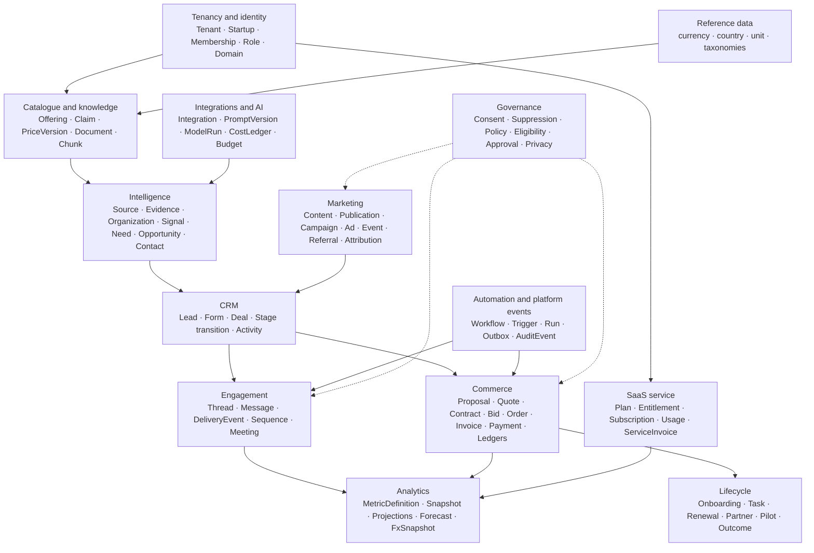
```mermaid
flowchart TD
  TEN["Tenancy and identity<br/>Tenant · Startup · Membership · Role · Domain"]
  REF["Reference data<br/>currency · country · unit · taxonomies"]
  CAT["Catalogue and knowledge<br/>Offering · Claim · PriceVersion · Document · Chunk"]
  GOV["Governance<br/>Consent · Suppression · Policy · Eligibility · Approval · Privacy"]
  AI["Integrations and AI<br/>Integration · PromptVersion · ModelRun · CostLedger · Budget"]
  INTEL["Intelligence<br/>Source · Evidence · Organization · Signal · Need · Opportunity · Contact"]
  CRM["CRM<br/>Lead · Form · Deal · Stage transition · Activity"]
  ENG["Engagement<br/>Thread · Message · DeliveryEvent · Sequence · Meeting"]
  MKT["Marketing<br/>Content · Publication · Campaign · Ad · Event · Referral · Attribution"]
  COM["Commerce<br/>Proposal · Quote · Contract · Bid · Order · Invoice · Payment · Ledgers"]
  LCY["Lifecycle<br/>Onboarding · Task · Renewal · Partner · Pilot · Outcome"]
  AUT["Automation and platform events<br/>Workflow · Trigger · Run · Outbox · AuditEvent"]
  SAAS["SaaS service<br/>Plan · Entitlement · Subscription · Usage · ServiceInvoice"]
  ANA["Analytics<br/>MetricDefinition · Snapshot · Projections · Forecast · FxSnapshot"]
  TEN --> CAT
  TEN --> SAAS
  REF --> CAT
  CAT --> INTEL
  INTEL --> CRM
  CRM --> ENG
  MKT --> CRM
  CRM --> COM
  COM --> LCY
  AUT --> ENG
  AUT --> COM
  AI --> INTEL
  GOV -.-> ENG
  GOV -.-> MKT
  GOV -.-> COM
  ENG --> ANA
  COM --> ANA
  SAAS --> ANA
```

### 3.3.2.2 Domain responsibilities and ownership

| Domain | Django app(s) (Part 2.1 §2.1.2) | Table prefix | Owns (system of record for) | Entities | Data steward role |
|---|---|---|---|---|---|
| Tenancy and identity | `core.tenancy`, `core.identity` | `ten_` | Tenants, startups, business lines, capability profiles, domains, membership, roles, portal grants | 10 | R12 Tenant Administrator |
| Reference data | `core.reference` | `ref_` | Platform and tenant reference lists (§3.3.13) | 5 | Platform data steward; R12 for tenant extensions |
| Catalogue and knowledge | `catalog`, `knowledge` | `cat_` | Offering truth, claims, prices, tax profile, knowledge documents and vectors | 11 | R02 Startup Head (offerings), R10 (claims), R08 (prices) |
| Governance | `governance` | `gov_` | Consent ledger, suppression, policy versions, jurisdiction rules, eligibility/policy decisions, approvals, privacy, retention, legal hold, compliance incidents | 13 | R10 Legal/Compliance/DPO |
| Integrations and AI | `integrations`, `ai` | `int_`, `ai_` | Connections, secret references, quotas, provider events, agents, prompts, model runs, evals, usage, cost ledger, budgets | 13 | R11 Automation Lead; R08 for budgets |
| Intelligence | `intelligence.*` | `intel_` | Sources, research, evidence, organizations, signals, needs, matches, scoring, opportunities, contacts, verification, reviews | 26 | R04 Research Analyst |
| CRM | `crm`, `crm.leads` | `crm_` | Leads, forms, submissions, pipelines, stages, deals, transitions, activities, closure policy | 10 | R02 Startup Head |
| Engagement | `engagement.*` | `eng_` | Channels, templates, drafts, threads, messages, delivery and inbound events, sequences, meetings, chat | 16 | R03 Growth Manager |
| Marketing | `marketing.*`, `web` | `mkt_` | Content, social, SEO, pages, publications, campaigns, audiences, ads, events, referrals, attribution | 20 | R05L Marketing Lead |
| Commerce | `commerce.*` | `com_` | Proposals, quotes, negotiation, contracts, signatures, bids, orders, fulfilment, inventory, invoices, payments, ledgers | 22 | R02 (documents), R08/R09 (finance) |
| Lifecycle | `lifecycle.*` | `lcy_` | Onboarding, tasks, handoffs, renewals, customer subscriptions, partners, pilots, deployments, licensing deals, feedback, outcomes | 12 | R02 Startup Head |
| Automation and platform events | `automation`, `core.events`, `core.audit`, `ops` | `aut_`, `ops_` | Workflows, revisions, triggers, runs, plans, conflicts, templates, configuration revisions, outbox, domain events, idempotency, audit, jobs, notifications, incidents, releases | 20 | R11 Automation Lead; SRE |
| SaaS service | `saas` | `saas_` | Service plans, versions, entitlements, subscriptions, usage meters, service invoices, credits, applications, support grants, export/import jobs | 12 | R14 Platform Billing; R12 for own tenant |
| Analytics | `analytics.*` | `ana_` | Metric definitions, snapshots, projections, forecasts, FX snapshots, report subscriptions | 9 | R08 Finance (metric definitions, A083) |
| **Total** | | | | **199** | |

---

## 3.3.3 Entity catalogue and reconciliation

### 3.3.3.1 Legend

| Column | Values |
|---|---|
| **Origin** | **F** = named in the FRD module specifications (FRD §6.x "Database entities"; listed in Part 2.1 §2.2). **D16** = DERIVED by DEC-016. **D** = DERIVED in this batch (a normalization, split or supporting entity that the baseline requires but does not name; justification column says which rule needs it) |
| **Scope class** | **S** = startup-scoped (`tenant_id` and `startup_id` NOT NULL). **T** = tenant-scoped (`tenant_id` NOT NULL, `startup_id` NULL or optional). **X** = mixed (`tenant_id` NULL means a platform-supplied default row, readable by all tenants, writable only by the platform). **P** = platform (no tenant column; platform metadata or pre-tenant data) |
| **Imm.** (immutability profile, §3.3.5.9) | **M** = mutable with optimistic revision. **V** = versioned: a version row is frozen once approved/published; changes create a new version. **F** = frozen-after-state: business fields freeze at a defined state; only forward state columns may change. **A** = append-only: insert only; corrections are new (reversing) rows |
| **Ret.** (retention class, §3.3.11) | FIN financial 8 y · CTR contract term + 8 y · AUD audit 7 y · MKT marketing contact 24 m after last eligible interaction · SUP suppression indefinite (hash) · EVD research evidence 12 m · AIL AI run log 90 d · CHT chat 90 d · REJ rejected/withdrawn lead 6 m · APP application draft 30 d · OPS operational 13 m · BUS business record (life of relationship + 24 m, GAP-113) · CFG configuration (superseded + 24 m) · PRJ rebuildable projection (no independent retention) |

### 3.3.3.2 Complete catalogue (199 logical entities)

| ENT | Entity (logical) | Physical table | Domain | Origin | FRD module / basis | Scope | Imm. | Ret. |
|---|---|---|---|---|---|---|---|---|
| ENT-001 | Tenant | `ten_tenant` | Tenancy | D16 | B-TENANT; DEC-065 | P (root) | M | BUS |
| ENT-002 | Startup | `ten_startup` | Tenancy | D16 | B-TENANT; FR-A099 | T | M | BUS |
| ENT-003 | BusinessLine | `ten_business_line` | Tenancy | D16 | FR-FLT-01; FR-A100 | S | M | BUS |
| ENT-004 | CapabilityProfile | `ten_capability_profile` | Tenancy | D16 | DEC-052; ABAC-08 | S | V | CFG |
| ENT-005 | Domain (verified web domain) | `ten_domain` | Tenancy | D16 | BRL-TEN-10; FR-A107 | S | M | BUS |
| ENT-006 | User (product-local identity mirror) | `ten_user` | Tenancy | F | M01 (FRD §6.1); DEC-003 | P | M | BUS |
| ENT-007 | Role | `ten_role` | Tenancy | F | M01 | X | M | CFG |
| ENT-008 | Membership | `ten_membership` | Tenancy | F | M01; BRL-TEN-01/07 | T | M | AUD |
| ENT-009 | PortalGrant (object grant for external users) | `ten_portal_grant` | Tenancy | D | ABAC-09; CA-PORTAL | S | M | AUD |
| ENT-010 | SavedView | `ten_saved_view` | Tenancy | D | FR-FLT-RULES (saved views scoped to user/product/tenant/startup) | S | M | CFG |
| ENT-011 | ReferenceDataset | `ref_dataset` | Reference | D | Part 2.4 §2.33.4; CFG-32 | X | V | CFG |
| ENT-012 | ReferenceValue | `ref_value` | Reference | D | Part 2.4 §2.33.4 | X | V | CFG |
| ENT-013 | Currency | `ref_currency` | Reference | D | DEC-027 ISO 4217; NFR-017 | P | M | CFG |
| ENT-014 | Country (with subdivisions) | `ref_country` | Reference | D | ISO 3166; BRL-ELG-05 | P | M | CFG |
| ENT-015 | UnitOfMeasure | `ref_unit` | Reference | D | BRL-QTE-07; DEC-045 | X | M | CFG |
| ENT-016 | Offering (FRD "Product" merged here) | `cat_offering` | Catalogue | D16 + F | M02, M66; DEC-003 | S | M | BUS |
| ENT-017 | OfferingVersion | `cat_offering_version` | Catalogue | D16 | M02; §2.27.18 Offering version states | S | V | CFG |
| ENT-018 | Capability | `cat_capability` | Catalogue | F | M02 | S | M | CFG |
| ENT-019 | ProductCapability (offering version × capability) | `cat_offering_capability` | Catalogue | F | M16 | S | V | CFG |
| ENT-020 | Claim | `cat_claim` | Catalogue | F | M02, M25; BRL-MKT-01/03 | S | V | CTR-like: claim + 8 y after expiry (evidence of what was published) |
| ENT-021 | PriceVersion | `cat_price_version` | Catalogue | F | M02, M44; BRL-QTE-01 | S | V | FIN |
| ENT-022 | TaxProfile | `cat_tax_profile` | Catalogue | D16 | DEC-027 | S | V | FIN |
| ENT-023 | LaunchApproval | `cat_launch_approval` | Catalogue | F | M66; DEC-060 | S | A | AUD |
| ENT-024 | Document | `cat_document` | Catalogue | F | M03 | S | V | CFG |
| ENT-025 | Chunk | `cat_chunk` | Catalogue | F | M03 | S | A | CFG (with document) |
| ENT-026 | Embedding | `cat_embedding` | Catalogue | F | M03 | S | A | CFG (with chunk) |
| ENT-027 | Consent | `gov_consent` | Governance | F | M04, M22 | S | A | AUD (pseudonymized after contact erasure) |
| ENT-028 | Suppression | `gov_suppression` | Governance | F | M04; BRL-ELG-02; BRL-PRV-03 | T | A | SUP |
| ENT-029 | PolicyVersion | `gov_policy_version` | Governance | F | M04, M24 | X | V | AUD |
| ENT-030 | JurisdictionRule | `gov_jurisdiction_rule` | Governance | D16 | DEC-029; BRL-ELG-05 | X | V | AUD |
| ENT-031 | EligibilityDecision | `gov_eligibility_decision` | Governance | F | M24 | S | A | OPS+ (24 m, GAP-113) |
| ENT-032 | PolicyDecision | `gov_policy_decision` | Governance | F | M57; RECOMMENDATION-012 | S | A | OPS+ (24 m, GAP-113) |
| ENT-033 | ApprovalPolicy | `gov_approval_policy` | Governance | D16 | DEC-038; CFG-17 | T | V | AUD |
| ENT-034 | Approval | `gov_approval` | Governance | F | M45, M61; CA-APPROVE | S | A | Same as governed object (CONFLICT-108) |
| ENT-035 | ApprovalDelegation | `gov_approval_delegation` | Governance | D | BRL-APR-09 | S | F | AUD |
| ENT-036 | PrivacyRequest | `gov_privacy_request` | Governance | F | M56 | T | M | AUD |
| ENT-037 | RetentionPolicy | `gov_retention_policy` | Governance | F | M56; DEC-028; CFG-28 | X | V | AUD |
| ENT-038 | LegalHold | `gov_legal_hold` | Governance | D | DEC-028; BRL-PRV-04 | T | F | AUD |
| ENT-039 | ComplianceIncident | `gov_compliance_incident` | Governance | F | M57 | S | M | AUD |
| ENT-040 | Integration (connection) | `int_integration` | Integrations | F | M05 | S | M | CFG |
| ENT-041 | CredentialRef | `int_credential_ref` | Integrations | F | M05; NFR-004 | S | M | CFG |
| ENT-042 | Quota | `int_quota` | Integrations | F | M05 | S | M | CFG |
| ENT-043 | ProviderEvent (verified webhook receipt) | `int_provider_event` | Integrations | D | FRD §5 "dedupe by provider account and event ID"; NFR-005 | S | A | OPS |
| ENT-044 | AgentDefinition (tool registry entry) | `ai_agent_definition` | AI | D | DEC-048; R20 | X | V | CFG |
| ENT-045 | PromptVersion | `ai_prompt_version` | AI | F | M08 | X | V | CFG |
| ENT-046 | ModelRun | `ai_model_run` | AI | F | M08; FR-OP001 | S | A | AIL (metadata 13 m, payload 90 d) |
| ENT-047 | EvalCase | `ai_eval_case` | AI | F | M08, M54 | X | V | CFG |
| ENT-048 | EvalRun | `ai_eval_run` | AI | F | M54; NFR-033 | X | A | OPS (24 m) |
| ENT-049 | AiFeedback (human feedback on AI output) | `ai_feedback` | AI | D | M54 (split from FRD "Feedback", CONFLICT-106) | S | A | OPS (24 m) |
| ENT-050 | Usage (AI/provider unit usage) | `ai_usage` | AI | F | M53 | S | A | FIN (cost evidence) |
| ENT-051 | CostLedger | `ai_cost_ledger` | AI | F | M53; NFR-014 | S | A | FIN |
| ENT-052 | Budget | `ai_budget` | AI | F | M53; DEC-008, DEC-020 | X | V | FIN |
| ENT-053 | Source | `intel_source` | Intelligence | F | M07, M33 | S | M | CFG |
| ENT-054 | SourcePolicy | `intel_source_policy` | Intelligence | F | M07; BRL-SRC-01/02 | S | V | AUD |
| ENT-055 | SearchPlan | `intel_search_plan` | Intelligence | F | M10 | S | V | CFG |
| ENT-056 | QueryRun | `intel_query_run` | Intelligence | F | M10 | S | A | OPS |
| ENT-057 | SourceRecord | `intel_source_record` | Intelligence | F | M11, M12 | S | M | EVD |
| ENT-058 | FetchLog | `intel_fetch_log` | Intelligence | F | M11 | S | A | OPS |
| ENT-059 | Evidence | `intel_evidence` | Intelligence | F | M12; BRL-SRC-03 | S | F | EVD (metadata kept) |
| ENT-060 | SocialPost | `intel_social_post` | Intelligence | F | M33 | S | M | EVD |
| ENT-061 | Competitor | `intel_competitor` | Intelligence | F | M59 | S | M | BUS |
| ENT-062 | MarketEvent | `intel_market_event` | Intelligence | F | M59 | S | M | EVD |
| ENT-063 | Organization | `intel_organization` | Intelligence | F | M13 | S | M | BUS |
| ENT-064 | Location | `intel_location` | Intelligence | F | M13 | S | M | BUS |
| ENT-065 | Alias | `intel_alias` | Intelligence | F | M13 | S | M | BUS |
| ENT-066 | SignalType | `intel_signal_type` | Intelligence | F | M14; §2.33.4 | X | M | CFG |
| ENT-067 | Signal | `intel_signal` | Intelligence | F | M14, M33 | S | M | EVD |
| ENT-068 | Need | `intel_need` | Intelligence | F | M15 | S | M | BUS |
| ENT-069 | NeedEvidence | `intel_need_evidence` | Intelligence | F | M15 | S | A | EVD |
| ENT-070 | Match | `intel_match` | Intelligence | F | M16 | S | M | BUS |
| ENT-071 | ScoringModel (weights version) | `intel_scoring_model` | Intelligence | D | DEC-011; BRL-SCR-01; CFG-10 | S | V | CFG |
| ENT-072 | Opportunity | `intel_opportunity` | Intelligence | F | M17 | S | M | BUS / REJ when rejected |
| ENT-073 | ScoreVersion (computed score record) | `intel_score_version` | Intelligence | F | M17; BRL-SCR-08 | S | A | BUS |
| ENT-074 | Contact | `intel_contact` | Intelligence | F | M18 | S | M | MKT |
| ENT-075 | RoleHypothesis | `intel_role_hypothesis` | Intelligence | F | M18 | S | M | MKT |
| ENT-076 | ContactSource | `intel_contact_source` | Intelligence | F | M18, M19 | S | A | MKT |
| ENT-077 | ContactVerification | `intel_contact_verification` | Intelligence | F | M19 | S | A | MKT |
| ENT-078 | Review | `intel_review` | Intelligence | F | M20 | S | A | AUD |
| ENT-079 | Lead | `crm_lead` | CRM | F | M22, M32, M42 | S | M | MKT / REJ |
| ENT-080 | Form | `crm_form` | CRM | F | M22 | S | M | CFG |
| ENT-081 | FormVersion | `crm_form_version` | CRM | D | CA-INTAKE "versioned form schema" | S | V | CFG |
| ENT-082 | Submission | `crm_submission` | CRM | F | M22 | S | A | MKT |
| ENT-083 | Pipeline | `crm_pipeline` | CRM | D | CFG-11; FR-CSM-01 | S | V | CFG |
| ENT-084 | Stage | `crm_stage` | CRM | F | M21 | S | V | CFG |
| ENT-085 | ClosurePolicy | `crm_closure_policy` | CRM | D | DEC-054; CFG-18 | S | V | CFG |
| ENT-086 | Deal | `crm_deal` | CRM | F | M21, M47 | S | M | BUS (CTR/FIN when contracted/paid) |
| ENT-087 | DealStageTransition | `crm_stage_transition` | CRM | D | §2.27.3; "every transition is audited" | S | A | Same as deal |
| ENT-088 | Activity | `crm_activity` | CRM | F | M21, M23 | S | A | BUS |
| ENT-089 | ChannelAccount | `eng_channel_account` | Engagement | F | M31, M35 | S | M | CFG |
| ENT-090 | MessageTemplate (FRD "Template") | `eng_message_template` | Engagement | F | M25, M31 | S | V | CFG |
| ENT-091 | MessageDraft | `eng_message_draft` | Engagement | F | M25 | S | M | MKT |
| ENT-092 | Thread | `eng_thread` | Engagement | F | M26, M27, M32, M41 | S | M | MKT |
| ENT-093 | Message | `eng_message` | Engagement | F | M26, M31 | S | F | MKT |
| ENT-094 | DeliveryEvent | `eng_delivery_event` | Engagement | F | M26 | S | A | OPS+ (24 m, GAP-113) |
| ENT-095 | InboundEvent | `eng_inbound_event` | Engagement | F | M27 | S | A | MKT |
| ENT-096 | Intent | `eng_intent` | Engagement | F | M27 | S | A | MKT |
| ENT-097 | IdentityLink | `eng_identity_link` | Engagement | F | M41 | S | M | MKT |
| ENT-098 | RoutingRule | `eng_routing_rule` | Engagement | F | M41 | S | V | CFG |
| ENT-099 | ChatSession | `eng_chat_session` | Engagement | F | M32 | S | M | CHT |
| ENT-100 | Sequence | `eng_sequence` | Engagement | F | M28 | S | V | CFG |
| ENT-101 | SequenceStep (FRD "Step") | `eng_sequence_step` | Engagement | F | M28 | S | V | CFG |
| ENT-102 | Enrollment | `eng_enrollment` | Engagement | F | M28 | S | M | MKT |
| ENT-103 | Meeting | `eng_meeting` | Engagement | F | M29 | S | M | BUS (GAP-113) |
| ENT-104 | CalendarLink | `eng_calendar_link` | Engagement | F | M29 | S | M | CFG |
| ENT-105 | ContentAsset | `mkt_content_asset` | Marketing | F | M34 | S | M | BUS |
| ENT-106 | ContentVersion | `mkt_content_version` | Marketing | F | M34 | S | V | BUS |
| ENT-107 | SocialPublication | `mkt_social_publication` | Marketing | F | M35 | S | F | BUS |
| ENT-108 | Keyword | `mkt_keyword` | Marketing | F | M36 | S | M | BUS |
| ENT-109 | SEOIssue | `mkt_seo_issue` | Marketing | F | M36 | S | M | OPS |
| ENT-110 | PageMetric | `mkt_page_metric` | Marketing | F | M36 | S | A | BUS (aggregates) |
| ENT-111 | LandingPage (site or landing page) | `mkt_landing_page` | Marketing | F | M37; FR-A107 | S | M | BUS |
| ENT-112 | Publication | `mkt_publication` | Marketing | D16 | FR-PUB-01; BRL-PUB-02 | S | M | BUS |
| ENT-113 | PublicationSnapshot | `mkt_publication_snapshot` | Marketing | D16 | BRD §9; NFR-020 | S | A | BUS (24 m after retirement) |
| ENT-114 | PreviewGrant | `mkt_preview_grant` | Marketing | D16 | BRL-PUB-03 | S | M | OPS |
| ENT-115 | Campaign | `mkt_campaign` | Marketing | F | M38 | S | M | BUS |
| ENT-116 | CampaignVersion | `mkt_campaign_version` | Marketing | F | M38 | S | V | BUS |
| ENT-117 | Audience | `mkt_audience` | Marketing | F | M38 | S | V | MKT |
| ENT-118 | AdCampaign | `mkt_ad_campaign` | Marketing | F | M39 | S | M | FIN (spend evidence) |
| ENT-119 | SpendEvent | `mkt_spend_event` | Marketing | F | M39 | S | A | FIN |
| ENT-120 | MarketingEvent (FRD "Event": webinar/demo) | `mkt_event` | Marketing | F | M40 | S | M | BUS |
| ENT-121 | Registration | `mkt_registration` | Marketing | F | M40 | S | M | MKT |
| ENT-122 | Attendance | `mkt_attendance` | Marketing | F | M40 | S | A | MKT |
| ENT-123 | Referral | `mkt_referral` | Marketing | F | M42; DEC-046 | S | M | MKT |
| ENT-124 | AttributionEvent | `mkt_attribution_event` | Marketing | F | M37, M52 | S | A | BUS (pseudonymized after MKT expiry) |
| ENT-125 | Proposal | `com_proposal` | Commerce | F | M43 | S | M | BUS / CTR if accepted |
| ENT-126 | ProposalVersion | `com_proposal_version` | Commerce | F | M43 | S | V | BUS / CTR if accepted |
| ENT-127 | Quote | `com_quote` | Commerce | F | M44 | S | F | FIN if accepted, else BUS |
| ENT-128 | QuoteLine | `com_quote_line` | Commerce | F | M44 | S | F | As quote |
| ENT-129 | Objection | `com_objection` | Commerce | F | M45 | S | M | BUS |
| ENT-130 | Negotiation | `com_negotiation` | Commerce | F | M45 | S | M | BUS |
| ENT-131 | Contract | `com_contract` | Commerce | F | M46, M63, M64 | S | F | CTR |
| ENT-132 | SignatureEvent | `com_signature_event` | Commerce | F | M46 | S | A | CTR |
| ENT-133 | Bid | `com_bid` | Commerce | D16 | FR-A104; DEC-053 | S | M | CTR if awarded, else BUS |
| ENT-134 | BidChecklistItem | `com_bid_checklist_item` | Commerce | D16 | BRL-BID-02 | S | M | As bid |
| ENT-135 | Order | `com_order` | Commerce | D16 | FR-A105 | S | F | FIN |
| ENT-136 | OrderLine | `com_order_line` | Commerce | D16 | FR-A105; BRL-ORD-01 | S | F | FIN |
| ENT-137 | FulfillmentEvent | `com_fulfillment_event` | Commerce | D16 | FR-DM-03; BRL-ORD-03 | S | A | FIN |
| ENT-138 | SkuAvailability | `com_sku_availability` | Commerce | D | DEC-045 | S | M | BUS |
| ENT-139 | InventoryReservation | `com_inventory_reservation` | Commerce | D | DEC-045; BRL-ORD-04 | S | M | FIN |
| ENT-140 | Invoice | `com_invoice` | Commerce | F | M47 | S | F | FIN |
| ENT-141 | InvoiceLine | `com_invoice_line` | Commerce | D | DEC-027 rounding per line | S | F | FIN |
| ENT-142 | Payment | `com_payment` | Commerce | F | M47, M52 | S | F | FIN |
| ENT-143 | PaymentAllocation | `com_payment_allocation` | Commerce | D | BRL-FIN-04 | S | A | FIN |
| ENT-144 | DiscrepancyCase | `com_discrepancy_case` | Commerce | D | BRL-FIN-03; §2.27.7 Discrepancy | S | M | FIN |
| ENT-145 | ReceivableEntry | `com_receivable_entry` | Commerce | D16 | RECOMMENDATION-018; BRL-ORD-06 | S | A | FIN |
| ENT-146 | PayableEntry | `com_payable_entry` | Commerce | D16 | RECOMMENDATION-018; BRL-ORD-06 | S | A | FIN |
| ENT-147 | Onboarding | `lcy_onboarding` | Lifecycle | F | M48 | S | M | BUS |
| ENT-148 | Task | `lcy_task` | Lifecycle | F | M30, M48 | S | M | BUS |
| ENT-149 | Handoff | `lcy_handoff` | Lifecycle | F | M48 | S | A | BUS |
| ENT-150 | Renewal | `lcy_renewal` | Lifecycle | F | M50 | S | M | CTR |
| ENT-151 | CustomerSubscription (FRD "Subscription", M50) | `lcy_customer_subscription` | Lifecycle | F | M50 (split, CONFLICT-106) | S | M | CTR |
| ENT-152 | AccountMetric | `lcy_account_metric` | Lifecycle | F | M50 | S | A | BUS |
| ENT-153 | Partner | `lcy_partner` | Lifecycle | F | M42, M49, M65 | S | M | BUS |
| ENT-154 | Pilot | `lcy_pilot` | Lifecycle | F | M49, M63 | S | M | CTR |
| ENT-155 | Deployment | `lcy_deployment` | Lifecycle | F | M49, M65 | S | M | CTR |
| ENT-156 | IntegrationDeal (licensing enquiry) | `lcy_integration_deal` | Lifecycle | F | M64 | S | M | CTR |
| ENT-157 | Feedback (customer / loss feedback) | `lcy_feedback` | Lifecycle | F | M51 | S | A | BUS |
| ENT-158 | Outcome | `lcy_outcome` | Lifecycle | F | M51 | S | A | BUS |
| ENT-159 | Workflow | `aut_workflow` | Automation | F | M55 | S | M | CFG |
| ENT-160 | WorkflowRevision | `aut_workflow_revision` | Automation | D | BRL-AUT-03 (pinned revision); FR-A112 | S | V | CFG |
| ENT-161 | Trigger | `aut_trigger` | Automation | D16 | FR-A109 | S | M | CFG |
| ENT-162 | WorkflowRun (FRD "Execution") | `aut_run` | Automation | F | M55; FR-A110 | S | M | OPS (13 m) |
| ENT-163 | StepRun | `aut_step_run` | Automation | F | M55 | S | M | OPS (13 m) |
| ENT-164 | AutonomyPlan (autonomous commercial plan) | `aut_autonomy_plan` | Automation | D | FR-A102; §2.27.15 (CONFLICT-106 naming) | S | M | CFG |
| ENT-165 | ConflictCase | `aut_conflict_case` | Automation | D16 | FR-A111; BRL-AUT-09 | S | M | OPS (13 m) |
| ENT-166 | NodeTemplate | `aut_node_template` | Automation | D16 | FR-A113; DEC-051 | X | V | CFG |
| ENT-167 | WorkflowTemplate | `aut_workflow_template` | Automation | D16 | FR-A113 | X | V | CFG |
| ENT-168 | ConfigRevision | `aut_config_revision` | Automation | D16 | FR-A112; §2.33.3 | X | V | CFG |
| ENT-169 | Outbox | `ops_outbox` | Platform events | F | M06; NFR-006 | S | F | OPS (30 d after dispatch) |
| ENT-170 | DomainEvent | `ops_domain_event` | Platform events | D | Part 2.4 §2.31.1 | S | A | OPS (13 m) |
| ENT-171 | IdempotencyKey | `ops_idempotency_key` | Platform events | D | NFR-015 "idempotency key + body hash"; CA-INTAKE | S | F | OPS (35 d) |
| ENT-172 | AuditEvent | `ops_audit_event` | Platform events | F | M06; Part 2.4 §2.34.2 | X | A | AUD (FIN objects 8 y) |
| ENT-173 | JobRun | `ops_job_run` | Platform events | F | M06, M58 | X | M | OPS (13 m) |
| ENT-174 | Notification | `ops_notification` | Platform events | F | M20; FR-A106 | S | M | OPS (12 m) |
| ENT-175 | NotificationPreference | `ops_notification_preference` | Platform events | D | DEC-036; CFG-30 | T | M | CFG |
| ENT-176 | Incident | `ops_incident` | Platform events | F | M09, M58 | X | M | AUD |
| ENT-177 | Release | `ops_release` | Platform events | F | M09, M62 | P | M | AUD |
| ENT-178 | TestRun | `ops_test_run` | Platform events | F | M62 | P | A | OPS (24 m) |
| ENT-179 | ServicePlan (DEC-016 "Plan") | `saas_plan` | SaaS | D16 | DEC-047 (CONFLICT-106 naming) | P | M | FIN |
| ENT-180 | PlanVersion | `saas_plan_version` | SaaS | D16 | FR-A101 "rate revision" | P | V | FIN |
| ENT-181 | Entitlement | `saas_entitlement` | SaaS | D16 | DEC-047; BRL-SVC-03 | X | V | FIN |
| ENT-182 | ServiceSubscription | `saas_subscription` | SaaS | D | FR-A101; §2.27.18 Subscription states (CONFLICT-106) | T | M | FIN |
| ENT-183 | UsageMeterReading | `saas_usage_meter_reading` | SaaS | D16 | BRL-SVC-04; NFR-035 | T | A | FIN |
| ENT-184 | ServiceInvoice | `saas_service_invoice` | SaaS | D16 | FR-A101 | T | F | FIN |
| ENT-185 | ServiceInvoiceLine | `saas_service_invoice_line` | SaaS | D | BRL-SVC-04 "reconciled to invoice lines" | T | F | FIN |
| ENT-186 | Credit (credit/adjustment) | `saas_credit` | SaaS | D | BRL-SVC-07 | T | A | FIN |
| ENT-187 | ApplicationDraft | `saas_application_draft` | SaaS | D16 | W32, W33; BRL-SVC-02 | P (pre-tenant) | M | APP |
| ENT-188 | SupportAccessGrant | `saas_support_access_grant` | SaaS | D16 | DEC-056; BRL-TEN-09 | T | F | AUD |
| ENT-189 | ExportJob | `saas_export_job` | SaaS | D16 | FR-A103; BRL-PRV-07 | T | M | AUD (file 7 d) |
| ENT-190 | ImportJob | `saas_import_job` | SaaS | D16 | FR-A103; DEC-039 | S | M | AUD (file 30 d) |
| ENT-191 | MetricDefinition | `ana_metric_definition` | Analytics | D | Part 2.4 §2.31.1; CFG-21 | X | V | CFG |
| ENT-192 | MetricSnapshot | `ana_metric_snapshot` | Analytics | F | M30, M52 | S | A | FIN-like 8 y (aggregates, no personal data) |
| ENT-193 | AccountProjection | `ana_account_projection` | Analytics | F | M23 | S | M | PRJ |
| ENT-194 | AdminProjection | `ana_admin_projection` | Analytics | F | M61 | T | M | PRJ |
| ENT-195 | PipelineProjection | `ana_pipeline_projection` | Analytics | D | RP-01, RP-02 (funnel and pipeline read models) | S | M | PRJ |
| ENT-196 | Forecast | `ana_forecast` | Analytics | F | M60 | S | A | BUS |
| ENT-197 | StageMetric | `ana_stage_metric` | Analytics | F | M60 | S | A | BUS |
| ENT-198 | FxSnapshot | `ana_fx_snapshot` | Analytics | D16 | DEC-027 | T | A | FIN |
| ENT-199 | ReportSubscription | `ana_report_subscription` | Analytics | D | Part 2.4 §2.31.5 | T | M | CFG |

### 3.3.3.3 Association (join) tables, not counted as logical entities

| Table | Joins | Key | Purpose |
|---|---|---|---|
| `ten_membership_grant` | Membership × Role × Startup (nullable = tenant-wide) | (membership_id, role_id, startup_id) UK | Role assignment per startup scope (ABAC-01) |
| `cat_document_offering` | Document × OfferingVersion | (document_id, offering_version_id) | Knowledge scoped to offering |
| `cat_claim_evidence` | Claim × Document/Evidence | (claim_id, evidence_ref) | Evidence for claims (BRL-MKT-03) |
| `intel_signal_evidence` | Signal × Evidence | (signal_id, evidence_id) | Signal provenance |
| `intel_opportunity_contact` | Opportunity × Contact | (opportunity_id, contact_id) | Buying-committee hypothesis |
| `crm_deal_contact` | Deal × Contact (role) | (deal_id, contact_id, role_code) | Deal participants |
| `eng_message_claim` | MessageDraft/Message × Claim | (message_id, claim_id) | Claim check (M25) |
| `mkt_content_claim` | ContentVersion × Claim | (content_version_id, claim_id) | Claims used (BRL-MKT-01) |
| `mkt_audience_member` | Audience (version) × Contact | (audience_id, contact_id) | Frozen audience snapshot at approval; eligibility rechecked at dispatch |
| `com_contract_party` | Contract × Organization/Contact | (contract_id, party_ref, party_role) | Signers and authority (BRL-CTR-03) |
| `aut_run_conflict` | WorkflowRun × ConflictCase | (run_id, conflict_case_id) | Candidate runs in a conflict |
| `saas_plan_entitlement` | PlanVersion × Entitlement | (plan_version_id, entitlement_id) | Plan composition |
| `lcy_onboarding_task` | Onboarding × Task | (onboarding_id, task_id) | Template-instantiated tasks |

### 3.3.3.4 Reconciliation with the source claim "149 retained + 6 candidate" (BRD §9; FRD §16)

**Formula.** Logical entities in this batch = FRD-named (distinct, after merges) + DEC-016 DERIVED + DERIVED in this batch.

| Line | Item | Count | Basis |
|---|---|---|---|
| a | Distinct entity names in FRD §6 module specifications (Part 2.1 §2.2) | 132 | Extracted from every "Database entities" line; duplicates across modules removed (e.g. Consent in M04 and M22, Activity in M21 and M23, JobRun in M06 and M58) |
| b | Merged: FRD "Product" → `Offering` (DEC-003: "approved startup offering truth"; `offering_kind` = product, service, training, programme, licence) | −1 | Avoids two tables for one concept |
| c | FRD-named logical entities retained (a + b) | **131** | |
| d | DEC-016 DERIVED entities | **35** | All 35 included (ENT origin D16) |
| e | DERIVED in this batch | **33** | Reference (5), tenancy (2), governance (2), AI/integrations (3), intelligence (1), CRM (4), commerce (5), automation (2), platform events (3), SaaS (3), analytics (3) |
| f | **Total logical entities** (c + d + e) | **199** | §3.3.3.2 |
| g | Source claim: retained 149 + candidate 6 | 155 | BRD §9, FRD §16 |
| h | Difference (f − g) | **+44** | See bounds below |

**Interpretation and bounds.**

1. The FRD module specifications name **132** of the **149** retained entities. The 17 retained entities that the FRD never names are unknown because the original entity catalogue was not supplied (Part 0 GAP-002 → DEC-016). [GAP-112]
2. The **6 candidate entities** are taken to be the entities introduced by the nine new interfaces (BRD §17.1): **Trigger** (A109), **ConflictCase** (A111), **ConfigRevision** (A112), **NodeTemplate** and **WorkflowTemplate** (A113) and **ApplicationDraft** (W32/W33). A110 reuses Run/StepRun; W31 and W34 reuse plans, subscriptions and invoices. All six are in DEC-016. [ASSUMPTION-111]
3. **Best case** (the 17 unnamed retained entities are among our 29 other DEC-016 + 33 batch-derived entities): 199 − (155 − 1 merge) = **45 genuinely new logical entities**, mostly normalization (lines, allocations, transitions, versions), homonym splits (CONFLICT-106) and reference tables.
4. **Worst case** (none of the 17 unnamed retained entities matches ours): the retained baseline holds up to **17 entities this blueprint does not model**. Mitigation: if the original catalogue surfaces, Part 3 adds a mapping table (as DEC-015 does for APIs) and any unmatched entity becomes a change request.
5. Physical tables = 199 logical + 13 association tables (§3.3.3.3) = **212 base tables**, plus monthly partitions of 9 partitioned tables (§3.3.10) and Django framework tables (migrations, content types, sessions; not business data).

**Homonym resolution [CONFLICT-106].** The FRD and the decision log use five names for two different concepts each. Physical names disambiguate them:

| Source name | Meaning A → table | Meaning B → table |
|---|---|---|
| Plan | SaaS service plan (DEC-016, DEC-047) → `saas_plan` | Autonomous commercial plan (FR-A102, §2.27.15) → `aut_autonomy_plan` |
| Subscription | Customer subscription to a startup offering, renewal object (FRD M50) → `lcy_customer_subscription` | Tenant subscription to a SaaS plan (FR-A101, §2.27.18) → `saas_subscription` |
| Feedback | Customer/loss feedback (FRD M51) → `lcy_feedback` | Human feedback on AI output (FRD M54) → `ai_feedback` |
| Event | Webinar/demo event (FRD M40) → `mkt_event` | Domain event stream (Part 2.4 §2.31.1) → `ops_domain_event` |
| Execution / Run | FRD M55 "Execution" and FR-A110 "Run" are the same concept → one table `aut_run` | — |

---

## 3.3.4 Logical data model (per domain)

**Reading the diagrams.** To keep each diagram legible, (a) every startup-scoped entity also carries `tenant_id`, `startup_id`, `revision`, `created_at/by` and `updated_at/by` (§3.3.6.1) even when not drawn; (b) the composite foreign key to `STARTUP` is implied for scope class S and not drawn; (c) only key and discriminating attributes are shown; the full column lists are in §3.3.6 and §3.3.7; (d) an entity owned by another domain is drawn only when the relationship crosses the boundary and is essential to understanding (marked in the notes under each diagram).

### 3.3.4.1 Tenancy, identity and reference data (15 entities)

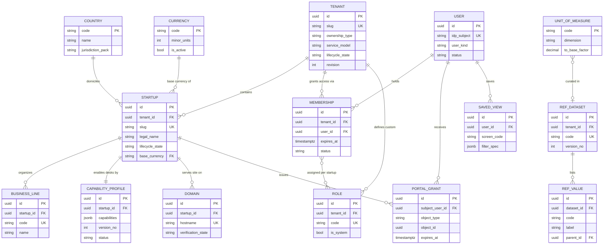
```mermaid
erDiagram
  TENANT ||--o{ STARTUP : "contains"
  TENANT ||--o{ MEMBERSHIP : "grants access via"
  USER ||--o{ MEMBERSHIP : "holds"
  MEMBERSHIP }o--o{ ROLE : "assigned per startup"
  TENANT ||--o{ ROLE : "defines custom"
  STARTUP ||--o{ BUSINESS_LINE : "organizes"
  STARTUP ||--|| CAPABILITY_PROFILE : "enables desks by"
  STARTUP ||--o{ DOMAIN : "serves site on"
  STARTUP ||--o{ PORTAL_GRANT : "issues"
  USER ||--o{ PORTAL_GRANT : "receives"
  USER ||--o{ SAVED_VIEW : "saves"
  REF_DATASET ||--o{ REF_VALUE : "lists"
  COUNTRY ||--o{ STARTUP : "domiciles"
  CURRENCY ||--o{ STARTUP : "base currency of"
  UNIT_OF_MEASURE }o--o| REF_DATASET : "curated in"
  TENANT {
    uuid id PK
    string slug UK
    string ownership_type
    string service_model
    string lifecycle_state
    int revision
  }
  STARTUP {
    uuid id PK
    uuid tenant_id FK
    string slug UK
    string legal_name
    string lifecycle_state
    string base_currency FK
  }
  BUSINESS_LINE {
    uuid id PK
    uuid startup_id FK
    string code UK
    string name
  }
  CAPABILITY_PROFILE {
    uuid id PK
    uuid startup_id FK
    jsonb capabilities
    int version_no
    string status
  }
  DOMAIN {
    uuid id PK
    uuid startup_id FK
    string hostname UK
    string verification_state
  }
  USER {
    uuid id PK
    string idp_subject UK
    string user_kind
    string status
  }
  ROLE {
    uuid id PK
    uuid tenant_id FK
    string code UK
    bool is_system
  }
  MEMBERSHIP {
    uuid id PK
    uuid tenant_id FK
    uuid user_id FK
    timestamptz expires_at
    string status
  }
  PORTAL_GRANT {
    uuid id PK
    uuid subject_user_id FK
    string object_type
    uuid object_id
    timestamptz expires_at
  }
  SAVED_VIEW {
    uuid id PK
    uuid user_id FK
    string screen_code
    jsonb filter_spec
  }
  REF_DATASET {
    uuid id PK
    uuid tenant_id FK
    string code UK
    int version_no
  }
  REF_VALUE {
    uuid id PK
    uuid dataset_id FK
    string code
    string label
    uuid parent_id FK
  }
  CURRENCY {
    string code PK
    int minor_units
    bool is_active
  }
  COUNTRY {
    string code PK
    string name
    string jurisdiction_pack
  }
  UNIT_OF_MEASURE {
    string code PK
    string dimension
    decimal to_base_factor
  }
```

Notes: `USER` is a **product-local mirror** of the reused AppNAI identity (DEC-003, DEC-019); credentials, MFA secrets and recovery data stay in the identity service and are never copied. `MEMBERSHIP` × `ROLE` is resolved through `ten_membership_grant` (role per startup, or tenant-wide when `startup_id` is NULL). Portal users (R16) and SaaS applicants (R17) are `USER` rows with `user_kind` = `external`.

### 3.3.4.2 Catalogue and knowledge (11 entities)

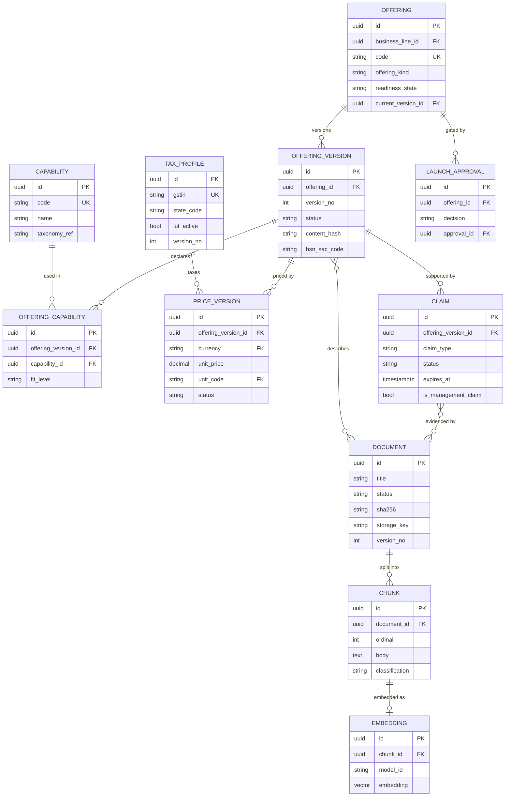
```mermaid
erDiagram
  OFFERING ||--o{ OFFERING_VERSION : "versions"
  OFFERING_VERSION ||--o{ OFFERING_CAPABILITY : "declares"
  CAPABILITY ||--o{ OFFERING_CAPABILITY : "used in"
  OFFERING_VERSION ||--o{ PRICE_VERSION : "priced by"
  OFFERING_VERSION ||--o{ CLAIM : "supported by"
  TAX_PROFILE ||--o{ PRICE_VERSION : "taxes"
  OFFERING ||--o{ LAUNCH_APPROVAL : "gated by"
  DOCUMENT ||--o{ CHUNK : "split into"
  CHUNK ||--o| EMBEDDING : "embedded as"
  DOCUMENT }o--o{ OFFERING_VERSION : "describes"
  CLAIM }o--o{ DOCUMENT : "evidenced by"
  OFFERING {
    uuid id PK
    uuid business_line_id FK
    string code UK
    string offering_kind
    string readiness_state
    uuid current_version_id FK
  }
  OFFERING_VERSION {
    uuid id PK
    uuid offering_id FK
    int version_no
    string status
    string content_hash
    string hsn_sac_code
  }
  CAPABILITY {
    uuid id PK
    string code UK
    string name
    string taxonomy_ref
  }
  OFFERING_CAPABILITY {
    uuid id PK
    uuid offering_version_id FK
    uuid capability_id FK
    string fit_level
  }
  CLAIM {
    uuid id PK
    uuid offering_version_id FK
    string claim_type
    string status
    timestamptz expires_at
    bool is_management_claim
  }
  PRICE_VERSION {
    uuid id PK
    uuid offering_version_id FK
    string currency FK
    decimal unit_price
    string unit_code FK
    string status
  }
  TAX_PROFILE {
    uuid id PK
    string gstin UK
    string state_code
    bool lut_active
    int version_no
  }
  LAUNCH_APPROVAL {
    uuid id PK
    uuid offering_id FK
    string decision
    uuid approval_id FK
  }
  DOCUMENT {
    uuid id PK
    string title
    string status
    string sha256
    string storage_key
    int version_no
  }
  CHUNK {
    uuid id PK
    uuid document_id FK
    int ordinal
    text body
    string classification
  }
  EMBEDDING {
    uuid id PK
    uuid chunk_id FK
    string model_id
    vector embedding
  }
```

### 3.3.4.3 Governance: consent, suppression, policy, privacy, compliance, jurisdiction (13 entities)

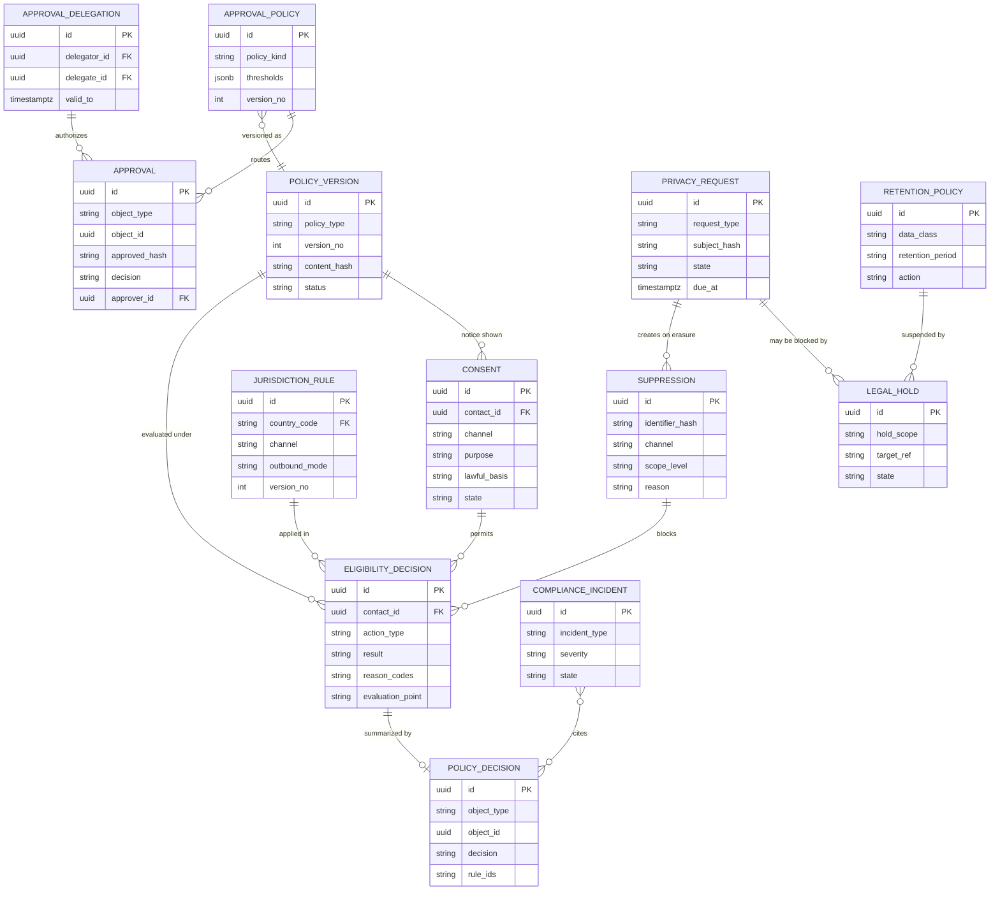
```mermaid
erDiagram
  POLICY_VERSION ||--o{ CONSENT : "notice shown"
  POLICY_VERSION ||--o{ ELIGIBILITY_DECISION : "evaluated under"
  JURISDICTION_RULE ||--o{ ELIGIBILITY_DECISION : "applied in"
  ELIGIBILITY_DECISION ||--o| POLICY_DECISION : "summarized by"
  SUPPRESSION ||--o{ ELIGIBILITY_DECISION : "blocks"
  CONSENT ||--o{ ELIGIBILITY_DECISION : "permits"
  APPROVAL_POLICY ||--o{ APPROVAL : "routes"
  APPROVAL_DELEGATION ||--o{ APPROVAL : "authorizes"
  PRIVACY_REQUEST ||--o{ LEGAL_HOLD : "may be blocked by"
  RETENTION_POLICY ||--o{ LEGAL_HOLD : "suspended by"
  COMPLIANCE_INCIDENT }o--o{ POLICY_DECISION : "cites"
  PRIVACY_REQUEST ||--o{ SUPPRESSION : "creates on erasure"
  APPROVAL_POLICY }o--|| POLICY_VERSION : "versioned as"
  CONSENT {
    uuid id PK
    uuid contact_id FK
    string channel
    string purpose
    string lawful_basis
    string state
  }
  SUPPRESSION {
    uuid id PK
    string identifier_hash
    string channel
    string scope_level
    string reason
  }
  POLICY_VERSION {
    uuid id PK
    string policy_type
    int version_no
    string content_hash
    string status
  }
  JURISDICTION_RULE {
    uuid id PK
    string country_code FK
    string channel
    string outbound_mode
    int version_no
  }
  ELIGIBILITY_DECISION {
    uuid id PK
    uuid contact_id FK
    string action_type
    string result
    string reason_codes
    string evaluation_point
  }
  POLICY_DECISION {
    uuid id PK
    string object_type
    uuid object_id
    string decision
    string rule_ids
  }
  APPROVAL_POLICY {
    uuid id PK
    string policy_kind
    jsonb thresholds
    int version_no
  }
  APPROVAL {
    uuid id PK
    string object_type
    uuid object_id
    string approved_hash
    string decision
    uuid approver_id FK
  }
  APPROVAL_DELEGATION {
    uuid id PK
    uuid delegator_id FK
    uuid delegate_id FK
    timestamptz valid_to
  }
  PRIVACY_REQUEST {
    uuid id PK
    string request_type
    string subject_hash
    string state
    timestamptz due_at
  }
  RETENTION_POLICY {
    uuid id PK
    string data_class
    string retention_period
    string action
  }
  LEGAL_HOLD {
    uuid id PK
    string hold_scope
    string target_ref
    string state
  }
  COMPLIANCE_INCIDENT {
    uuid id PK
    string incident_type
    string severity
    string state
  }
```

Notes: `CONSENT.contact_id` and `ELIGIBILITY_DECISION.contact_id` reference `intel_contact` (Intelligence). `APPROVAL` is polymorphic (`object_type`, `object_id`, `object_revision`, `approved_hash`); referential integrity is enforced by a trigger that checks the object exists in the same scope (§3.3.5.8) because PostgreSQL has no polymorphic FK.

### 3.3.4.4 Integrations and AI: prompt, model run, eval, cost ledger, budget (13 entities)

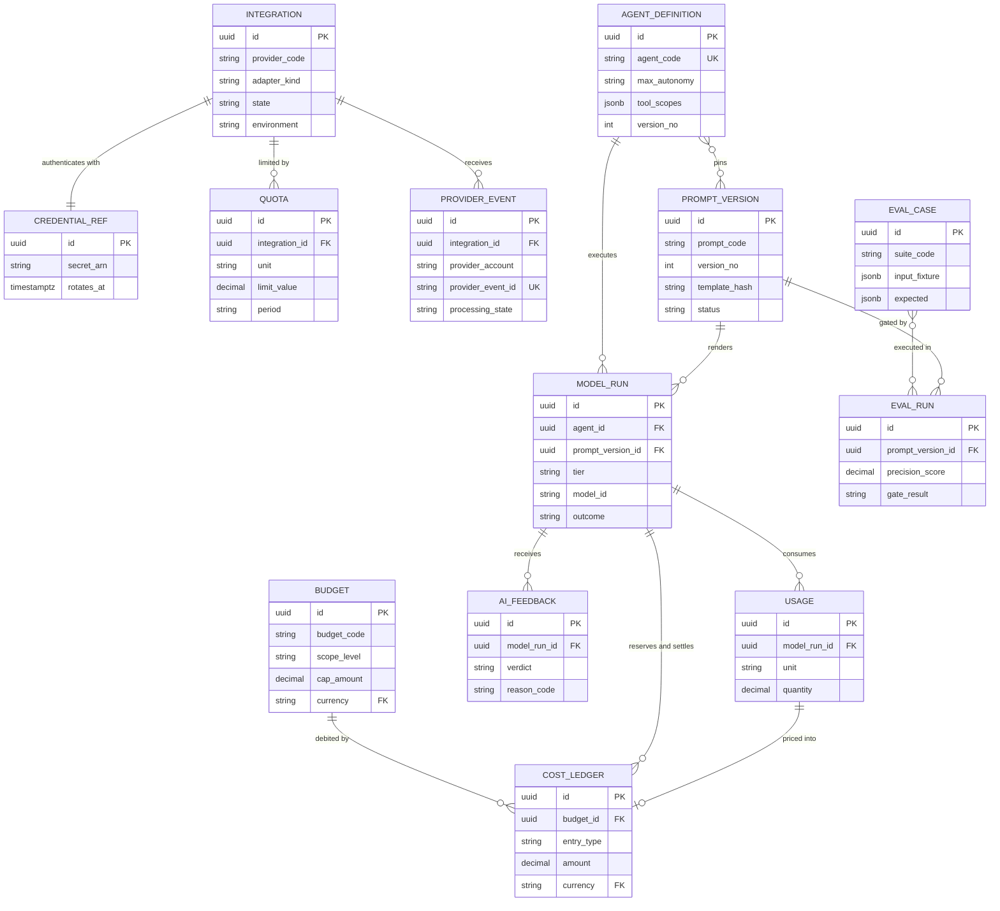
```mermaid
erDiagram
  INTEGRATION ||--|| CREDENTIAL_REF : "authenticates with"
  INTEGRATION ||--o{ QUOTA : "limited by"
  INTEGRATION ||--o{ PROVIDER_EVENT : "receives"
  AGENT_DEFINITION ||--o{ MODEL_RUN : "executes"
  PROMPT_VERSION ||--o{ MODEL_RUN : "renders"
  MODEL_RUN ||--o{ USAGE : "consumes"
  MODEL_RUN ||--o{ AI_FEEDBACK : "receives"
  BUDGET ||--o{ COST_LEDGER : "debited by"
  MODEL_RUN ||--o{ COST_LEDGER : "reserves and settles"
  USAGE ||--o| COST_LEDGER : "priced into"
  EVAL_CASE }o--o{ EVAL_RUN : "executed in"
  PROMPT_VERSION ||--o{ EVAL_RUN : "gated by"
  AGENT_DEFINITION }o--o{ PROMPT_VERSION : "pins"
  INTEGRATION {
    uuid id PK
    string provider_code
    string adapter_kind
    string state
    string environment
  }
  CREDENTIAL_REF {
    uuid id PK
    string secret_arn
    timestamptz rotates_at
  }
  QUOTA {
    uuid id PK
    uuid integration_id FK
    string unit
    decimal limit_value
    string period
  }
  PROVIDER_EVENT {
    uuid id PK
    uuid integration_id FK
    string provider_account
    string provider_event_id UK
    string processing_state
  }
  AGENT_DEFINITION {
    uuid id PK
    string agent_code UK
    string max_autonomy
    jsonb tool_scopes
    int version_no
  }
  PROMPT_VERSION {
    uuid id PK
    string prompt_code
    int version_no
    string template_hash
    string status
  }
  MODEL_RUN {
    uuid id PK
    uuid agent_id FK
    uuid prompt_version_id FK
    string tier
    string model_id
    string outcome
  }
  EVAL_CASE {
    uuid id PK
    string suite_code
    jsonb input_fixture
    jsonb expected
  }
  EVAL_RUN {
    uuid id PK
    uuid prompt_version_id FK
    decimal precision_score
    string gate_result
  }
  AI_FEEDBACK {
    uuid id PK
    uuid model_run_id FK
    string verdict
    string reason_code
  }
  USAGE {
    uuid id PK
    uuid model_run_id FK
    string unit
    decimal quantity
  }
  COST_LEDGER {
    uuid id PK
    uuid budget_id FK
    string entry_type
    decimal amount
    string currency FK
  }
  BUDGET {
    uuid id PK
    string budget_code
    string scope_level
    decimal cap_amount
    string currency FK
  }
```

### 3.3.4.5 Intelligence (part A): sources, research, evidence, organizations, signals, needs (17 entities)

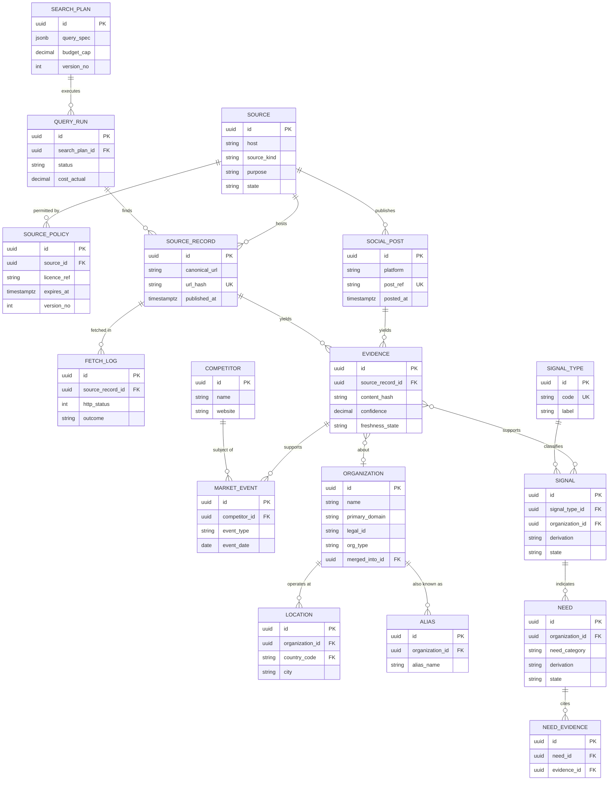
```mermaid
erDiagram
  SOURCE ||--o{ SOURCE_POLICY : "permitted by"
  SEARCH_PLAN ||--o{ QUERY_RUN : "executes"
  QUERY_RUN ||--o{ SOURCE_RECORD : "finds"
  SOURCE ||--o{ SOURCE_RECORD : "hosts"
  SOURCE_RECORD ||--o{ FETCH_LOG : "fetched in"
  SOURCE_RECORD ||--o{ EVIDENCE : "yields"
  SOURCE ||--o{ SOCIAL_POST : "publishes"
  SOCIAL_POST ||--o{ EVIDENCE : "yields"
  COMPETITOR ||--o{ MARKET_EVENT : "subject of"
  EVIDENCE ||--o{ MARKET_EVENT : "supports"
  ORGANIZATION ||--o{ LOCATION : "operates at"
  ORGANIZATION ||--o{ ALIAS : "also known as"
  EVIDENCE }o--o| ORGANIZATION : "about"
  SIGNAL_TYPE ||--o{ SIGNAL : "classifies"
  EVIDENCE }o--o{ SIGNAL : "supports"
  SIGNAL ||--o{ NEED : "indicates"
  NEED ||--o{ NEED_EVIDENCE : "cites"
  SOURCE {
    uuid id PK
    string host
    string source_kind
    string purpose
    string state
  }
  SOURCE_POLICY {
    uuid id PK
    uuid source_id FK
    string licence_ref
    timestamptz expires_at
    int version_no
  }
  SEARCH_PLAN {
    uuid id PK
    jsonb query_spec
    decimal budget_cap
    int version_no
  }
  QUERY_RUN {
    uuid id PK
    uuid search_plan_id FK
    string status
    decimal cost_actual
  }
  SOURCE_RECORD {
    uuid id PK
    string canonical_url
    string url_hash UK
    timestamptz published_at
  }
  FETCH_LOG {
    uuid id PK
    uuid source_record_id FK
    int http_status
    string outcome
  }
  EVIDENCE {
    uuid id PK
    uuid source_record_id FK
    string content_hash
    decimal confidence
    string freshness_state
  }
  SOCIAL_POST {
    uuid id PK
    string platform
    string post_ref UK
    timestamptz posted_at
  }
  COMPETITOR {
    uuid id PK
    string name
    string website
  }
  MARKET_EVENT {
    uuid id PK
    uuid competitor_id FK
    string event_type
    date event_date
  }
  ORGANIZATION {
    uuid id PK
    string name
    string primary_domain
    string legal_id
    string org_type
    uuid merged_into_id FK
  }
  LOCATION {
    uuid id PK
    uuid organization_id FK
    string country_code FK
    string city
  }
  ALIAS {
    uuid id PK
    uuid organization_id FK
    string alias_name
  }
  SIGNAL_TYPE {
    uuid id PK
    string code UK
    string label
  }
  SIGNAL {
    uuid id PK
    uuid signal_type_id FK
    uuid organization_id FK
    string derivation
    string state
  }
  NEED {
    uuid id PK
    uuid organization_id FK
    string need_category
    string derivation
    string state
  }
  NEED_EVIDENCE {
    uuid id PK
    uuid need_id FK
    uuid evidence_id FK
  }
```

### 3.3.4.6 Intelligence (part B): matching, scoring, opportunity, contact, verification, review (9 entities + 3 anchors)

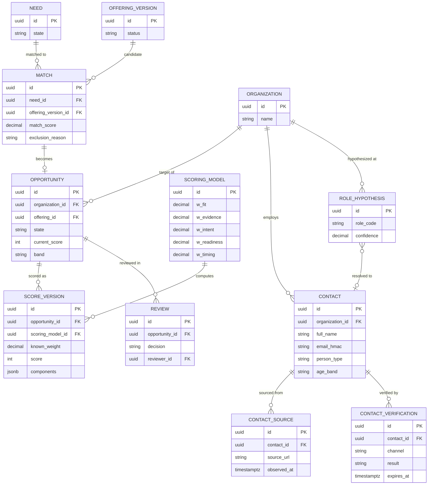
```mermaid
erDiagram
  NEED ||--o{ MATCH : "matched to"
  OFFERING_VERSION ||--o{ MATCH : "candidate"
  MATCH ||--o| OPPORTUNITY : "becomes"
  ORGANIZATION ||--o{ OPPORTUNITY : "target of"
  SCORING_MODEL ||--o{ SCORE_VERSION : "computes"
  OPPORTUNITY ||--o{ SCORE_VERSION : "scored as"
  ORGANIZATION ||--o{ CONTACT : "employs"
  ORGANIZATION ||--o{ ROLE_HYPOTHESIS : "hypothesized at"
  ROLE_HYPOTHESIS }o--o| CONTACT : "resolved to"
  CONTACT ||--o{ CONTACT_SOURCE : "sourced from"
  CONTACT ||--o{ CONTACT_VERIFICATION : "verified by"
  OPPORTUNITY ||--o{ REVIEW : "reviewed in"
  NEED {
    uuid id PK
    string state
  }
  ORGANIZATION {
    uuid id PK
    string name
  }
  OFFERING_VERSION {
    uuid id PK
    string status
  }
  MATCH {
    uuid id PK
    uuid need_id FK
    uuid offering_version_id FK
    decimal match_score
    string exclusion_reason
  }
  SCORING_MODEL {
    uuid id PK
    decimal w_fit
    decimal w_evidence
    decimal w_intent
    decimal w_readiness
    decimal w_timing
  }
  OPPORTUNITY {
    uuid id PK
    uuid organization_id FK
    uuid offering_id FK
    string state
    int current_score
    string band
  }
  SCORE_VERSION {
    uuid id PK
    uuid opportunity_id FK
    uuid scoring_model_id FK
    decimal known_weight
    int score
    jsonb components
  }
  CONTACT {
    uuid id PK
    uuid organization_id FK
    string full_name
    string email_hmac
    string person_type
    string age_band
  }
  ROLE_HYPOTHESIS {
    uuid id PK
    string role_code
    decimal confidence
  }
  CONTACT_SOURCE {
    uuid id PK
    uuid contact_id FK
    string source_url
    timestamptz observed_at
  }
  CONTACT_VERIFICATION {
    uuid id PK
    uuid contact_id FK
    string channel
    string result
    timestamptz expires_at
  }
  REVIEW {
    uuid id PK
    uuid opportunity_id FK
    string decision
    uuid reviewer_id FK
  }
```

Notes: `NEED`, `ORGANIZATION` (Intelligence A) and `OFFERING_VERSION` (Catalogue) are anchors drawn for context. `OPPORTUNITY` is unique per organization × offering × startup (BRL-SCR-06).

### 3.3.4.7 CRM: lead, form, deal, stage, activity (10 entities)

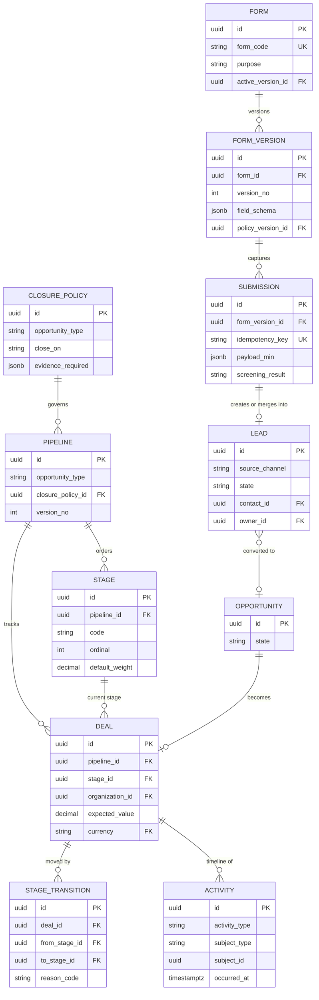
```mermaid
erDiagram
  FORM ||--o{ FORM_VERSION : "versions"
  FORM_VERSION ||--o{ SUBMISSION : "captures"
  SUBMISSION ||--o| LEAD : "creates or merges into"
  LEAD }o--o| OPPORTUNITY : "converted to"
  PIPELINE ||--o{ STAGE : "orders"
  PIPELINE ||--o{ DEAL : "tracks"
  CLOSURE_POLICY ||--o{ PIPELINE : "governs"
  STAGE ||--o{ DEAL : "current stage"
  DEAL ||--o{ STAGE_TRANSITION : "moved by"
  DEAL ||--o{ ACTIVITY : "timeline of"
  OPPORTUNITY ||--o| DEAL : "becomes"
  FORM {
    uuid id PK
    string form_code UK
    string purpose
    uuid active_version_id FK
  }
  FORM_VERSION {
    uuid id PK
    uuid form_id FK
    int version_no
    jsonb field_schema
    uuid policy_version_id FK
  }
  SUBMISSION {
    uuid id PK
    uuid form_version_id FK
    string idempotency_key UK
    jsonb payload_min
    string screening_result
  }
  LEAD {
    uuid id PK
    string source_channel
    string state
    uuid contact_id FK
    uuid owner_id FK
  }
  OPPORTUNITY {
    uuid id PK
    string state
  }
  PIPELINE {
    uuid id PK
    string opportunity_type
    uuid closure_policy_id FK
    int version_no
  }
  STAGE {
    uuid id PK
    uuid pipeline_id FK
    string code
    int ordinal
    decimal default_weight
  }
  CLOSURE_POLICY {
    uuid id PK
    string opportunity_type
    string close_on
    jsonb evidence_required
  }
  DEAL {
    uuid id PK
    uuid pipeline_id FK
    uuid stage_id FK
    uuid organization_id FK
    decimal expected_value
    string currency FK
  }
  STAGE_TRANSITION {
    uuid id PK
    uuid deal_id FK
    uuid from_stage_id FK
    uuid to_stage_id FK
    string reason_code
  }
  ACTIVITY {
    uuid id PK
    string activity_type
    string subject_type
    uuid subject_id
    timestamptz occurred_at
  }
```

### 3.3.4.8 Engagement: thread, message, delivery event, sequence, enrolment, meeting (16 entities)

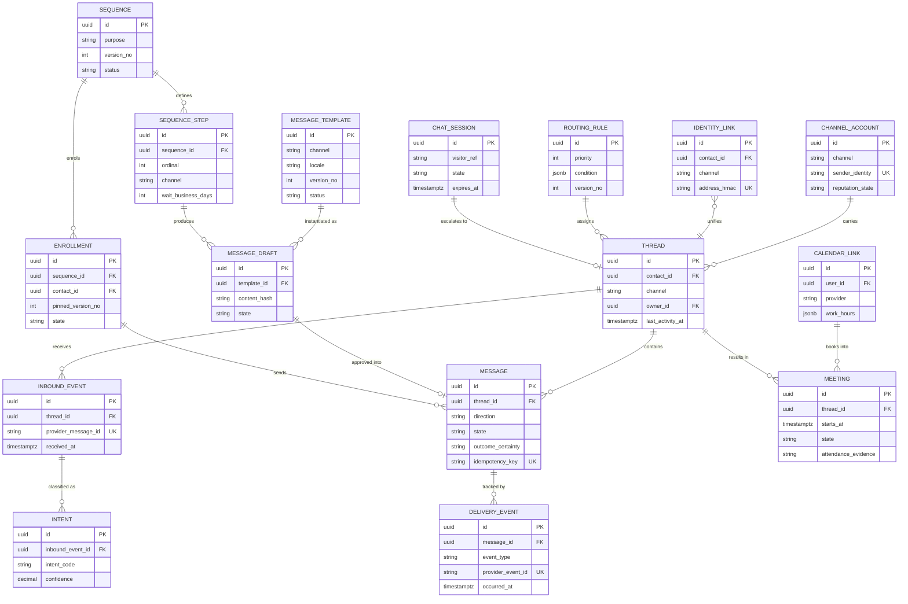
```mermaid
erDiagram
  CHANNEL_ACCOUNT ||--o{ THREAD : "carries"
  THREAD ||--o{ MESSAGE : "contains"
  MESSAGE_TEMPLATE ||--o{ MESSAGE_DRAFT : "instantiated as"
  MESSAGE_DRAFT ||--o| MESSAGE : "approved into"
  MESSAGE ||--o{ DELIVERY_EVENT : "tracked by"
  THREAD ||--o{ INBOUND_EVENT : "receives"
  INBOUND_EVENT ||--o{ INTENT : "classified as"
  IDENTITY_LINK }o--|| THREAD : "unifies"
  ROUTING_RULE ||--o{ THREAD : "assigns"
  CHAT_SESSION ||--o| THREAD : "escalates to"
  SEQUENCE ||--o{ SEQUENCE_STEP : "defines"
  SEQUENCE ||--o{ ENROLLMENT : "enrols"
  SEQUENCE_STEP ||--o{ MESSAGE_DRAFT : "produces"
  ENROLLMENT ||--o{ MESSAGE : "sends"
  CALENDAR_LINK ||--o{ MEETING : "books into"
  THREAD ||--o{ MEETING : "results in"
  CHANNEL_ACCOUNT {
    uuid id PK
    string channel
    string sender_identity UK
    string reputation_state
  }
  MESSAGE_TEMPLATE {
    uuid id PK
    string channel
    string locale
    int version_no
    string status
  }
  MESSAGE_DRAFT {
    uuid id PK
    uuid template_id FK
    string content_hash
    string state
  }
  THREAD {
    uuid id PK
    uuid contact_id FK
    string channel
    uuid owner_id FK
    timestamptz last_activity_at
  }
  MESSAGE {
    uuid id PK
    uuid thread_id FK
    string direction
    string state
    string outcome_certainty
    string idempotency_key UK
  }
  DELIVERY_EVENT {
    uuid id PK
    uuid message_id FK
    string event_type
    string provider_event_id UK
    timestamptz occurred_at
  }
  INBOUND_EVENT {
    uuid id PK
    uuid thread_id FK
    string provider_message_id UK
    timestamptz received_at
  }
  INTENT {
    uuid id PK
    uuid inbound_event_id FK
    string intent_code
    decimal confidence
  }
  IDENTITY_LINK {
    uuid id PK
    uuid contact_id FK
    string channel
    string address_hmac UK
  }
  ROUTING_RULE {
    uuid id PK
    int priority
    jsonb condition
    int version_no
  }
  CHAT_SESSION {
    uuid id PK
    string visitor_ref
    string state
    timestamptz expires_at
  }
  SEQUENCE {
    uuid id PK
    string purpose
    int version_no
    string status
  }
  SEQUENCE_STEP {
    uuid id PK
    uuid sequence_id FK
    int ordinal
    string channel
    int wait_business_days
  }
  ENROLLMENT {
    uuid id PK
    uuid sequence_id FK
    uuid contact_id FK
    int pinned_version_no
    string state
  }
  MEETING {
    uuid id PK
    uuid thread_id FK
    timestamptz starts_at
    string state
    string attendance_evidence
  }
  CALENDAR_LINK {
    uuid id PK
    uuid user_id FK
    string provider
    jsonb work_hours
  }
```

### 3.3.4.9 Marketing (part A): content, claims use, publication, landing pages, SEO (10 entities + 1 anchor)

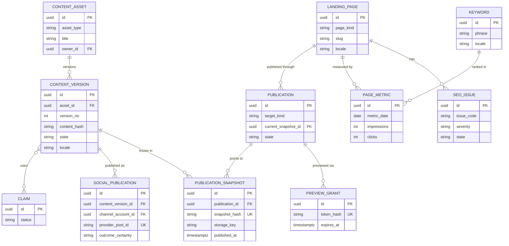
```mermaid
erDiagram
  CONTENT_ASSET ||--o{ CONTENT_VERSION : "versions"
  CONTENT_VERSION }o--o{ CLAIM : "uses"
  CONTENT_VERSION ||--o{ SOCIAL_PUBLICATION : "published as"
  LANDING_PAGE ||--o{ PUBLICATION : "published through"
  PUBLICATION ||--o{ PUBLICATION_SNAPSHOT : "points to"
  CONTENT_VERSION ||--o{ PUBLICATION_SNAPSHOT : "frozen in"
  PUBLICATION ||--o{ PREVIEW_GRANT : "previewed via"
  LANDING_PAGE ||--o{ PAGE_METRIC : "measured by"
  KEYWORD ||--o{ PAGE_METRIC : "ranked in"
  LANDING_PAGE ||--o{ SEO_ISSUE : "has"
  CONTENT_ASSET {
    uuid id PK
    string asset_type
    string title
    uuid owner_id FK
  }
  CONTENT_VERSION {
    uuid id PK
    uuid asset_id FK
    int version_no
    string content_hash
    string state
    string locale
  }
  CLAIM {
    uuid id PK
    string status
  }
  SOCIAL_PUBLICATION {
    uuid id PK
    uuid content_version_id FK
    uuid channel_account_id FK
    string provider_post_id UK
    string outcome_certainty
  }
  LANDING_PAGE {
    uuid id PK
    string page_kind
    string slug
    string locale
  }
  PUBLICATION {
    uuid id PK
    string target_kind
    uuid current_snapshot_id FK
    string state
  }
  PUBLICATION_SNAPSHOT {
    uuid id PK
    uuid publication_id FK
    string snapshot_hash UK
    string storage_key
    timestamptz published_at
  }
  PREVIEW_GRANT {
    uuid id PK
    string token_hash UK
    timestamptz expires_at
  }
  KEYWORD {
    uuid id PK
    string phrase
    string locale
  }
  PAGE_METRIC {
    uuid id PK
    date metric_date
    int impressions
    int clicks
  }
  SEO_ISSUE {
    uuid id PK
    string issue_code
    string severity
    string state
  }
```

### 3.3.4.10 Marketing (part B): campaign, audience, ad, event, referral, attribution (10 entities)

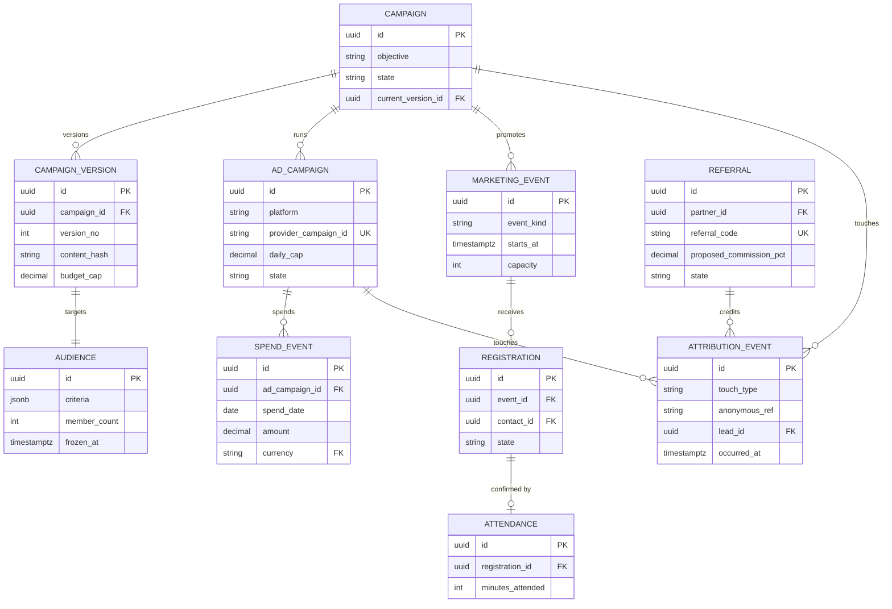
```mermaid
erDiagram
  CAMPAIGN ||--o{ CAMPAIGN_VERSION : "versions"
  CAMPAIGN_VERSION ||--|| AUDIENCE : "targets"
  CAMPAIGN ||--o{ AD_CAMPAIGN : "runs"
  AD_CAMPAIGN ||--o{ SPEND_EVENT : "spends"
  CAMPAIGN ||--o{ MARKETING_EVENT : "promotes"
  MARKETING_EVENT ||--o{ REGISTRATION : "receives"
  REGISTRATION ||--o| ATTENDANCE : "confirmed by"
  REFERRAL ||--o{ ATTRIBUTION_EVENT : "credits"
  CAMPAIGN ||--o{ ATTRIBUTION_EVENT : "touches"
  AD_CAMPAIGN ||--o{ ATTRIBUTION_EVENT : "touches"
  CAMPAIGN {
    uuid id PK
    string objective
    string state
    uuid current_version_id FK
  }
  CAMPAIGN_VERSION {
    uuid id PK
    uuid campaign_id FK
    int version_no
    string content_hash
    decimal budget_cap
  }
  AUDIENCE {
    uuid id PK
    jsonb criteria
    int member_count
    timestamptz frozen_at
  }
  AD_CAMPAIGN {
    uuid id PK
    string platform
    string provider_campaign_id UK
    decimal daily_cap
    string state
  }
  SPEND_EVENT {
    uuid id PK
    uuid ad_campaign_id FK
    date spend_date
    decimal amount
    string currency FK
  }
  MARKETING_EVENT {
    uuid id PK
    string event_kind
    timestamptz starts_at
    int capacity
  }
  REGISTRATION {
    uuid id PK
    uuid event_id FK
    uuid contact_id FK
    string state
  }
  ATTENDANCE {
    uuid id PK
    uuid registration_id FK
    int minutes_attended
  }
  REFERRAL {
    uuid id PK
    uuid partner_id FK
    string referral_code UK
    decimal proposed_commission_pct
    string state
  }
  ATTRIBUTION_EVENT {
    uuid id PK
    string touch_type
    string anonymous_ref
    uuid lead_id FK
    timestamptz occurred_at
  }
```

### 3.3.4.11 Commerce (part A): proposal, quote, negotiation, contract, signature, bid (10 entities + 1 anchor)

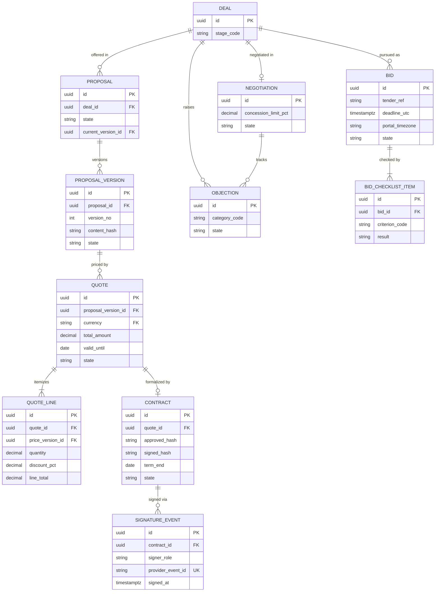
```mermaid
erDiagram
  DEAL ||--o{ PROPOSAL : "offered in"
  PROPOSAL ||--o{ PROPOSAL_VERSION : "versions"
  PROPOSAL_VERSION ||--o{ QUOTE : "priced by"
  QUOTE ||--|{ QUOTE_LINE : "itemizes"
  DEAL ||--o{ OBJECTION : "raises"
  DEAL ||--o| NEGOTIATION : "negotiated in"
  NEGOTIATION ||--o{ OBJECTION : "tracks"
  QUOTE ||--o| CONTRACT : "formalized by"
  CONTRACT ||--o{ SIGNATURE_EVENT : "signed via"
  DEAL ||--o{ BID : "pursued as"
  BID ||--|{ BID_CHECKLIST_ITEM : "checked by"
  DEAL {
    uuid id PK
    string stage_code
  }
  PROPOSAL {
    uuid id PK
    uuid deal_id FK
    string state
    uuid current_version_id FK
  }
  PROPOSAL_VERSION {
    uuid id PK
    uuid proposal_id FK
    int version_no
    string content_hash
    string state
  }
  QUOTE {
    uuid id PK
    uuid proposal_version_id FK
    string currency FK
    decimal total_amount
    date valid_until
    string state
  }
  QUOTE_LINE {
    uuid id PK
    uuid quote_id FK
    uuid price_version_id FK
    decimal quantity
    decimal discount_pct
    decimal line_total
  }
  OBJECTION {
    uuid id PK
    string category_code
    string state
  }
  NEGOTIATION {
    uuid id PK
    decimal concession_limit_pct
    string state
  }
  CONTRACT {
    uuid id PK
    uuid quote_id FK
    string approved_hash
    string signed_hash
    date term_end
    string state
  }
  SIGNATURE_EVENT {
    uuid id PK
    uuid contract_id FK
    string signer_role
    string provider_event_id UK
    timestamptz signed_at
  }
  BID {
    uuid id PK
    string tender_ref
    timestamptz deadline_utc
    string portal_timezone
    string state
  }
  BID_CHECKLIST_ITEM {
    uuid id PK
    uuid bid_id FK
    string criterion_code
    string result
  }
```

### 3.3.4.12 Commerce (part B): order, fulfilment, inventory, invoice, payment, ledgers (12 entities)

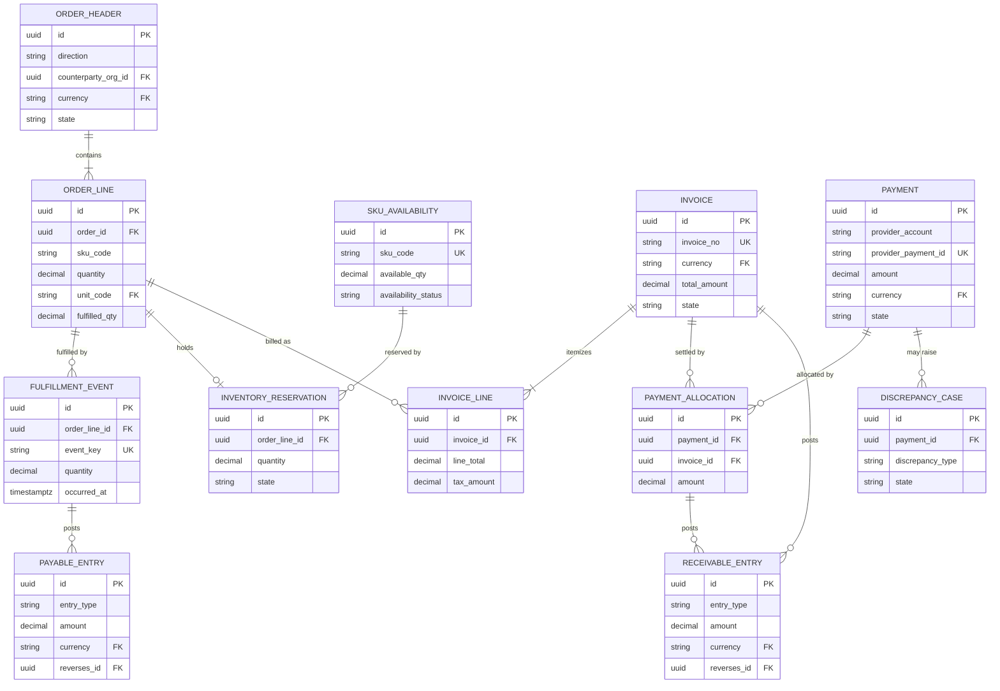
```mermaid
erDiagram
  ORDER_HEADER ||--|{ ORDER_LINE : "contains"
  ORDER_LINE ||--o{ FULFILLMENT_EVENT : "fulfilled by"
  SKU_AVAILABILITY ||--o{ INVENTORY_RESERVATION : "reserved by"
  ORDER_LINE ||--o| INVENTORY_RESERVATION : "holds"
  INVOICE ||--|{ INVOICE_LINE : "itemizes"
  ORDER_LINE ||--o{ INVOICE_LINE : "billed as"
  PAYMENT ||--o{ PAYMENT_ALLOCATION : "allocated by"
  INVOICE ||--o{ PAYMENT_ALLOCATION : "settled by"
  PAYMENT ||--o{ DISCREPANCY_CASE : "may raise"
  INVOICE ||--o{ RECEIVABLE_ENTRY : "posts"
  PAYMENT_ALLOCATION ||--o{ RECEIVABLE_ENTRY : "posts"
  FULFILLMENT_EVENT ||--o{ PAYABLE_ENTRY : "posts"
  ORDER_HEADER {
    uuid id PK
    string direction
    uuid counterparty_org_id FK
    string currency FK
    string state
  }
  ORDER_LINE {
    uuid id PK
    uuid order_id FK
    string sku_code
    decimal quantity
    string unit_code FK
    decimal fulfilled_qty
  }
  FULFILLMENT_EVENT {
    uuid id PK
    uuid order_line_id FK
    string event_key UK
    decimal quantity
    timestamptz occurred_at
  }
  SKU_AVAILABILITY {
    uuid id PK
    string sku_code UK
    decimal available_qty
    string availability_status
  }
  INVENTORY_RESERVATION {
    uuid id PK
    uuid order_line_id FK
    decimal quantity
    string state
  }
  INVOICE {
    uuid id PK
    string invoice_no UK
    string currency FK
    decimal total_amount
    string state
  }
  INVOICE_LINE {
    uuid id PK
    uuid invoice_id FK
    decimal line_total
    decimal tax_amount
  }
  PAYMENT {
    uuid id PK
    string provider_account
    string provider_payment_id UK
    decimal amount
    string currency FK
    string state
  }
  PAYMENT_ALLOCATION {
    uuid id PK
    uuid payment_id FK
    uuid invoice_id FK
    decimal amount
  }
  DISCREPANCY_CASE {
    uuid id PK
    uuid payment_id FK
    string discrepancy_type
    string state
  }
  RECEIVABLE_ENTRY {
    uuid id PK
    string entry_type
    decimal amount
    string currency FK
    uuid reverses_id FK
  }
  PAYABLE_ENTRY {
    uuid id PK
    string entry_type
    decimal amount
    string currency FK
    uuid reverses_id FK
  }
```

Note: the logical entity **Order** is drawn as `ORDER_HEADER` because `ORDER` is a reserved word in SQL and in the diagram grammar; the physical table is `com_order`.

### 3.3.4.13 Lifecycle: onboarding, task, handoff, renewal, partner, pilot, deployment, feedback, outcome (12 entities)

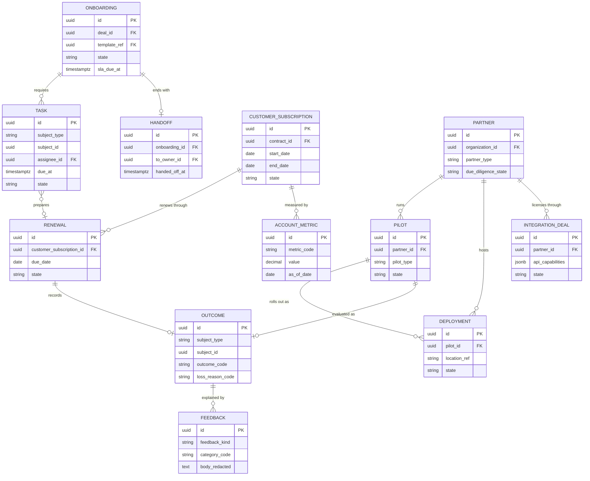
```mermaid
erDiagram
  ONBOARDING ||--o{ TASK : "requires"
  ONBOARDING ||--o| HANDOFF : "ends with"
  CUSTOMER_SUBSCRIPTION ||--o{ RENEWAL : "renews through"
  CUSTOMER_SUBSCRIPTION ||--o{ ACCOUNT_METRIC : "measured by"
  PARTNER ||--o{ PILOT : "runs"
  PILOT ||--o{ DEPLOYMENT : "rolls out as"
  PARTNER ||--o{ DEPLOYMENT : "hosts"
  PARTNER ||--o{ INTEGRATION_DEAL : "licenses through"
  OUTCOME ||--o{ FEEDBACK : "explained by"
  RENEWAL ||--o| OUTCOME : "records"
  PILOT ||--o| OUTCOME : "evaluated as"
  TASK }o--o| RENEWAL : "prepares"
  ONBOARDING {
    uuid id PK
    uuid deal_id FK
    uuid template_ref FK
    string state
    timestamptz sla_due_at
  }
  TASK {
    uuid id PK
    string subject_type
    uuid subject_id
    uuid assignee_id FK
    timestamptz due_at
    string state
  }
  HANDOFF {
    uuid id PK
    uuid onboarding_id FK
    uuid to_owner_id FK
    timestamptz handed_off_at
  }
  RENEWAL {
    uuid id PK
    uuid customer_subscription_id FK
    date due_date
    string state
  }
  CUSTOMER_SUBSCRIPTION {
    uuid id PK
    uuid contract_id FK
    date start_date
    date end_date
    string state
  }
  ACCOUNT_METRIC {
    uuid id PK
    string metric_code
    decimal value
    date as_of_date
  }
  PARTNER {
    uuid id PK
    uuid organization_id FK
    string partner_type
    string due_diligence_state
  }
  PILOT {
    uuid id PK
    uuid partner_id FK
    string pilot_type
    string state
  }
  DEPLOYMENT {
    uuid id PK
    uuid pilot_id FK
    string location_ref
    string state
  }
  INTEGRATION_DEAL {
    uuid id PK
    uuid partner_id FK
    jsonb api_capabilities
    string state
  }
  FEEDBACK {
    uuid id PK
    string feedback_kind
    string category_code
    text body_redacted
  }
  OUTCOME {
    uuid id PK
    string subject_type
    uuid subject_id
    string outcome_code
    string loss_reason_code
  }
```

### 3.3.4.14 Automation: workflow, revision, trigger, run, step run, plan, conflict case, templates, configuration (10 entities)

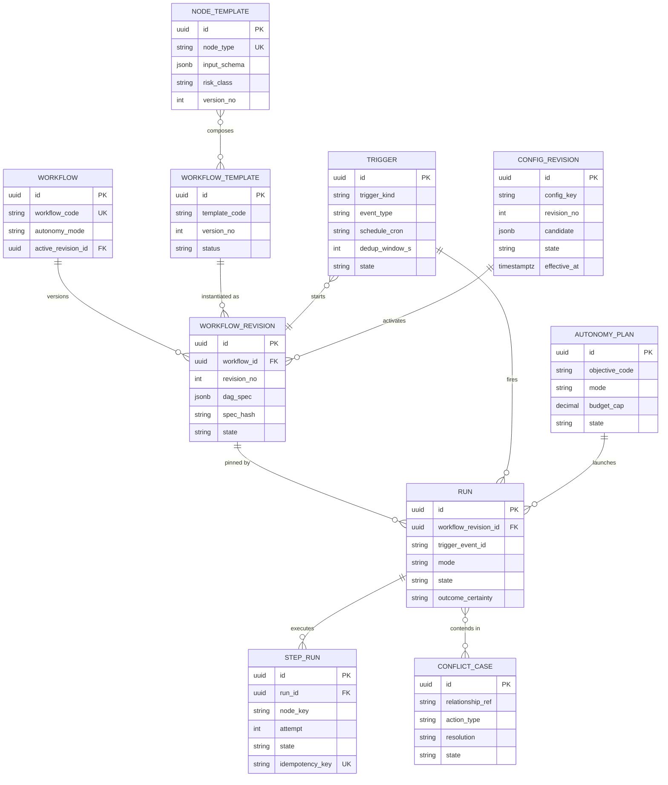
```mermaid
erDiagram
  WORKFLOW ||--o{ WORKFLOW_REVISION : "versions"
  WORKFLOW_TEMPLATE ||--o{ WORKFLOW_REVISION : "instantiated as"
  NODE_TEMPLATE }o--o{ WORKFLOW_TEMPLATE : "composes"
  TRIGGER }o--|| WORKFLOW_REVISION : "starts"
  WORKFLOW_REVISION ||--o{ RUN : "pinned by"
  TRIGGER ||--o{ RUN : "fires"
  RUN ||--o{ STEP_RUN : "executes"
  AUTONOMY_PLAN ||--o{ RUN : "launches"
  RUN }o--o{ CONFLICT_CASE : "contends in"
  CONFIG_REVISION ||--o{ WORKFLOW_REVISION : "activates"
  WORKFLOW {
    uuid id PK
    string workflow_code UK
    string autonomy_mode
    uuid active_revision_id FK
  }
  WORKFLOW_REVISION {
    uuid id PK
    uuid workflow_id FK
    int revision_no
    jsonb dag_spec
    string spec_hash
    string state
  }
  TRIGGER {
    uuid id PK
    string trigger_kind
    string event_type
    string schedule_cron
    int dedup_window_s
    string state
  }
  RUN {
    uuid id PK
    uuid workflow_revision_id FK
    string trigger_event_id
    string mode
    string state
    string outcome_certainty
  }
  STEP_RUN {
    uuid id PK
    uuid run_id FK
    string node_key
    int attempt
    string state
    string idempotency_key UK
  }
  AUTONOMY_PLAN {
    uuid id PK
    string objective_code
    string mode
    decimal budget_cap
    string state
  }
  CONFLICT_CASE {
    uuid id PK
    string relationship_ref
    string action_type
    string resolution
    string state
  }
  NODE_TEMPLATE {
    uuid id PK
    string node_type UK
    jsonb input_schema
    string risk_class
    int version_no
  }
  WORKFLOW_TEMPLATE {
    uuid id PK
    string template_code
    int version_no
    string status
  }
  CONFIG_REVISION {
    uuid id PK
    string config_key
    int revision_no
    jsonb candidate
    string state
    timestamptz effective_at
  }
```

### 3.3.4.15 Platform events and operations: outbox, domain event, idempotency, audit, jobs, notifications, incidents, releases (10 entities)

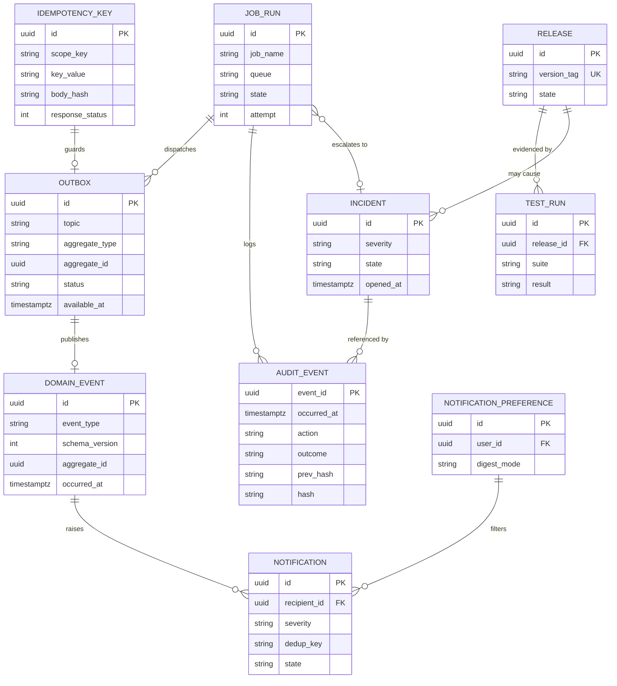
```mermaid
erDiagram
  OUTBOX ||--o| DOMAIN_EVENT : "publishes"
  DOMAIN_EVENT ||--o{ NOTIFICATION : "raises"
  IDEMPOTENCY_KEY ||--o| OUTBOX : "guards"
  JOB_RUN ||--o{ OUTBOX : "dispatches"
  JOB_RUN ||--o{ AUDIT_EVENT : "logs"
  NOTIFICATION_PREFERENCE ||--o{ NOTIFICATION : "filters"
  INCIDENT ||--o{ AUDIT_EVENT : "referenced by"
  RELEASE ||--o{ TEST_RUN : "evidenced by"
  RELEASE ||--o{ INCIDENT : "may cause"
  JOB_RUN }o--o| INCIDENT : "escalates to"
  OUTBOX {
    uuid id PK
    string topic
    string aggregate_type
    uuid aggregate_id
    string status
    timestamptz available_at
  }
  DOMAIN_EVENT {
    uuid id PK
    string event_type
    int schema_version
    uuid aggregate_id
    timestamptz occurred_at
  }
  IDEMPOTENCY_KEY {
    uuid id PK
    string scope_key
    string key_value
    string body_hash
    int response_status
  }
  AUDIT_EVENT {
    uuid event_id PK
    timestamptz occurred_at
    string action
    string outcome
    string prev_hash
    string hash
  }
  JOB_RUN {
    uuid id PK
    string job_name
    string queue
    string state
    int attempt
  }
  NOTIFICATION {
    uuid id PK
    uuid recipient_id FK
    string severity
    string dedup_key
    string state
  }
  NOTIFICATION_PREFERENCE {
    uuid id PK
    uuid user_id FK
    string digest_mode
  }
  INCIDENT {
    uuid id PK
    string severity
    string state
    timestamptz opened_at
  }
  RELEASE {
    uuid id PK
    string version_tag UK
    string state
  }
  TEST_RUN {
    uuid id PK
    uuid release_id FK
    string suite
    string result
  }
```

### 3.3.4.16 SaaS: plan, plan version, entitlement, subscription, usage, service invoice, credit, application draft, export/import, support access (12 entities + 1 anchor)

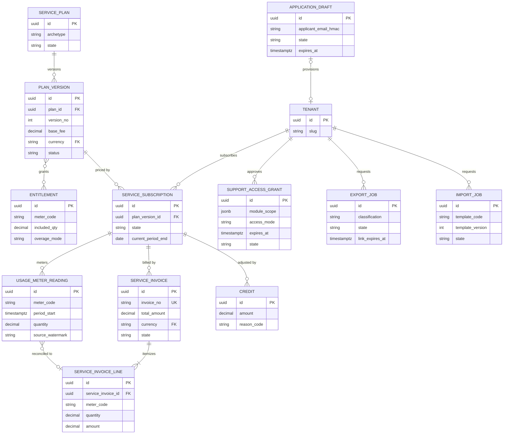
```mermaid
erDiagram
  SERVICE_PLAN ||--o{ PLAN_VERSION : "versions"
  PLAN_VERSION }o--o{ ENTITLEMENT : "grants"
  TENANT ||--o{ SERVICE_SUBSCRIPTION : "subscribes"
  PLAN_VERSION ||--o{ SERVICE_SUBSCRIPTION : "priced by"
  SERVICE_SUBSCRIPTION ||--o{ USAGE_METER_READING : "meters"
  SERVICE_SUBSCRIPTION ||--o{ SERVICE_INVOICE : "billed by"
  SERVICE_INVOICE ||--|{ SERVICE_INVOICE_LINE : "itemizes"
  USAGE_METER_READING }o--o| SERVICE_INVOICE_LINE : "reconciled to"
  SERVICE_SUBSCRIPTION ||--o{ CREDIT : "adjusted by"
  APPLICATION_DRAFT |o--o| TENANT : "provisions"
  TENANT ||--o{ SUPPORT_ACCESS_GRANT : "approves"
  TENANT ||--o{ EXPORT_JOB : "requests"
  TENANT ||--o{ IMPORT_JOB : "requests"
  TENANT {
    uuid id PK
    string slug
  }
  SERVICE_PLAN {
    uuid id PK
    string archetype
    string state
  }
  PLAN_VERSION {
    uuid id PK
    uuid plan_id FK
    int version_no
    decimal base_fee
    string currency FK
    string status
  }
  ENTITLEMENT {
    uuid id PK
    string meter_code
    decimal included_qty
    string overage_mode
  }
  SERVICE_SUBSCRIPTION {
    uuid id PK
    uuid plan_version_id FK
    string state
    date current_period_end
  }
  USAGE_METER_READING {
    uuid id PK
    string meter_code
    timestamptz period_start
    decimal quantity
    string source_watermark
  }
  SERVICE_INVOICE {
    uuid id PK
    string invoice_no UK
    decimal total_amount
    string currency FK
    string state
  }
  SERVICE_INVOICE_LINE {
    uuid id PK
    uuid service_invoice_id FK
    string meter_code
    decimal quantity
    decimal amount
  }
  CREDIT {
    uuid id PK
    decimal amount
    string reason_code
  }
  APPLICATION_DRAFT {
    uuid id PK
    string applicant_email_hmac
    string state
    timestamptz expires_at
  }
  SUPPORT_ACCESS_GRANT {
    uuid id PK
    jsonb module_scope
    string access_mode
    timestamptz expires_at
    string state
  }
  EXPORT_JOB {
    uuid id PK
    string classification
    string state
    timestamptz link_expires_at
  }
  IMPORT_JOB {
    uuid id PK
    string template_code
    int template_version
    string state
  }
```

### 3.3.4.17 Analytics: metric definition, snapshot, projections, forecast, FX snapshot (9 entities)

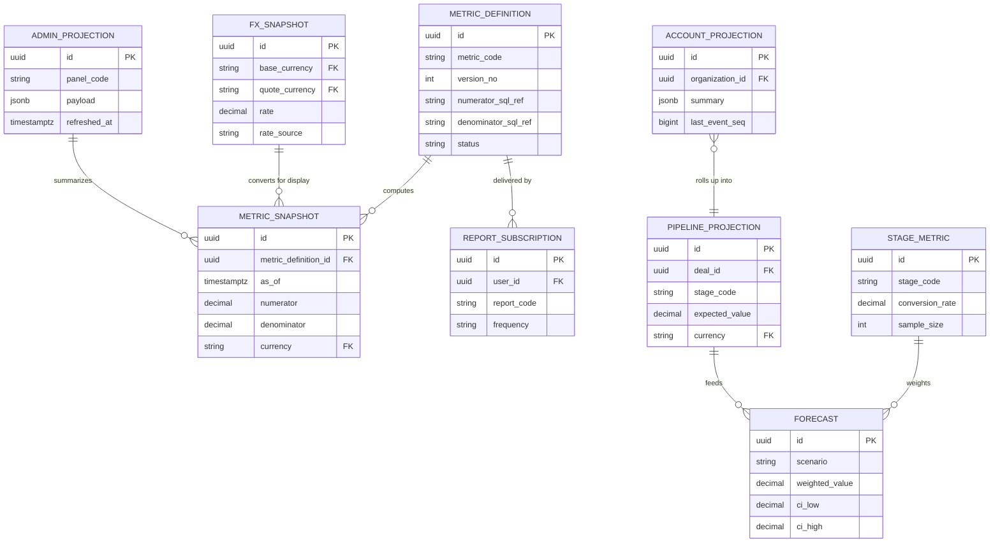
```mermaid
erDiagram
  METRIC_DEFINITION ||--o{ METRIC_SNAPSHOT : "computes"
  FX_SNAPSHOT ||--o{ METRIC_SNAPSHOT : "converts for display"
  METRIC_DEFINITION ||--o{ REPORT_SUBSCRIPTION : "delivered by"
  STAGE_METRIC ||--o{ FORECAST : "weights"
  PIPELINE_PROJECTION ||--o{ FORECAST : "feeds"
  ACCOUNT_PROJECTION }o--|| PIPELINE_PROJECTION : "rolls up into"
  ADMIN_PROJECTION ||--o{ METRIC_SNAPSHOT : "summarizes"
  METRIC_DEFINITION {
    uuid id PK
    string metric_code
    int version_no
    string numerator_sql_ref
    string denominator_sql_ref
    string status
  }
  METRIC_SNAPSHOT {
    uuid id PK
    uuid metric_definition_id FK
    timestamptz as_of
    decimal numerator
    decimal denominator
    string currency FK
  }
  ACCOUNT_PROJECTION {
    uuid id PK
    uuid organization_id FK
    jsonb summary
    bigint last_event_seq
  }
  ADMIN_PROJECTION {
    uuid id PK
    string panel_code
    jsonb payload
    timestamptz refreshed_at
  }
  PIPELINE_PROJECTION {
    uuid id PK
    uuid deal_id FK
    string stage_code
    decimal expected_value
    string currency FK
  }
  FORECAST {
    uuid id PK
    string scenario
    decimal weighted_value
    decimal ci_low
    decimal ci_high
  }
  STAGE_METRIC {
    uuid id PK
    string stage_code
    decimal conversion_rate
    int sample_size
  }
  FX_SNAPSHOT {
    uuid id PK
    string base_currency FK
    string quote_currency FK
    decimal rate
    string rate_source
  }
  REPORT_SUBSCRIPTION {
    uuid id PK
    uuid user_id FK
    string report_code
    string frequency
  }
```

---

## 3.3.5 Physical model conventions (FRD §5)

### 3.3.5.1 Platform and extensions

| Item | Decision | Basis |
|---|---|---|
| Engine | PostgreSQL **17** on Amazon RDS for PostgreSQL in ap-south-1 (16 acceptable). *Verify supported major/minor versions and extension versions on RDS at implementation (as of 27 Nov 2026).* [ASSUMPTION-113] | ASSUMPTION-005; DEC-040 |
| Database | One database `growth_engine` per environment, independent of the investor product (NFR-031, DEC-009). Schema `ge` for business tables, `ge_ref` for reference data, `ge_audit` for audit/hash-chain tables, `ge_archive` for archive manifests | FRD §5 "independent PostgreSQL database and role per product" |
| Extensions | `pgcrypto` (digests), `pg_trgm` (trigram search), `vector` (pgvector ≥ 0.8 for iterative filtered scans and `halfvec`), `pg_partman` (partition maintenance), `pg_stat_statements` (tuning), `btree_gin` (mixed GIN indexes). *Verify each is on the RDS allowed-extension list* | DEC-037; Part 2.4 §2.35.2 |
| Connection pooling | RDS Proxy or PgBouncer in **transaction** mode; all scope variables set with `SET LOCAL` / `set_config(…, true)` so they never leak across pooled sessions (§3.3.9) | NFR-002 |
| Django | Explicit `db_table` on every model (names in §3.3.3.2); `managed = True`; constraints declared in `Meta.constraints` so migrations own them; raw SQL migrations for RLS, triggers, partitions | FRD §5 "validate physical naming against existing schema" |

### 3.3.5.2 Primary keys: UUIDv7 [RECOMMENDATION-036]

| Aspect | Decision |
|---|---|
| Type | `uuid` column `id`, **UUIDv7** (RFC 9562), generated in the application (Python `uuid_utils.uuid7()` or equivalent) so IDs are known before insert (outbox, idempotency, correlation). PostgreSQL 18 adds a native `uuidv7()`; use it only if the platform is upgraded (verify) |
| Why v7 over v4 | (1) Time-ordered values append to the right edge of B-tree indexes: fewer page splits and better cache locality on the highest-volume tables (audit, delivery events, model runs). (2) Rough creation-time ordering supports keyset pagination (`ORDER BY id`) for cursor pagination (NFR-015). (3) Consistent with the audit schema `event_id` = UUIDv7 (Part 2.4 §2.34.2). (4) Partition pruning on time-partitioned tables can use the embedded timestamp as a secondary check |
| Risk and control | A v7 value reveals its creation time (millisecond precision). **Never expose a raw primary key as a capability or secret.** Every externally shared link (portal invite, preview link, opt-out link, payment instruction, export link) uses a separate **256-bit random token** stored only as SHA-256 `token_hash` (BRL-PUB-03, BRL-PRV-07). External object references in portal URLs are acceptable because authorization never relies on knowing the ID (CA-PORTAL, BRL-TEN-04) |
| Natural keys | Kept as **unique constraints**, never as PKs: tenant `slug`, startup `slug`, `invoice_no`, `(provider_account, provider_event_id)`, `sku_code`, `hostname` |
| Reference tables | `ref_currency.code` (char 3), `ref_country.code` (char 2), `ref_unit.code` use the ISO/standard code as PK because they are stable, global and used in check constraints |

### 3.3.5.3 Scope keys and composite foreign keys

1. **Scope class S tables** carry `tenant_id uuid NOT NULL` and `startup_id uuid NOT NULL`. Each such table declares `UNIQUE (tenant_id, startup_id, id)` so that children can reference it with a **composite foreign key** `(tenant_id, startup_id, parent_id) REFERENCES parent (tenant_id, startup_id, id)`. A row can therefore never point at a parent in another startup or tenant, even if application code is wrong (BRL-TEN-03, NFR-032).
2. `ten_startup` declares `UNIQUE (tenant_id, id)`; every S table has `FOREIGN KEY (tenant_id, startup_id) REFERENCES ten_startup (tenant_id, id)`.
3. **Scope class T tables** carry `tenant_id NOT NULL` and an optional `startup_id`. Because a composite FK with a NULL column is not checked under `MATCH SIMPLE`, T tables use `FOREIGN KEY (tenant_id) REFERENCES ten_tenant (id)` plus a separate `CHECK` and a trigger `trg_scope_consistency` that verifies `startup_id` (when present) belongs to `tenant_id`.
4. **Scope class X tables** allow `tenant_id IS NULL` for platform defaults. A partial unique index separates platform defaults from tenant overrides, e.g. `UNIQUE (prompt_code, version_no) WHERE tenant_id IS NULL` and `UNIQUE (tenant_id, prompt_code, version_no) WHERE tenant_id IS NOT NULL`.
5. **Scope class P tables** have no tenant column; access is controlled by grants (read-only for application roles) rather than RLS.
6. Cross-tenant foreign keys are impossible by construction; cross-startup references inside one tenant (e.g. portfolio projections) are **not allowed** in business tables (DEC-065); portfolio views are built by queries over permitted startups, not by FKs.

### 3.3.5.4 Time, dates and time zones

| Rule | Specification |
|---|---|
| Instants | `timestamptz` everywhere; the database session runs with `TimeZone = 'UTC'`; APIs emit ISO 8601 with `Z` |
| Business dates | `date` for invoice date, due date, contract term, renewal due date; the zone used to derive them is stored (`business_timezone`, IANA name) on the startup and copied onto the document at issue |
| Deadlines | Bid deadline stored as `deadline_utc timestamptz` + `portal_timezone text` (BRL-BID-01, FR-DM-02) |
| Meetings | `starts_at`, `ends_at` in UTC + `organizer_timezone`, `attendee_timezone` (BRL-MTG-03) |
| Precision | Microsecond in DB; audit `occurred_at` exposed at millisecond (Part 2.4 §2.34.2) |
| Clock source | Database `now()` (transaction time) for `created_at`; `clock_timestamp()` for audit `occurred_at` so ordering within one transaction is preserved |

### 3.3.5.5 Optimistic concurrency (`revision`)

* Every mutable table (Imm. M or F) has `revision integer NOT NULL DEFAULT 1 CHECK (revision >= 1)`.
* Updates are issued as `UPDATE … SET …, revision = revision + 1 WHERE id = $1 AND revision = $expected`; zero rows updated → HTTP **409 STALE_REVISION** (NFR-025, FR-STD-03). Clients send the revision as `If-Match`.
* State transitions additionally take `SELECT … FOR UPDATE` on the aggregate root inside `transaction.atomic` (FRD §5) and write the outbox row in the same transaction (NFR-006).
* Versioned tables (Imm. V) use `version_no` (business version, user-visible) **and** `revision` (technical concurrency on the draft row). Once `status` reaches Approved/Published the row is frozen (§3.3.5.9).

### 3.3.5.6 Money, quantities, rates and currency (DEC-027, CA-FIN)

| Kind | Type | Example columns | Rule |
|---|---|---|---|
| Monetary amount (document, ledger, payment) | `numeric(18,2)` | `line_total`, `total_amount`, `amount` | ROUND_HALF_UP to 2 places per line; document total = Σ rounded lines + tax lines (BRL-QTE-02) |
| Unit price, cost per unit, AI unit cost | `numeric(18,4)` | `unit_price`, `unit_cost` | Rounded only when multiplied into a line |
| Quantity | `numeric(18,4)` | `quantity`, `fulfilled_qty` (kg, quintal, hours, AI tasks) | Non-negative CHECK; unit validated against SKU allowed units (BRL-QTE-07) |
| Percentage | `numeric(7,4)` | `discount_pct`, `tax_rate_pct`, `proposed_commission_pct` | `CHECK (discount_pct >= 0 AND discount_pct <= 100)` |
| FX rate | `numeric(18,8)` | `ana_fx_snapshot.rate` | Reporting display only; **never** converts stored actuals (DEC-027) |
| Weights | `numeric(5,4)` | scoring weights | Sum = 1.0000 (BRL-SCR-01) |
| Currency | `char(3)` | `currency` | FK to `ref_currency(code)` + `CHECK (currency ~ '^[A-Z]{3}$')`; every amount column has a sibling currency column on the same row (no implicit currency) |
| Minor units | from `ref_currency.minor_units` | | Display only; storage always 2 dp (currencies with 0 or 3 minor units are rounded at presentation; none in Year 1 scope) |

Python uses `decimal.Decimal` with a context of `ROUND_HALF_UP`; floats are banned in money code paths by a lint rule (Part 3.1/Part 6).

### 3.3.5.7 Soft delete, archive and erasure policy

| Profile | Applies to | Behaviour |
|---|---|---|
| **Archive (soft delete)** | Mutable business and configuration records (Imm. M, V drafts) | User "delete" sets `archived_at`, `archived_by`, `archive_reason`; default Django manager filters `archived_at IS NULL`; unique constraints are **partial** (`WHERE archived_at IS NULL`) so a code can be reused after archive; restore within 30 days by the owner role |
| **No delete** | Immutable tables (Imm. A, approved V, frozen F) | No DELETE grant; removal only by the retention purge role at end of retention (§3.3.11) |
| **Hard delete on expiry** | Ephemeral data: application drafts (30 d), preview grants, idempotency keys, chat sessions (90 d), outbox rows after dispatch | Purge job deletes; audit event records counts only |
| **Erasure (privacy)** | Personal data of a data subject (M56) | Not a soft delete: personal columns are **nulled or overwritten with irreversible tokens**, encrypted values are destroyed, a `gov_suppression` hash is kept (BRL-PRV-03), and dependent immutable records keep pseudonymous references (§3.3.16.6) |

### 3.3.5.8 Naming conventions

| Object | Convention | Example |
|---|---|---|
| Table | `<domain_prefix>_<entity_snake_singular>` | `crm_deal`, `com_quote_line` |
| Column | `snake_case`; FK = `<referenced_entity>_id`; booleans `is_`/`has_`; instants `_at`; dates `_date`; hashes `_hash` (hex SHA-256, `char(64)`); HMAC lookup columns `_hmac`; encrypted columns `_enc` (bytea) | `approved_hash`, `email_hmac`, `email_enc` |
| Enumerations | `text` + `CHECK (col IN (…))` (not PostgreSQL enum types, which are awkward to alter); values in `snake_case`, mirroring the CamelCase states of Part 2.3 §2.27 (e.g. `WonContracted` → `won_contracted`) | `CHECK (state IN ('draft','pending_approval','approved'))` |
| Primary key | `pk_<table>` | `pk_crm_deal` |
| Foreign key | `fk_<table>__<column>` | `fk_crm_deal__stage_id` |
| Unique | `uq_<table>__<cols>` | `uq_com_payment__provider_account__provider_payment_id` |
| Check | `ck_<table>__<rule>` | `ck_com_quote_line__qty_nonneg` |
| Index | `ix_<table>__<cols>`; partial `ixp_`; GIN `ixg_`; vector `ixv_`; BRIN `ixb_` | `ixp_ops_outbox__pending` |
| RLS policy | `rls_<table>__<verb>` | `rls_crm_deal__select` |
| Trigger / function | `trg_<table>__<purpose>` / `fn_<purpose>` | `trg_com_receivable_entry__immutable` |
| Polymorphic references | `subject_type` + `subject_id` (or `object_type` + `object_id`) with `subject_type` CHECK-listed; existence and same-scope checked by `fn_assert_scoped_ref()` trigger | `gov_approval.object_type` |

### 3.3.5.9 Immutability enforcement (NFR-018)

| Profile | Mechanism | Tables (examples) |
|---|---|---|
| **A: append-only** | `REVOKE UPDATE, DELETE` from `ge_app` and `ge_worker`; trigger `fn_forbid_mutation()` `BEFORE UPDATE OR DELETE` raises `SQLSTATE 'P0001' IMMUTABLE_RECORD` unless `current_user = 'ge_retention'` **and** `current_setting('app.retention_run_id', true)` is set (purge only) | `gov_approval`, `ops_audit_event`, `com_receivable_entry`, `com_payable_entry`, `com_payment_allocation`, `com_fulfillment_event`, `com_signature_event`, `ai_cost_ledger`, `ai_usage`, `saas_usage_meter_reading`, `saas_credit`, `gov_consent`, `gov_suppression`, `gov_eligibility_decision`, `crm_stage_transition`, `ops_domain_event` |
| **V: versioned-frozen** | Trigger `fn_freeze_versioned()` rejects UPDATE when `OLD.status IN ('approved','published','active','superseded')` except the single allowed transition to `superseded`/`expired`/`retired` and the `superseded_by_id` pointer | `cat_offering_version`, `cat_price_version`, `cat_claim`, `mkt_content_version`, `com_proposal_version`, `aut_workflow_revision`, `aut_config_revision`, `saas_plan_version`, `gov_policy_version` |
| **F: frozen-after-state** | Trigger `fn_freeze_after_state()` driven by a per-table column allowlist: after the freeze state only `state`, `state_changed_at`, `revision`, `updated_at/by` and listed forward-only columns may change; state may only move along the Part 2.3 transition table (`fn_assert_transition`) | `com_quote` (after `approved`), `com_invoice` (after `issued`), `com_payment` (after `evidence_received`: amount, currency, payer fields frozen), `com_order` (after `approved`), `com_contract` (after `legally_approved`), `eng_message` (after `queued`), `saas_service_invoice` (after `issued`) |
| Corrections | Never UPDATE: insert a **reversing entry** (`entry_type = 'reversal'`, `reverses_id` → original, reason mandatory) (BRL-FIN-05, BRL-SVC-07); invoices are corrected by credit notes; approvals by a new approval or revocation row | Ledgers, credits, approvals |
| Tamper evidence | `ops_audit_event` hash chain per tenant: `hash = sha256(prev_hash ‖ canonical_json(event))`, computed in a serialized per-tenant sequence (advisory lock) by the audit writer; daily anchor hash exported to S3 Object Lock (Part 2.4 §2.34.3) | `ops_audit_event`, `ops_audit_anchor` (anchor table is part of the audit entity) |

### 3.3.5.10 Database roles and grants

| Role | Login | Used by | Privileges |
|---|---|---|---|
| `ge_owner` | No (assumed by migration job) | Migrations | Owns all objects; **never used by the running application**; RLS is `FORCE`d so even the owner path is filtered when not bypassing intentionally |
| `ge_app` | Yes | Django web (Admin, Website/Portal BFF) | SELECT/INSERT/UPDATE on mutable tables; INSERT-only on A tables; no DELETE except ephemeral tables; subject to RLS |
| `ge_worker` | Yes | Celery workers | Same as `ge_app` plus EXECUTE on outbox claim functions; subject to RLS |
| `ge_audit_writer` | No (SECURITY DEFINER function owner) | `fn_append_audit()` | INSERT on `ops_audit_event` only; computes hash chain |
| `ge_retention` | Yes (separate secret) | Retention purge job | DELETE/UPDATE on retention-managed tables only under `app.retention_run_id`; subject to RLS per tenant iteration |
| `ge_readonly` | Yes | Analyst read replica / on-call diagnostics | SELECT on non-Restricted columns via views `v_*_masked`; subject to RLS |
| `ge_platform_meta` | No (SECURITY DEFINER functions) | Platform billing/support metadata (R13, R14) | Aggregate-only functions (counts, usage totals) without business content (BRL-TEN-06 exception) |

No role has `BYPASSRLS` in production. Break-glass access follows the documented emergency procedure (BRL-TEN-09 exception) with dual control and post-hoc notice.

### 3.3.5.11 Migration ordering and deferred cyclic constraints

Order (FRD §5): **(1)** extensions and roles → **(2)** tenant root (`ten_tenant`) → **(3)** startup, user, role, membership, grants → **(4)** reference and configuration tables (`ref_*`, policy, approval policy, jurisdiction, retention, plans, templates, scoring model, pipelines, stages) → **(5)** business tables in FK order: catalogue → governance ledgers → intelligence → CRM → engagement → marketing → commerce → lifecycle → automation → SaaS → analytics → **(6)** deferred cyclic FKs → **(7)** RLS policies and triggers → **(8)** indexes (built `CONCURRENTLY` on populated environments) and views last.

| Cycle | Forward FK | Back-pointer FK (added in step 6) | Constraint mode |
|---|---|---|---|
| Offering ↔ OfferingVersion | `cat_offering_version.offering_id` | `cat_offering.current_version_id` | `DEFERRABLE INITIALLY DEFERRED` |
| Publication ↔ PublicationSnapshot | `mkt_publication_snapshot.publication_id` | `mkt_publication.current_snapshot_id` | Deferred (atomic pointer swap, BRL-PUB-02) |
| Workflow ↔ WorkflowRevision | `aut_workflow_revision.workflow_id` | `aut_workflow.active_revision_id` | Deferred |
| Campaign ↔ CampaignVersion | `mkt_campaign_version.campaign_id` | `mkt_campaign.current_version_id` | Deferred |
| Proposal ↔ ProposalVersion | `com_proposal_version.proposal_id` | `com_proposal.current_version_id` | Deferred |
| Form ↔ FormVersion | `crm_form_version.form_id` | `crm_form.active_version_id` | Deferred |
| Deal ↔ Quote | `com_quote.deal_id` | `crm_deal.accepted_quote_id` | Deferred |
| Thread ↔ Message | `eng_message.thread_id` | `eng_thread.last_message_id` | Deferred |
| Organization ↔ Organization (merge) | — | `intel_organization.merged_into_id` (self) | Immediate, `ON DELETE RESTRICT` |
| Tenant ↔ ApplicationDraft | `saas_application_draft.provisioned_tenant_id` | `ten_tenant.source_application_id` | Deferred |

All FKs use `ON DELETE RESTRICT` (no cascades on business data); ephemeral child tables (e.g. `ops_idempotency_key`) may use `ON DELETE CASCADE` from their own parents only.

---

## 3.3.6 Data dictionary: core entities (column level)

### 3.3.6.1 Notation and standard column sets

**Columns in each table:** Column · Type · Null (**N** = NOT NULL, **Y** = nullable) · Default · Constraint · Class (**Pub** Public, **Int** Internal, **Conf** Confidential, **Rest** Restricted; RECOMMENDATION-004, §3.3.16) · Description. Types are PostgreSQL types. `→ x` means "foreign key to x". `app` default means generated by the application (UUIDv7).

To avoid repeating the same rows 199 times, every table starts with one or more **standard column sets**. The per-entity tables below list only the columns **in addition to** the declared sets.

**STD-S: startup-scoped, mutable (scope S, Imm. M/F)**

| Column | Type | Null | Default | Constraint | Class | Description |
|---|---|---|---|---|---|---|
| `id` | uuid | N | app (UUIDv7) | PK | Int | Surrogate key |
| `tenant_id` | uuid | N | session scope | → ten_tenant; part of composite FK | Int | Owning tenant (RLS key) |
| `startup_id` | uuid | N | session write scope | (tenant_id, startup_id) → ten_startup(tenant_id, id) | Int | Owning startup workspace (RLS key) |
| `revision` | integer | N | 1 | CHECK ≥ 1 | Int | Optimistic concurrency (§3.3.5.5) |
| `created_at` | timestamptz | N | now() | | Int | Insert time (UTC) |
| `created_by` | uuid | Y | session actor | | Int | Actor ID (user, service, AI agent) |
| `created_by_type` | text | N | 'user' | CHECK IN (user, service, ai_agent, provider, anonymous) | Int | Actor type (audit schema) |
| `updated_at` | timestamptz | N | now() | trigger maintains | Int | Last update |
| `updated_by` | uuid | Y | session actor | | Int | Last updater |
| `archived_at` | timestamptz | Y | NULL | | Int | Soft-delete (§3.3.5.7) |
| `archived_by` | uuid | Y | NULL | | Int | Who archived |
| `archive_reason` | text | Y | NULL | length ≤ 500 | Int | Why archived |

**STD-SA: startup-scoped, append-only (scope S, Imm. A)**: `id`, `tenant_id`, `startup_id`, `created_at`, `created_by`, `created_by_type` as above, plus `correlation_id uuid Y` (request/run correlation, RECOMMENDATION-006). No `revision`, `updated_*` or `archived_*`.

**STD-T: tenant-scoped**: as STD-S but `startup_id` is **Y** (NULL = tenant-wide), FK `tenant_id → ten_tenant(id)` and scope trigger (§3.3.5.3).

**STD-X: mixed platform/tenant**: as STD-T but `tenant_id` is **Y** (NULL = platform default; writable only by platform).

**STD-V: versioned add-on (Imm. V)**

| Column | Type | Null | Default | Constraint | Class | Description |
|---|---|---|---|---|---|---|
| `version_no` | integer | N | next in series | UNIQUE within parent; CHECK ≥ 1 | Int | Business version number |
| `status` | text | N | 'draft' | CHECK per entity state set (§2.27.18) | Int | Version lifecycle |
| `content_hash` | char(64) | Y | computed on submit | CHECK hex | Int | SHA-256 of canonical content; approvals bind to it (BRL-APR-02) |
| `approval_id` | uuid | Y | NULL | → gov_approval | Int | Approval that released this version |
| `approved_at` | timestamptz | Y | NULL | | Int | When approved |
| `effective_from` / `effective_to` | timestamptz | Y | NULL | CHECK from < to | Int | Validity window |
| `supersedes_id` | uuid | Y | NULL | → same table | Int | Previous version |

**STD-W: workflow-touched add-on** (every table a workflow or AI agent can write): `is_simulated boolean N false` (BRL-AUT-04: simulated rows excluded from KPIs, partial indexes exclude them), `run_id uuid Y → aut_run` (originating run), `correlation_id uuid Y`.

### 3.3.6.2 Tenancy and identity

**ENT-001 Tenant (`ten_tenant`)**: scope P (root). Sets: id, revision, created_*, updated_* from STD-S without tenant/startup.

| Column | Type | Null | Default | Constraint | Class | Description |
|---|---|---|---|---|---|---|
| `slug` | text | N | | UNIQUE; CHECK `^[a-z0-9-]{3,40}$` | Int | Stable tenant handle |
| `display_name` | text | N | | length ≤ 200 | Int | Name shown in Admin |
| `legal_name` | text | N | | | Conf | Registered legal entity name |
| `legal_id` | text | Y | | | Conf | Company registration / tax ID |
| `ownership_type` | text | N | | CHECK IN (owner_portfolio, external_client) | Int | DEC-065 |
| `service_model` | text | N | | CHECK IN (owned, saas) | Int | FR-A099 |
| `lifecycle_state` | text | N | 'applicant' | CHECK IN (applicant, under_verification, rejected, approved, provisioning, trial, active, suspended, offboarding, closed) | Int | §2.27.16 |
| `home_region` | text | N | 'ap-south-1' | | Int | Residency (Part 2.4 §2.35.5) |
| `kms_key_arn` | text | N | | | Int | Per-tenant KEK for field encryption (§3.3.16.4) |
| `storage_prefix` | text | N | | UNIQUE | Int | S3 prefix (Part 2.4 §2.35.2) |
| `source_application_id` | uuid | Y | | → saas_application_draft (deferred) | Int | Provisioning origin (idempotency, FRD §16.3) |
| `audit_genesis_hash` | char(64) | N | | | Int | Hash-chain genesis (§2.35.4 step 6) |
| `suspended_reason` | text | Y | | | Int | BRL-SVC-06 |

**ENT-002 Startup (`ten_startup`)**: scope T (tenant_id N, no startup_id). Sets: STD-T minus startup_id.

| Column | Type | Null | Default | Constraint | Class | Description |
|---|---|---|---|---|---|---|
| `slug` | text | N | | UNIQUE (tenant_id, slug) | Int | Workspace handle |
| `display_name` | text | N | | | Pub | Brand name (public site) |
| `legal_name` | text | N | | | Conf | Legal entity (BRD: startup = legal entity) |
| `country_code` | char(2) | N | 'IN' | → ref_country | Int | Domicile |
| `base_currency` | char(3) | N | 'INR' | → ref_currency | Int | Default document currency |
| `business_timezone` | text | N | 'Asia/Kolkata' | valid IANA (app check) | Int | For business dates and quiet hours |
| `default_locale` | text | N | 'en-IN' | CHECK IN (en-IN, hi-IN, ta-IN, or-IN) | Int | DEC-026 |
| `lifecycle_state` | text | N | 'provisioning' | CHECK as tenant subset (provisioning, trial, active, suspended, offboarding, closed) | Int | §2.27.16 |
| `template_ref` | uuid | N | | → aut_workflow_template or business template config | Int | Created from approved template (BRL-TEN-11) |
| `margin_floor_pct` | numeric(7,4) | N | 25.0000 | CHECK 0–100 | Conf | DEC-038 default |
| `tax_profile_id` | uuid | Y | | → cat_tax_profile | Conf | DEC-027 |
| `emergency_stop` | boolean | N | false | | Int | BRL-AUT-05 startup-level stop |
| | | | | UNIQUE (tenant_id, id) | | Target of composite FKs |

**ENT-008 Membership (`ten_membership`)**: scope T. Sets: STD-T.

| Column | Type | Null | Default | Constraint | Class | Description |
|---|---|---|---|---|---|---|
| `user_id` | uuid | N | | → ten_user; UNIQUE (tenant_id, user_id) WHERE archived_at IS NULL | Int | Member |
| `status` | text | N | 'invited' | CHECK IN (invited, active, suspended, expired, revoked) | Int | BRL-TEN-07 |
| `invited_by` | uuid | Y | | → ten_user | Int | Inviter |
| `invite_token_hash` | char(64) | Y | | UNIQUE | Rest | Hash of single-use invite token |
| `activated_at` | timestamptz | Y | | | Int | |
| `expires_at` | timestamptz | Y | | CHECK > created_at | Int | Membership expiry |
| `mfa_required` | boolean | N | computed | true if any grant has privileged role (BRL-TEN-08) | Int | |
| `last_access_review_at` | timestamptz | Y | | | Int | Quarterly attestation (RECOMMENDATION-023) |
| `approval_limits` | jsonb | N | '{}' | JSON schema: {discount_pct_max, amount_max, currency} | Conf | ABAC-04 threshold authority |

Role grants: `ten_membership_grant (id, tenant_id, membership_id → ten_membership, role_id → ten_role, startup_id NULL|→ten_startup, granted_by, valid_from, valid_to)`, UNIQUE (membership_id, role_id, COALESCE(startup_id, '00000000-0000-0000-0000-000000000000')).

**ENT-007 Role (`ten_role`)**: scope X (NULL tenant = system roles R01–R20). Sets: STD-X.

| Column | Type | Null | Default | Constraint | Class | Description |
|---|---|---|---|---|---|---|
| `code` | text | N | | UNIQUE (COALESCE(tenant_id), code); CHECK `^R[0-9]{2}L?$` for system roles | Int | R01…R20, R03L, R05L (Part 2.3 §2.26.1) |
| `name` | text | N | | | Int | Display name |
| `is_system` | boolean | N | false | system roles have tenant_id NULL | Int | System roles immutable |
| `surface` | text | N | | CHECK IN (admin, portal, public, internal) | Int | Allowed surface |
| `permissions` | jsonb | N | '{}' | JSON schema of screen-group × verb (V/C/E/A/X/S) | Int | RBAC matrix §2.26.3 |
| `is_privileged` | boolean | N | false | | Int | Requires MFA (BRL-TEN-08) |
| `can_approve` | boolean | N | false | R19/R20 must be false (CHECK when code IN ('R19','R20')) | Int | BRL-AI-07 |

### 3.3.6.3 Catalogue and knowledge

**ENT-016 Offering (`cat_offering`)**: Sets: STD-S.

| Column | Type | Null | Default | Constraint | Class | Description |
|---|---|---|---|---|---|---|
| `business_line_id` | uuid | Y | | (tenant, startup, id) → ten_business_line | Int | FR-FLT-01 |
| `code` | text | N | | UNIQUE (tenant_id, startup_id, code) WHERE archived_at IS NULL | Int | Offering code / SKU family |
| `name` | text | N | | | Pub | Public name (after approval) |
| `offering_kind` | text | N | | CHECK IN (product, service, training, programme, licence, project, partnership) | Int | Merges FRD "Product" |
| `readiness_state` | text | N | 'planned' | CHECK IN (planned, draft, pending_approval, approved, available, suspended, withdrawn) | Int | M66 readiness gate (DEC-060) |
| `current_version_id` | uuid | Y | | → cat_offering_version (deferred) | Int | Active approved version |
| `is_promotable` | boolean | N | generated: readiness_state IN ('approved','available') | GENERATED ALWAYS AS … STORED | Int | BRL-MKT-02, BRL-SCR-04 |
| `owner_id` | uuid | N | | → ten_user | Int | Accountable owner |

**ENT-017 OfferingVersion (`cat_offering_version`)**: Sets: STD-S + STD-V (status CHECK: planned, draft, pending_approval, approved, available, suspended, withdrawn, superseded).

| Column | Type | Null | Default | Constraint | Class | Description |
|---|---|---|---|---|---|---|
| `offering_id` | uuid | N | | composite → cat_offering; UNIQUE (offering_id, version_no) | Int | Parent |
| `summary` | text | N | | length ≤ 2000 | Pub | Approved description |
| `specification` | jsonb | N | '{}' | JSON schema per offering_kind | Int | Typed attributes (technology, programme, SKU spec) |
| `hsn_sac_code` | text | Y | | → ref_value (dataset HSN_SAC) | Int | DEC-027 |
| `allowed_units` | text[] | N | '{}' | each ∈ ref_unit | Int | BRL-QTE-07 |
| `min_order_qty` / `max_order_qty` | numeric(18,4) | Y | | CHECK ≥ 0, min ≤ max | Int | Order validation |
| `delivery_geographies` | text[] | N | '{}' | country codes | Int | FR-FLT-02 |
| `excluded_data_classes` | text[] | N | '{}' | e.g. {patient_data, minor_profiling} | Int | AP-05 sensitive-data exclusions |

**ENT-020 Claim (`cat_claim`)**: Sets: STD-S + STD-V (status: draft, pending_approval, approved, expired, revoked).

| Column | Type | Null | Default | Constraint | Class | Description |
|---|---|---|---|---|---|---|
| `offering_version_id` | uuid | Y | | composite → cat_offering_version | Int | NULL = startup-level claim |
| `claim_text` | text | N | | length ≤ 1000 | Pub | Exact approved wording |
| `claim_type` | text | N | | CHECK IN (capability, traction, certification, outcome, comparative, testimonial) | Int | BRL-SRC-10 comparative restricted |
| `is_management_claim` | boolean | N | false | if true, display label required (BRL-MKT-03, DEC-021) | Int | |
| `evidence_count` | integer | N | 0 | CHECK > 0 when status = 'approved' | Int | Maintained from `cat_claim_evidence` |
| `subject_consent_ref` | uuid | Y | | → gov_consent | Rest | Testimonial consent (BRL-MKT-09) |
| `expires_at` | timestamptz | N | | CHECK > created_at | Int | Expired claims cannot be used (BRL-MKT-01) |
| `author_id` | uuid | N | | ≠ approver (trigger, BRL-APR-01) | Int | Separation of duties |

**ENT-021 PriceVersion (`cat_price_version`)**: Sets: STD-S + STD-V (status: draft, pending_approval, approved, superseded, withdrawn).

| Column | Type | Null | Default | Constraint | Class | Description |
|---|---|---|---|---|---|---|
| `offering_version_id` | uuid | N | | composite → cat_offering_version | Int | Priced version |
| `price_list_code` | text | N | 'standard' | UNIQUE (offering_version_id, price_list_code, currency, unit_code, version_no) | Int | List (standard, institutional, export) |
| `currency` | char(3) | N | | → ref_currency; CHECK `^[A-Z]{3}$` | Int | ISO 4217 |
| `unit_code` | text | N | | → ref_unit | Int | Pricing unit |
| `unit_price` | numeric(18,4) | N | | CHECK ≥ 0 | Conf | Approved unit price (BRL-QTE-01) |
| `unit_cost` | numeric(18,4) | Y | | CHECK ≥ 0 | Conf | For margin floor check (DEC-038) |
| `tax_rate_pct` | numeric(7,4) | N | 0 | CHECK 0–100 | Int | GST rate snapshot (verify rates) |
| `tax_inclusive` | boolean | N | false | | Int | Price basis |
| `valid_from` / `valid_to` | date | N / Y | | CHECK from ≤ to; EXCLUDE overlapping approved ranges per (offering_version, list, currency, unit) using `daterange` GiST | Int | No overlapping active prices |

**ENT-024 Document (`cat_document`)**: Sets: STD-S + STD-V (status: uploaded, scanning, quarantined, parsed, indexed, pending_approval, approved, superseded, rejected).

| Column | Type | Null | Default | Constraint | Class | Description |
|---|---|---|---|---|---|---|
| `title` | text | N | | | Int | |
| `doc_kind` | text | N | | CHECK IN (product_sheet, faq, policy, case_study, price_list, contract_template, other) | Int | |
| `classification` | text | N | 'internal' | CHECK IN (public, internal, confidential, restricted) | Int | Drives retrieval and Tier 2 eligibility (DEC-007) |
| `storage_key` | text | N | | UNIQUE | Int | S3 key under tenant prefix |
| `mime_type` | text | N | | CHECK in allowlist | Int | NFR-021 |
| `size_bytes` | bigint | N | | CHECK 0 < size ≤ 50 MB (policy) | Int | |
| `sha256` | char(64) | N | | UNIQUE (tenant_id, startup_id, sha256, version_no) | Int | Integrity and dedupe |
| `scan_result` | text | N | 'pending' | CHECK IN (pending, clean, infected, error) | Int | Must be clean before parse |
| `language` | text | N | 'en' | | Int | Full-text config selection |
| `chunk_count` | integer | N | 0 | CHECK ≥ 0 | Int | |
| `embedding_model_id` | text | Y | | | Int | Model used for all chunks of this version |

**ENT-025 Chunk (`cat_chunk`)**: Sets: STD-SA.

| Column | Type | Null | Default | Constraint | Class | Description |
|---|---|---|---|---|---|---|
| `document_id` | uuid | N | | composite → cat_document | Int | Parent version |
| `ordinal` | integer | N | | UNIQUE (document_id, ordinal); CHECK ≥ 0 | Int | Order |
| `body` | text | N | | length ≤ 8,000 chars | per document | Chunk text |
| `token_count` | integer | N | | CHECK > 0 | Int | |
| `heading_path` | text | Y | | | Int | Citation anchor |
| `classification` | text | N | inherited | = document.classification | Int | Retrieval filter |
| `tsv` | tsvector | N | generated: to_tsvector(config_for(language), body) | STORED | Int | Full-text (DEC-037) |
| `is_searchable` | boolean | N | false | true only when document approved (§2.27.18) | Int | Approved version only in search |

**ENT-026 Embedding (`cat_embedding`)**: Sets: STD-SA.

| Column | Type | Null | Default | Constraint | Class | Description |
|---|---|---|---|---|---|---|
| `chunk_id` | uuid | N | | composite → cat_chunk; UNIQUE (chunk_id, model_id) | Int | |
| `model_id` | text | N | | | Int | Embedding model and version (GAP-111) |
| `embedding` | halfvec(1024) | N | | dimension fixed per model table version | Int | Vector (RECOMMENDATION-039) |
| `classification` | text | N | inherited | | Int | Mandatory retrieval filter |
| `offering_version_ids` | uuid[] | N | '{}' | | Int | Filter for offering-scoped retrieval |

### 3.3.6.4 Governance

**ENT-027 Consent (`gov_consent`)**: Sets: STD-SA + `is_simulated`. Append-only ledger: each grant, withdrawal or expiry is a new row; current state = latest row per (contact, channel, purpose).

| Column | Type | Null | Default | Constraint | Class | Description |
|---|---|---|---|---|---|---|
| `contact_id` | uuid | Y | | composite → intel_contact | Rest | Subject (NULL after erasure; `subject_hmac` remains) |
| `subject_hmac` | char(64) | N | | | Rest | HMAC of normalized identifier (per-tenant key) |
| `channel` | text | N | | CHECK IN (email, whatsapp, sms, phone, web_push, any) | Int | |
| `purpose` | text | N | | CHECK IN (marketing, transactional, research_contact, event, renewal, referral) | Int | |
| `action` | text | N | | CHECK IN (grant, withdraw, expire, verify_guardian) | Int | Ledger action |
| `lawful_basis` | text | N | | CHECK IN (consent, legitimate_interest, contract, legal_obligation, guardian_consent) | Int | BRL-ELG-03, DEC-029 |
| `lia_ref` | uuid | Y | | → cat_document; required when basis = legitimate_interest and jurisdiction EU/UK | Conf | DEC-029 |
| `policy_version_id` | uuid | N | | → gov_policy_version | Int | Notice shown (CA-INTAKE) |
| `capture_method` | text | N | | CHECK IN (web_form, portal, import, verbal_recorded, provider_opt_in, guardian_otp) | Int | |
| `evidence_ref` | text | N | | | Rest | Form submission ID, import row hash or OTP verification ID |
| `guardian_contact_id` | uuid | Y | | composite → intel_contact; required when subject is a minor (DEC-030) | Rest | |
| `jurisdiction_code` | char(2) | N | | → ref_country | Int | Rule pack applied |
| `effective_at` | timestamptz | N | now() | | Int | |
| `expires_at` | timestamptz | Y | | | Int | Consent validity if policy sets one |

**ENT-028 Suppression (`gov_suppression`)**: scope T (startup_id NULL = tenant-wide). Sets: STD-SA with nullable `startup_id`.

| Column | Type | Null | Default | Constraint | Class | Description |
|---|---|---|---|---|---|---|
| `identifier_hmac` | char(64) | N | | UNIQUE (tenant_id, COALESCE(startup_id), identifier_hmac, channel, purpose) WHERE lifted_by_id IS NULL | Rest | Minimal hashed identifier (DEC-028 indefinite) |
| `identifier_kind` | text | N | | CHECK IN (email, phone, whatsapp, domain, org_legal_id) | Int | |
| `channel` | text | N | 'any' | CHECK as consent | Int | |
| `purpose` | text | N | 'any' | | Int | |
| `scope_level` | text | N | | CHECK IN (startup, tenant) | Int | BRL-ELG-02 ("global" = tenant-wide, GAP-116) |
| `reason` | text | N | | CHECK IN (opt_out, complaint, hard_bounce, soft_bounce_limit, erasure, rejected_review, legal, minor) | Int | |
| `expires_at` | timestamptz | Y | | NULL = indefinite; soft-bounce = 30 days (BRL-ELG-12) | Int | |
| `lifted_by_id` | uuid | Y | | → gov_suppression (a later lift row) | Int | Lift only via new consent evidence; opt-out/complaint/erasure never lifted automatically |

**ENT-029 PolicyVersion (`gov_policy_version`)**: Sets: STD-X + STD-V (status: draft, validated, simulated, approved, active, superseded).

| Column | Type | Null | Default | Constraint | Class | Description |
|---|---|---|---|---|---|---|
| `policy_type` | text | N | | CHECK IN (privacy_notice, consent_text, quiet_hours, frequency_cap, eligibility, retention_override, closure, lost_deal) | Int | |
| `policy_code` | text | N | | UNIQUE (COALESCE(tenant_id), COALESCE(startup_id), policy_code, version_no) | Int | |
| `body` | jsonb | N | | JSON schema per policy_type | Int | Rule parameters or notice text per locale |
| `tightens_only` | boolean | N | computed at validation | if false, approval by R01 required (BRL-APR-11) | Int | |
| `simulation_report_ref` | uuid | Y | | → aut_config_revision | Int | 30-day replay result (§2.33.3) |

**ENT-031 EligibilityDecision (`gov_eligibility_decision`)**: Sets: STD-SA + STD-W. Partitioned monthly by `created_at` (§3.3.10).

| Column | Type | Null | Default | Constraint | Class | Description |
|---|---|---|---|---|---|---|
| `contact_id` | uuid | Y | | (no FK: partitioned; validated on insert) | Rest | Recipient |
| `organization_id` | uuid | Y | | | Conf | For org-level caps |
| `action_type` | text | N | | CHECK IN (send_email, send_whatsapp, enrol, publish_ad_audience, book_meeting, call, campaign_dispatch) | Int | |
| `evaluation_point` | text | N | | CHECK IN (plan, approval, dispatch) | Int | BRL-ELG-18 |
| `result` | text | N | | CHECK IN (eligible, ineligible, unknown) | Int | Unknown → no send (BRL-ELG-01) |
| `reason_codes` | text[] | N | '{}' | each matches `^BRL-[A-Z]{2,4}-[0-9]{2}$` | Int | Rules that fired |
| `policy_version_ids` | uuid[] | N | | | Int | Versions evaluated |
| `jurisdiction_rule_id` | uuid | Y | | | Int | Pack applied |
| `inputs_digest` | char(64) | N | | | Int | Hash of evaluated facts (replayable) |
| `object_type` / `object_id` | text / uuid | N | | | Int | Message, enrolment, campaign item |
| `created_at` | timestamptz | N | now() | partition key; PK (id, created_at) | Int | |

**ENT-034 Approval (`gov_approval`)**: Sets: STD-SA + `is_simulated`. Immutable (A).

| Column | Type | Null | Default | Constraint | Class | Description |
|---|---|---|---|---|---|---|
| `object_type` | text | N | | CHECK IN (offering_version, claim, price_version, document, content_version, publication, campaign_version, ad_budget, message_draft, template, proposal_version, quote, contract, bid_decision, bid_submission, order, invoice, payment_verification_maker, payment_verification_checker, config_revision, workflow_revision, autonomy_plan, export_job, support_access_grant, plan_version, launch) | Int | Governed object |
| `object_id` | uuid | N | | existence + scope checked by trigger | Int | |
| `object_revision` | integer | N | | | Int | Revision approved |
| `approved_hash` | char(64) | N | | equals object's content hash at decision time (trigger) | Int | BRL-APR-02 |
| `decision` | text | N | | CHECK IN (approved, rejected, revoked, expired) | Int | |
| `approver_id` | uuid | N | | → ten_user; ≠ object author (trigger, ABAC-03) | Int | |
| `approver_role` | text | N | | | Int | Role exercised |
| `delegation_id` | uuid | Y | | → gov_approval_delegation | Int | BRL-APR-09 |
| `policy_rule_ref` | text | N | | e.g. DEC-038 threshold key | Int | Threshold authority applied |
| `mfa_at` | timestamptz | N | | CHECK ≥ now() − 12 h at insert (ABAC-11) | Int | Step-up evidence |
| `reason_code` / `reason_text` | text | Y | | required when decision ≠ approved (BRL-APR-08) | Int | |
| `expires_at` | timestamptz | Y | | BRL-APR-03 defaults | Int | |
| `revokes_id` | uuid | Y | | → gov_approval | Int | Revocation row references original |

### 3.3.6.5 Intelligence

**ENT-053 Source (`intel_source`)**: Sets: STD-S.

| Column | Type | Null | Default | Constraint | Class | Description |
|---|---|---|---|---|---|---|
| `host` | text | N | | UNIQUE (tenant_id, startup_id, host, path_prefix) | Int | Normalized host |
| `path_prefix` | text | N | '/' | | Int | |
| `source_kind` | text | N | | CHECK IN (website, tender_portal, registry, news, social_api, licensed_api, directory, search_api) | Int | |
| `purpose` | text | N | | | Int | Permitted purpose (M07) |
| `state` | text | N | 'proposed' | CHECK IN (proposed, pending_approval, active, expired, revoked) | Int | §2.27.18 |
| `active_policy_id` | uuid | Y | | → intel_source_policy | Int | |
| `country_codes` | char(2)[] | N | '{}' | | Int | Coverage (KPI-27) |
| `freshness_sla_days` | integer | N | 90 | CHECK 1–365; tenders 7 (BRL-SRC-06) | Int | |
| `robots_respected` | boolean | N | true | CHECK = true (BRL-SRC-04) | Int | |

**ENT-059 Evidence (`intel_evidence`)**: Sets: STD-S + STD-W. Frozen after `extracted` (F).

| Column | Type | Null | Default | Constraint | Class | Description |
|---|---|---|---|---|---|---|
| `source_record_id` | uuid | Y | | composite → intel_source_record | Int | |
| `social_post_id` | uuid | Y | | composite → intel_social_post; CHECK exactly one of source_record/social_post | Int | |
| `organization_id` | uuid | Y | | composite → intel_organization | Int | Subject account |
| `source_policy_version` | integer | N | | | Int | Permission revision at fetch (BRL-SRC-03) |
| `url` | text | N | | | Pub | Provenance URL |
| `retrieved_at` | timestamptz | N | | | Int | |
| `published_at` | timestamptz | Y | | | Int | Observed/published date |
| `content_hash` | char(64) | N | | UNIQUE (tenant_id, startup_id, content_hash, organization_id) | Int | Dedupe + provenance |
| `extracted` | jsonb | N | | JSON schema per extraction type | Int | Structured facts |
| `content_text` | text | Y | | NULLed after 12 months (DEC-028) | Int | Cleaned page text |
| `content_storage_key` | text | Y | | deleted after 12 months | Int | Raw snapshot (S3) |
| `confidence` | numeric(5,4) | N | | CHECK 0–1 | Int | |
| `freshness_state` | text | N | 'fresh' | CHECK IN (fresh, stale, source_expired, purged) | Int | BRL-SRC-02/06 |
| `injection_flag` | boolean | N | false | | Int | BRL-SRC-07 |
| `rights_state` | text | N | 'permitted' | CHECK IN (permitted, quarantined) | Int | NFR-028 |
| `model_run_id` | uuid | Y | | | Int | Extraction run |

**ENT-063 Organization (`intel_organization`)**: Sets: STD-S + STD-W.

| Column | Type | Null | Default | Constraint | Class | Description |
|---|---|---|---|---|---|---|
| `name` | text | N | | GIN trigram index | Conf | Canonical name |
| `normalized_name` | text | N | generated lower/unaccent | | Conf | Matching key |
| `primary_domain` | text | Y | | UNIQUE (tenant_id, startup_id, primary_domain) WHERE merged_into_id IS NULL AND archived_at IS NULL | Conf | |
| `legal_id` | text | Y | | | Conf | Registry ID (merge rule BRL-SRC-08) |
| `org_type` | text | N | 'unknown' | → ref_value (ORG_TYPE) | Int | School, hospital, insurer, buyer, supplier … |
| `industry_code` | text | Y | | → ref_value (INDUSTRY) | Int | |
| `country_code` | char(2) | Y | | → ref_country | Int | Jurisdiction resolution |
| `size_band` | text | Y | | | Int | |
| `relationship` | text | N | 'prospect' | CHECK IN (prospect, customer, supplier, partner, competitor, institution) | Int | |
| `merged_into_id` | uuid | Y | | self FK; reversible 30 days | Int | Safe merge |
| `merge_reversible_until` | timestamptz | Y | | | Int | BRL-SRC-08 |
| `owner_id` | uuid | Y | | → ten_user | Int | Account owner |
| `tsv` | tsvector | N | generated | | Int | Global search (DEC-037) |

**ENT-074 Contact (`intel_contact`)**: Sets: STD-S + STD-W. Retention class MKT (24 months after last eligible interaction).

| Column | Type | Null | Default | Constraint | Class | Description |
|---|---|---|---|---|---|---|
| `organization_id` | uuid | Y | | composite → intel_organization | Conf | Employer / institution |
| `person_type` | text | N | 'professional' | CHECK IN (professional, guardian, learner, individual_customer, supplier_rep) | Int | DEC-030 |
| `full_name` | text | N | | trigram index on `name_search` | Conf | Display name |
| `name_search` | text | N | generated normalized | | Conf | Search key |
| `job_title` | text | Y | | | Conf | Published role |
| `role_code` | text | Y | | → ref_value (ROLE_TAXONOMY) | Int | |
| `email_enc` | bytea | Y | | envelope-encrypted (§3.3.16.4) | Rest | Professional email |
| `email_hmac` | char(64) | Y | | UNIQUE (tenant_id, startup_id, email_hmac) WHERE archived_at IS NULL | Rest | Blind index for dedupe/suppression |
| `email_domain` | text | Y | | | Conf | For role-based check (DEC-029 EU/UK) |
| `is_role_based_address` | boolean | N | false | | Int | info@, sales@ |
| `phone_enc` | bytea | Y | | | Rest | |
| `phone_hmac` | char(64) | Y | | | Rest | |
| `country_code` | char(2) | Y | | → ref_country | Int | Jurisdiction |
| `timezone` | text | Y | | | Int | Quiet hours |
| `preferred_locale` | text | Y | | | Int | |
| `age_band` | text | N | 'adult_assumed' | CHECK IN (adult_assumed, adult_verified, under_18, unknown) | Rest | Minors gate (BRL-ELG-13) |
| `guardian_contact_id` | uuid | Y | | self composite FK; CHECK required when age_band = 'under_18' | Rest | |
| `grade_band` | text | Y | | only for learners | Rest | Only learner attribute allowed in AI prompts (DEC-030) |
| `verification_state` | text | N | 'unverified' | CHECK IN (unverified, verifying, verified, stale, failed) | Int | M19 |
| `verified_until` | timestamptz | Y | | | Int | Freshness expiry |
| `eligibility_basis` | text | N | 'none' | CHECK IN (none, import_unverified, consent, legitimate_interest, contract, guardian_consent) | Int | Imported contacts start `import_unverified` (DEC-039) |
| `last_eligible_interaction_at` | timestamptz | Y | | | Int | Retention clock (DEC-028) |
| `erased_at` | timestamptz | Y | | when set, personal columns are NULL | Int | Erasure marker |
| `import_job_id` | uuid | Y | | → saas_import_job | Int | Lineage |

**ENT-067 Signal (`intel_signal`)**: Sets: STD-S + STD-W.

| Column | Type | Null | Default | Constraint | Class | Description |
|---|---|---|---|---|---|---|
| `signal_type_id` | uuid | N | | → intel_signal_type | Int | |
| `organization_id` | uuid | N | | composite → intel_organization | Conf | |
| `derivation` | text | N | | CHECK IN (explicit, inferred) | Int | BRL-SCR-05 |
| `state` | text | N | 'proposed' | CHECK IN (proposed, in_review, confirmed, rejected, expired); CHECK NOT (derivation='inferred' AND state='confirmed' AND evidence_count=0) | Int | §2.27.18 |
| `confidence` | numeric(5,4) | N | | CHECK 0–1 | Int | |
| `evidence_count` | integer | N | 0 | | Int | From `intel_signal_evidence` |
| `observed_at` | timestamptz | N | | | Int | |
| `expires_at` | timestamptz | Y | | | Int | |
| `classifier_run_id` | uuid | Y | | | Int | Tier 1a run (M14) |
| `reviewer_id` / `reviewed_at` | uuid / timestamptz | Y | | | Int | KPI-02, KPI-08 |
| `review_verdict` | text | Y | | CHECK IN (correct, incorrect, unsure) | Int | Precision measurement |

**ENT-068 Need (`intel_need`)**: Sets: STD-S + STD-W.

| Column | Type | Null | Default | Constraint | Class | Description |
|---|---|---|---|---|---|---|
| `organization_id` | uuid | N | | composite → intel_organization | Conf | |
| `need_category` | text | N | | → ref_value (NEED_CATEGORY) | Int | |
| `statement` | text | N | | length ≤ 1000 | Conf | Need description |
| `derivation` | text | N | | CHECK IN (explicit, inferred) | Int | |
| `state` | text | N | 'proposed' | CHECK IN (proposed, in_review, confirmed, rejected, expired) | Int | |
| `source_signal_id` | uuid | Y | | composite → intel_signal | Int | |
| `health_data_flag` | boolean | N | false | CHECK = false (BRL-ELG-14; never store patient attributes) | Int | Guard column |

**ENT-072 Opportunity (`intel_opportunity`)**: Sets: STD-S + STD-W.

| Column | Type | Null | Default | Constraint | Class | Description |
|---|---|---|---|---|---|---|
| `organization_id` | uuid | N | | composite → intel_organization | Conf | |
| `offering_id` | uuid | N | | composite → cat_offering | Int | |
| `match_id` | uuid | Y | | composite → intel_match | Int | |
| `need_id` | uuid | Y | | composite → intel_need | Int | |
| `opportunity_type` | text | N | | CHECK IN (project_bid, healthcare_pilot, education_enrolment, product_purchase, product_sale, service, training, licensing) | Int | FR-CSM-01 |
| `state` | text | N | 'discovered' | CHECK IN (discovered, scored, unknown, priority_review, nurture, archived, qualified, rejected, deal_created, stale) | Int | §2.27.2 |
| `current_score` | smallint | Y | | CHECK 0–100; NULL = Unknown (FR-UIS-02) | Int | |
| `band` | text | Y | | CHECK IN (priority, research_nurture, archive_review, unknown) | Int | BRL-SCR-03 |
| `current_score_version_id` | uuid | Y | | → intel_score_version | Int | |
| `owner_id` | uuid | Y | | | Int | Accountable owner (qualified definition) |
| `qualified_at` | timestamptz | Y | | | Int | KPI-07 |
| `priority_override` | text | Y | | reason required (BRL-SCR-09) | Int | |
| `rejection_reason` | text | Y | | | Int | REJ retention clock |
| | | | | UNIQUE (tenant_id, startup_id, organization_id, offering_id) WHERE state NOT IN ('archived','rejected') AND archived_at IS NULL | | De-duplicated per org × offering × startup (BRL-SCR-06) |

**ENT-073 ScoreVersion (`intel_score_version`)**: Sets: STD-SA + STD-W.

| Column | Type | Null | Default | Constraint | Class | Description |
|---|---|---|---|---|---|---|
| `opportunity_id` | uuid | N | | composite → intel_opportunity | Int | |
| `scoring_model_id` | uuid | N | | → intel_scoring_model | Int | Weights version |
| `components` | jsonb | N | | keys fit, evidence, intent, readiness, timing; each value 0–1 or null | Int | c_i (DEC-011) |
| `known_weight` | numeric(5,4) | N | | CHECK 0–1 | Int | Σ w_known |
| `score` | smallint | Y | | CHECK 0–100; CHECK (known_weight < 0.60) = (score IS NULL) | Int | Unknown rule (BRL-SCR-02) |
| `band` | text | N | | | Int | |
| `trigger_reason` | text | N | | CHECK IN (new_evidence, evidence_expiry, offering_change, model_change, manual) | Int | BRL-SCR-08 |
| `evidence_ids` | uuid[] | N | '{}' | | Int | Inputs cited |

---
### 3.3.6.6 CRM

**ENT-079 Lead (`crm_lead`)**: Sets: STD-S + STD-W.

| Column | Type | Null | Default | Constraint | Class | Description |
|---|---|---|---|---|---|---|
| `source_channel` | text | N | | CHECK IN (web_form, portal, chat, referral, event, import, inbound_email, inbound_whatsapp) | Int | |
| `submission_id` | uuid | Y | | composite → crm_submission | Int | Origin submission |
| `contact_id` | uuid | Y | | composite → intel_contact | Conf | Resolved person |
| `organization_id` | uuid | Y | | composite → intel_organization | Conf | |
| `intent_summary` | text | Y | | length ≤ 2000; sensitive-data redaction applied (BRL-PRV-06) | Conf | |
| `state` | text | N | 'received' | CHECK IN (received, duplicate, screening, disqualified, routed, accepted, rejected, converted_to_opportunity, nurture) | Int | §2.27.1 |
| `duplicate_of_id` | uuid | Y | | self composite FK | Int | |
| `dedupe_key` | char(64) | N | | HMAC(email or phone + startup + form purpose) | Rest | One lead per duplicate submission (M22) |
| `owner_id` | uuid | Y | | | Int | Routed owner |
| `routing_rule_id` | uuid | Y | | | Int | |
| `consent_id` | uuid | Y | | → gov_consent | Int | Consent captured at intake |
| `attribution_ref` | text | Y | | campaign/referral code | Int | M37 |
| `opportunity_id` | uuid | Y | | composite → intel_opportunity | Int | Conversion target |
| `rejected_at` | timestamptz | Y | | | Int | REJ retention clock (6 months) |
| | | | | UNIQUE (tenant_id, startup_id, dedupe_key) WHERE state NOT IN ('duplicate','rejected','disqualified') | | |

**ENT-086 Deal (`crm_deal`)**: Sets: STD-S + STD-W.

| Column | Type | Null | Default | Constraint | Class | Description |
|---|---|---|---|---|---|---|
| `deal_no` | text | N | sequence per startup | UNIQUE (tenant_id, startup_id, deal_no) | Int | Human reference |
| `title` | text | N | | | Conf | |
| `opportunity_id` | uuid | Y | | composite → intel_opportunity; UNIQUE when not null | Int | |
| `organization_id` | uuid | N | | composite → intel_organization | Conf | |
| `offering_id` | uuid | N | | composite → cat_offering | Int | |
| `pipeline_id` | uuid | N | | composite → crm_pipeline | Int | Opportunity-type pipeline |
| `stage_id` | uuid | N | | composite → crm_stage; must belong to pipeline (trigger) | Int | §2.27.3 |
| `stage_code` | text | N | | denormalized from stage for partial indexes | Int | |
| `owner_id` | uuid | N | | → ten_user | Int | |
| `expected_value` | numeric(18,2) | Y | | CHECK ≥ 0 | Conf | Estimate (never revenue, RPT-R4) |
| `currency` | char(3) | Y | | → ref_currency; CHECK both null or both set with expected_value | Int | |
| `expected_close_date` | date | Y | | | Int | |
| `accepted_quote_id` | uuid | Y | | composite → com_quote (deferred) | Int | |
| `closure_status` | text | N | 'open' | CHECK IN (open, won_contracted, paid, lost, on_hold) | Int | Derived from evidence, never set manually (RECOMMENDATION-018) |
| `awarded_at` / `signed_at` / `delivered_at` / `paid_at` | timestamptz | Y | | set by evidence events only | Int | Separate milestones (DEC-054, RPT-R6) |
| `lost_reason_code` | text | Y | | → ref_value (LOSS_REASON); required when lost | Int | M51 |
| `recontact_not_before` | date | Y | | lost + cooling period (BRL-ELG-16) | Int | |

**ENT-087 DealStageTransition (`crm_stage_transition`)**: Sets: STD-SA + STD-W. Immutable (A).

| Column | Type | Null | Default | Constraint | Class | Description |
|---|---|---|---|---|---|---|
| `deal_id` | uuid | N | | composite → crm_deal | Int | |
| `from_stage_id` | uuid | Y | | NULL for creation | Int | |
| `to_stage_id` | uuid | N | | allowed per pipeline transition table (trigger, else 409 INVALID_TRANSITION) | Int | |
| `guard_results` | jsonb | N | '{}' | | Int | Entry/exit rule outcomes (CFG-11) |
| `evidence_refs` | jsonb | N | '[]' | required for won/paid (closure policy) | Int | DEC-054 |
| `reason_code` | text | Y | | | Int | |
| `deal_revision` | integer | N | | | Int | Deal revision after transition |
| `occurred_at` | timestamptz | N | now() | | Int | Stage-duration metrics (StageMetric) |

**ENT-088 Activity (`crm_activity`)**: Sets: STD-SA + STD-W. Unified timeline source for Customer 360 (M23).

| Column | Type | Null | Default | Constraint | Class | Description |
|---|---|---|---|---|---|---|
| `activity_type` | text | N | | CHECK IN (note, call, email_out, email_in, whatsapp_out, whatsapp_in, meeting, task, stage_change, document, payment, system) | Int | |
| `subject_type` / `subject_id` | text / uuid | N | | CHECK subject_type IN (deal, organization, contact, lead, bid, order) | Int | Timeline owner |
| `organization_id` | uuid | Y | | composite → intel_organization | Conf | 360 grouping |
| `summary` | text | N | | length ≤ 500 | Conf | |
| `body_ref` | text | Y | | link to message/document (no copy of body) | Conf | Minimization |
| `occurred_at` | timestamptz | N | | | Int | |
| `visibility` | text | N | 'team' | CHECK IN (owner, team, startup) | Int | ABAC-02 |

### 3.3.6.7 Engagement

**ENT-092 Thread (`eng_thread`)**: Sets: STD-S + STD-W.

| Column | Type | Null | Default | Constraint | Class | Description |
|---|---|---|---|---|---|---|
| `contact_id` | uuid | Y | | composite → intel_contact | Conf | Counterparty |
| `organization_id` | uuid | Y | | | Conf | |
| `primary_channel` | text | N | | CHECK IN (email, whatsapp, web_chat, portal) | Int | |
| `channel_account_id` | uuid | N | | composite → eng_channel_account | Int | Sender identity |
| `owner_id` | uuid | Y | | | Int | Assigned owner (M41) |
| `state` | text | N | 'open' | CHECK IN (open, awaiting_reply, handed_off, closed) | Int | |
| `last_message_id` | uuid | Y | | deferred FK | Int | |
| `last_activity_at` | timestamptz | N | now() | | Int | Inbox ordering |
| `service_window_expires_at` | timestamptz | Y | | WhatsApp customer-service window (verify Meta rules) | Int | BRL-ELG-07 |
| `deal_id` | uuid | Y | | | Int | |

**ENT-093 Message (`eng_message`)**: Sets: STD-S + STD-W. Frozen after `queued` (F).

| Column | Type | Null | Default | Constraint | Class | Description |
|---|---|---|---|---|---|---|
| `thread_id` | uuid | N | | composite → eng_thread | Int | |
| `direction` | text | N | | CHECK IN (outbound, inbound) | Int | |
| `channel` | text | N | | | Int | |
| `draft_id` | uuid | Y | | composite → eng_message_draft | Int | |
| `template_id` / `template_version` | uuid / int | Y | | | Int | Approved template |
| `enrollment_id` | uuid | Y | | composite → eng_enrollment | Int | |
| `campaign_version_id` | uuid | Y | | | Int | |
| `recipient_hmac` | char(64) | N | | | Rest | Suppression check key |
| `recipient_enc` | bytea | N | | | Rest | Address (encrypted) |
| `subject` | text | Y | | | Conf | |
| `body_storage_key` | text | Y | | S3 (encrypted); retained per MKT class | Conf | Message body (not in DB rows) |
| `content_hash` | char(64) | N | | = approved hash (CA-DISPATCH) | Int | |
| `approval_id` | uuid | Y | | → gov_approval | Int | |
| `state` | text | N | 'drafted' | CHECK IN (drafted, policy_checked, blocked, awaiting_approval, queued, rejected, cancelled, simulated, sending, sent, uncertain, failed, delivered, bounced, read, complained) | Int | §2.27.9 |
| `outcome_certainty` | text | Y | | CHECK IN (confirmed, uncertain, failed, reconciled_confirmed, reconciled_failed) | Int | DEC-050 |
| `idempotency_key` | text | N | | UNIQUE (channel_account_id, idempotency_key) | Int | One provider action (NFR-005) |
| `provider_message_id` | text | Y | | UNIQUE (channel_account_id, provider_message_id) | Int | Provider reference |
| `eligibility_decision_id` | uuid | Y | | | Int | Dispatch-time decision |
| `scheduled_for` | timestamptz | Y | | | Int | Quiet-hours deferral |
| `sent_at` | timestamptz | Y | | | Int | |
| `cost_reservation_id` | uuid | Y | | → ai_cost_ledger / channel budget | Int | |

**ENT-094 DeliveryEvent (`eng_delivery_event`)**: Sets: STD-SA. Partitioned monthly by `occurred_at`.

| Column | Type | Null | Default | Constraint | Class | Description |
|---|---|---|---|---|---|---|
| `message_id` | uuid | N | | logical FK (partitioned; validated at insert) | Int | |
| `channel_account_id` | uuid | N | | | Int | Provider account |
| `event_type` | text | N | | CHECK IN (accepted, delivered, opened, read, clicked, bounced_hard, bounced_soft, complained, failed, unsubscribed) | Int | |
| `provider_event_id` | text | N | | UNIQUE (channel_account_id, provider_event_id, occurred_at) | Int | Dedupe (FRD §5) |
| `occurred_at` | timestamptz | N | | partition key | Int | Provider time |
| `received_at` | timestamptz | N | now() | | Int | |
| `diagnostic` | jsonb | Y | | bounce code etc.; no message content | Int | |
| `ip_hmac` | char(64) | Y | | | Rest | Open/click IP (hashed) |

**ENT-100 Sequence (`eng_sequence`)**: Sets: STD-S + STD-V (status: draft, pending_approval, approved, active, retired).

| Column | Type | Null | Default | Constraint | Class | Description |
|---|---|---|---|---|---|---|
| `code` | text | N | | UNIQUE (tenant_id, startup_id, code, version_no) | Int | |
| `purpose` | text | N | | CHECK IN (generic_outreach, follow_up, onboarding, renewal, event_reminder) | Int | Generic vs transactional (BRL-SEQ-03) |
| `max_attempts` | smallint | N | 3 | CHECK 1–10 | Int | BRL-SEQ-02 |
| `min_interval_business_days` | smallint | N | 2 | CHECK ≥ 2 unless recipient-requested | Int | BRL-SEQ-05 |
| `stop_conditions` | text[] | N | fixed list | must contain reply, opt_out, complaint, bounce, meeting_booked, won_lost | Int | BRL-SEQ-02 |

**ENT-102 Enrollment (`eng_enrollment`)**: Sets: STD-S + STD-W.

| Column | Type | Null | Default | Constraint | Class | Description |
|---|---|---|---|---|---|---|
| `sequence_id` | uuid | N | | composite → eng_sequence (pinned version row) | Int | Pinned revision (BRL-SEQ-04) |
| `contact_id` | uuid | N | | composite → intel_contact | Conf | |
| `relationship_key` | char(64) | N | | hash(contact, startup) | Int | Conflict detection |
| `state` | text | N | 'enrolled' | CHECK IN (enrolled, active, waiting, paused, stopped, completed) | Int | §2.27.10 |
| `current_step_ordinal` | smallint | N | 0 | | Int | |
| `next_due_at` | timestamptz | Y | | | Int | Scheduler |
| `stop_reason` | text | Y | | | Int | |
| | | | | UNIQUE (tenant_id, startup_id, relationship_key) WHERE state IN ('enrolled','active','waiting','paused') AND purpose_generic | | One active generic sequence (BRL-SEQ-03), implemented via a denormalized `is_generic` column |

**ENT-103 Meeting (`eng_meeting`)**: Sets: STD-S + STD-W.

| Column | Type | Null | Default | Constraint | Class | Description |
|---|---|---|---|---|---|---|
| `thread_id` / `deal_id` | uuid | Y | | composite FKs | Int | Context |
| `organizer_id` | uuid | N | | → ten_user | Int | |
| `contact_id` | uuid | Y | | | Conf | Attendee |
| `starts_at` / `ends_at` | timestamptz | N / N | | CHECK ends_at > starts_at | Int | UTC (BRL-MTG-03) |
| `organizer_timezone` / `attendee_timezone` | text | N / Y | | | Int | |
| `state` | text | N | 'slots_offered' | CHECK IN (slots_offered, held, confirmed, expired, rescheduled, cancelled, completed, no_show) | Int | §2.27.11 (`held` = slot hold) |
| `hold_expires_at` | timestamptz | Y | | 15 min (BRL-MTG-02) | Int | |
| `provider_event_ref` | text | Y | | UNIQUE (calendar_link_id, provider_event_ref) | Int | Calendar event |
| `calendar_link_id` | uuid | Y | | | Int | |
| `attendance_evidence` | text | Y | | CHECK IN (owner_confirmed, provider_attendance) required when completed | Int | Booked ≠ held (BRL-MTG-05, KPI-06) |
| `meeting_url_enc` | bytea | Y | | | Conf | Join link |

### 3.3.6.8 Marketing

**ENT-106 ContentVersion (`mkt_content_version`)**: Sets: STD-S + STD-V (status: draft, validated, approval_pending, approved, scheduled, published, rolled_back, retired, expired) + STD-W.

| Column | Type | Null | Default | Constraint | Class | Description |
|---|---|---|---|---|---|---|
| `asset_id` | uuid | N | | composite → mkt_content_asset | Int | |
| `locale` | text | N | 'en-IN' | DEC-026 | Int | |
| `body` | jsonb | N | | block schema | Pub (after publish) | Content blocks |
| `claim_ids` | uuid[] | N | '{}' | each approved & unexpired at approval (trigger) | Int | BRL-MKT-01 |
| `author_id` | uuid | N | | ≠ approver | Int | |
| `ai_generated` | boolean | N | false | | Int | Provenance |
| `model_run_id` | uuid | Y | | | Int | |
| `accessibility_result` | text | Y | | CHECK IN (pass, fail, waived) required before approval for pages | Int | BRL-PUB-06 |
| `is_machine_translation` | boolean | N | false | if true, approval required (DEC-026) | Int | |

**ENT-112 Publication (`mkt_publication`)**: Sets: STD-S + STD-W.

| Column | Type | Null | Default | Constraint | Class | Description |
|---|---|---|---|---|---|---|
| `target_kind` | text | N | | CHECK IN (site_page, landing_page, faq_set, public_asset) | Int | |
| `target_id` | uuid | N | | | Int | Page or asset |
| `domain_id` | uuid | N | | composite → ten_domain (verified) | Int | Host mapping (BRL-TEN-10) |
| `locale` | text | N | | UNIQUE (domain_id, path, locale) | Int | |
| `path` | text | N | | CHECK `^/[a-z0-9/_-]*$` | Pub | |
| `current_snapshot_id` | uuid | Y | | deferred → mkt_publication_snapshot | Int | Atomic pointer (BRL-PUB-02) |
| `previous_snapshot_id` | uuid | Y | | | Int | One-click rollback |
| `state` | text | N | 'draft' | CHECK IN (draft, published, rolled_back, retired) | Int | |
| `cache_tag` | text | N | generated tenant/startup/locale/revision | | Int | CDN purge key (CA-PUB) |

**ENT-115 Campaign (`mkt_campaign`)**: Sets: STD-S + STD-W.

| Column | Type | Null | Default | Constraint | Class | Description |
|---|---|---|---|---|---|---|
| `name` | text | N | | | Int | |
| `objective` | text | N | | | Int | |
| `channels` | text[] | N | | each ∈ {email, whatsapp, social, ads, web, event} | Int | |
| `state` | text | N | 'draft' | CHECK IN (draft, simulated, pending_approval, approved, running, paused, completed, cancelled) | Int | §2.27.13 |
| `current_version_id` | uuid | Y | | deferred → mkt_campaign_version | Int | Approved hash holder |
| `starts_at` / `ends_at` | timestamptz | Y | | CHECK start < end | Int | Approval expiry = end date (BRL-APR-03) |
| `budget_id` | uuid | Y | | → ai_budget (channel/ad budget) | Conf | |
| `complaint_threshold_pct` | numeric(7,4) | N | 0.1000 | | Int | BRL-ELG-11 |
| `attribution_window_days` | smallint | N | 90 | CHECK 1–365 | Int | Part 2.4 §2.31.4 |

### 3.3.6.9 Commerce

**ENT-125 Proposal (`com_proposal`)**: Sets: STD-S + STD-W.

| Column | Type | Null | Default | Constraint | Class | Description |
|---|---|---|---|---|---|---|
| `deal_id` | uuid | N | | composite → crm_deal | Int | |
| `proposal_no` | text | N | | UNIQUE (tenant_id, startup_id, proposal_no) | Int | |
| `template_ref` | uuid | N | | approved template | Int | M43 |
| `state` | text | N | 'draft' | CHECK IN (draft, validating, pending_approval, approved, sent, viewed, accepted, change_requested, expired, superseded, withdrawn) | Int | §2.27.5 |
| `current_version_id` | uuid | Y | | deferred → com_proposal_version | Int | |
| `portal_grant_id` | uuid | Y | | → ten_portal_grant | Int | Customer view (W23) |

**ENT-127 Quote (`com_quote`)**: Sets: STD-S + STD-W. Frozen after `approved` (F).

| Column | Type | Null | Default | Constraint | Class | Description |
|---|---|---|---|---|---|---|
| `deal_id` | uuid | N | | composite → crm_deal | Int | |
| `proposal_version_id` | uuid | Y | | composite → com_proposal_version | Int | |
| `quote_no` | text | N | | UNIQUE (tenant_id, startup_id, quote_no, quote_revision) | Int | |
| `quote_revision` | integer | N | 1 | change after approval → new revision (BRL-QTE-06) | Int | |
| `currency` | char(3) | N | | → ref_currency; all lines same currency (BRL-QTE-04) | Int | |
| `subtotal_amount` | numeric(18,2) | N | 0 | = Σ line_total (trigger recompute) | Conf | |
| `discount_amount` | numeric(18,2) | N | 0 | CHECK ≥ 0 | Conf | |
| `tax_amount` | numeric(18,2) | N | 0 | = Σ line tax | Conf | |
| `total_amount` | numeric(18,2) | N | 0 | CHECK = subtotal + tax (ck) | Conf | Server-recomputed (FR-DM-01) |
| `max_discount_pct` | numeric(7,4) | N | 0 | max over lines | Conf | Drives approval routing (DEC-038) |
| `margin_pct` | numeric(7,4) | Y | | | Conf | Margin floor check |
| `tax_regime` | text | N | | CHECK IN (intra_state, inter_state, export_lut, not_applicable) | Int | DEC-027 |
| `place_of_supply` | text | Y | | | Int | |
| `valid_until` | date | N | issue + 30 d | BRL-QTE-05 | Int | |
| `content_hash` | char(64) | Y | | set at submit | Int | Approval binding |
| `state` | text | N | 'draft' | CHECK IN (draft, validating, pending_approval, approved, sent, viewed, accepted, change_requested, expired, superseded, withdrawn) | Int | |
| `accepted_at` / `accepted_by_ref` | timestamptz / text | Y | | | Conf | Counterparty acceptance (W23) |

**ENT-128 QuoteLine (`com_quote_line`)**: Sets: STD-S. Frozen with quote.

| Column | Type | Null | Default | Constraint | Class | Description |
|---|---|---|---|---|---|---|
| `quote_id` | uuid | N | | composite → com_quote | Int | |
| `line_no` | smallint | N | | UNIQUE (quote_id, line_no); CHECK ≥ 1 | Int | |
| `offering_version_id` | uuid | N | | composite → cat_offering_version | Int | |
| `price_version_id` | uuid | N | | composite → cat_price_version (approved, valid on quote date: trigger) | Int | BRL-QTE-01 |
| `description` | text | N | | | Conf | |
| `quantity` | numeric(18,4) | N | | CHECK > 0 | Int | |
| `unit_code` | text | N | | ∈ offering allowed_units (trigger) | Int | BRL-QTE-07 |
| `unit_price` | numeric(18,4) | N | | = price_version.unit_price unless exception approved | Conf | Snapshot |
| `discount_pct` | numeric(7,4) | N | 0 | CHECK 0 ≤ d ≤ 100 | Conf | |
| `line_total` | numeric(18,2) | N | | CHECK = round_half_up(quantity × unit_price × (1 − discount_pct/100), 2) via `fn_round_half_up` | Conf | FR-DM-01: 2 × 150.00 × 0.90 = 270.00 |
| `hsn_sac_code` | text | Y | | | Int | |
| `tax_rate_pct` | numeric(7,4) | N | 0 | CHECK 0–100 | Int | |
| `tax_amount` | numeric(18,2) | N | 0 | = round_half_up(line_total × tax_rate_pct/100, 2) | Conf | |

**ENT-131 Contract (`com_contract`)**: Sets: STD-S + STD-W. Frozen after `legally_approved`.

| Column | Type | Null | Default | Constraint | Class | Description |
|---|---|---|---|---|---|---|
| `deal_id` | uuid | N | | composite → crm_deal | Int | |
| `quote_id` | uuid | Y | | composite → com_quote | Int | |
| `contract_no` | text | N | | UNIQUE (tenant_id, startup_id, contract_no) | Int | |
| `contract_kind` | text | N | | CHECK IN (msa, sow, mou, licence, pilot_agreement, purchase_agreement, nda) | Int | |
| `template_ref` | uuid | N | | approved template (BRL-CTR-01) | Int | |
| `has_deviation` | boolean | N | false | if true, legal approval required (BRL-APR-05) | Int | |
| `contract_value` | numeric(18,2) | Y | | CHECK ≥ 0 | Conf | ≥ ₹10 lakh → Founder + Legal (DEC-038) |
| `currency` | char(3) | Y | | → ref_currency | Int | |
| `is_cross_border` | boolean | N | false | | Int | DEC-038 |
| `document_storage_key` | text | N | | | Conf | PDF in S3 |
| `approved_hash` | char(64) | Y | | | Int | Legally approved SHA-256 |
| `signed_hash` | char(64) | Y | | CHECK signed_hash IS NULL OR signed_hash = approved_hash | Int | BRL-CTR-02 |
| `state` | text | N | 'drafting' | CHECK IN (drafting, legal_review, legally_approved, out_for_signature, partially_signed, executed, declined, expired, active, renewal_due, renewed, terminated) | Int | §2.27.6 |
| `term_start` / `term_end` | date | Y | | CHECK start ≤ end | Int | CTR retention clock (term + 8 y) |
| `renewal_notice_days` | smallint | N | 60 | | Int | BRL-CTR-05 |
| `esign_provider` | text | Y | | CHECK IN (signed_pdf_upload, leegality, digio, zoho_sign, docusign) (verify) | Int | DEC-023 |

**ENT-132 SignatureEvent (`com_signature_event`)**: Sets: STD-SA. Immutable.

| Column | Type | Null | Default | Constraint | Class | Description |
|---|---|---|---|---|---|---|
| `contract_id` | uuid | N | | composite → com_contract | Int | |
| `party_side` | text | N | | CHECK IN (startup, counterparty) | Int | |
| `signer_name` | text | N | | | Rest | Signer identity (retained CTR, CONFLICT-109) |
| `signer_authority_ref` | text | N | | board resolution / authority letter ref | Conf | BRL-CTR-03 |
| `method` | text | N | | CHECK IN (signed_pdf_upload, aadhaar_esign, dsc, provider_esign) | Int | |
| `document_hash` | char(64) | N | | must equal contract.approved_hash (trigger) | Int | |
| `provider_account` | text | Y | | | Int | |
| `provider_event_id` | text | Y | | UNIQUE (provider_account, provider_event_id) | Int | Webhook dedupe |
| `signed_at` | timestamptz | N | | | Int | |
| `evidence_storage_key` | text | Y | | | Rest | Certificate / audit trail file |

**ENT-133 Bid (`com_bid`)**: Sets: STD-S + STD-W.

| Column | Type | Null | Default | Constraint | Class | Description |
|---|---|---|---|---|---|---|
| `deal_id` | uuid | N | | composite → crm_deal | Int | |
| `tender_ref` | text | N | | UNIQUE (tenant_id, startup_id, portal_code, tender_ref) | Int | Tender ID |
| `portal_code` | text | N | | | Int | Tender portal |
| `organization_id` | uuid | N | | composite → intel_organization | Conf | Buyer |
| `technology_codes` | text[] | N | '{}' | | Int | FR-FLT-08 |
| `deadline_utc` | timestamptz | N | | | Int | FR-DM-02 |
| `portal_timezone` | text | N | | | Int | |
| `submission_buffer_hours` | smallint | N | 24 | CHECK ≥ 2 | Int | BRL-BID-01 |
| `delivery_model` | text | Y | | CHECK IN (remote, onsite, hybrid) | Int | |
| `budget_amount` | numeric(18,2) | Y | | CHECK ≥ 0 | Conf | Tender budget |
| `currency` | char(3) | Y | | | Int | |
| `eligibility_result` | text | N | 'not_evaluated' | CHECK IN (not_evaluated, eligible, ineligible, waived) | Int | Computed from checklist |
| `state` | text | N | 'identified' | CHECK IN (identified, eligibility_check, no_bid, bid_decision, preparing, ready_to_submit, expired, submitted, clarification, awarded, not_awarded, withdrawn) | Int | §2.27.4 |
| `submitted_by` | uuid | Y | | human only (CHECK created_by_type = 'user' on transition) | Int | DEC-053 |
| `submission_ref` / `submitted_at` / `receipt_hash` | text / timestamptz / char(64) | Y | | all required when submitted; CHECK submitted_at < deadline_utc | Conf | BRL-BID-04 |
| `award_evidence_ref` | text | Y | | required when awarded (BRL-BID-05) | Conf | |

**ENT-135 Order (`com_order`)**: Sets: STD-S + STD-W. Frozen after `approved`.

| Column | Type | Null | Default | Constraint | Class | Description |
|---|---|---|---|---|---|---|
| `order_no` | text | N | | UNIQUE (tenant_id, startup_id, order_no) | Int | |
| `direction` | text | N | | CHECK IN (sell, buy) | Int | BRL-ORD-01 |
| `deal_id` | uuid | Y | | composite → crm_deal | Int | |
| `counterparty_org_id` | uuid | N | | composite → intel_organization | Conf | Buyer or supplier |
| `currency` | char(3) | N | | → ref_currency | Int | |
| `total_amount` | numeric(18,2) | N | 0 | = Σ lines (trigger) | Conf | |
| `tax_amount` | numeric(18,2) | N | 0 | | Conf | |
| `state` | text | N | 'draft' | CHECK IN (draft, pending_approval, approved, issued, acknowledged, partially_fulfilled, fulfilled, accepted, disputed, partially_accepted, ledger_posted, closed, cancelled) | Int | §2.27.8 |
| `acceptance_deadline` | date | Y | | deemed acceptance after 7 days (BRL-ORD-05) | Int | |
| `delivery_region` | text | Y | | | Int | FR-FLT-11 |
| `over_delivery_tolerance_pct` | numeric(7,4) | N | 0 | CHECK 0–2 | Int | BRL-ORD-02 |

**ENT-136 OrderLine (`com_order_line`)**: Sets: STD-S. Frozen with order (except `fulfilled_qty`, `accepted_qty` maintained by trigger from events).

| Column | Type | Null | Default | Constraint | Class | Description |
|---|---|---|---|---|---|---|
| `order_id` | uuid | N | | composite → com_order | Int | |
| `line_no` | smallint | N | | UNIQUE (order_id, line_no) | Int | |
| `sku_code` | text | N | | → com_sku_availability (sell) or catalogue SKU | Int | |
| `offering_version_id` | uuid | Y | | | Int | |
| `price_version_id` | uuid | Y | | required for sell orders | Int | Price revision |
| `quantity` | numeric(18,4) | N | | CHECK > 0 | Int | |
| `unit_code` | text | N | | → ref_unit | Int | |
| `unit_price` | numeric(18,4) | N | | CHECK ≥ 0 | Conf | |
| `line_total` | numeric(18,2) | N | | round_half_up rule | Conf | |
| `fulfilled_qty` | numeric(18,4) | N | 0 | CHECK 0 ≤ fulfilled_qty ≤ quantity × (1 + tolerance) | Int | FR-DM-03 over-delivery rejected |
| `accepted_qty` | numeric(18,4) | N | 0 | CHECK ≤ fulfilled_qty | Int | |
| `certification_ref` | text | Y | | organic certification | Int | FR-FLT-11 |

**ENT-137 FulfillmentEvent (`com_fulfillment_event`)**: Sets: STD-SA. Immutable.

| Column | Type | Null | Default | Constraint | Class | Description |
|---|---|---|---|---|---|---|
| `order_line_id` | uuid | N | | composite → com_order_line | Int | |
| `event_key` | text | N | | UNIQUE (tenant_id, startup_id, order_line_id, event_key) | Int | Idempotency (BRL-ORD-03) |
| `event_type` | text | N | | CHECK IN (dispatched, delivered, accepted, rejected, returned, service_rendered, reversal) | Int | |
| `quantity` | numeric(18,4) | N | | CHECK > 0 (reversal uses reverses_id) | Int | |
| `unit_code` | text | N | | = line unit | Int | |
| `occurred_at` | timestamptz | N | | | Int | |
| `evidence_ref` | text | Y | | delivery note, photo hash | Conf | |
| `reverses_id` | uuid | Y | | self | Int | Correction |

**ENT-140 Invoice (`com_invoice`)**: Sets: STD-S + STD-W. Frozen after `issued`.

| Column | Type | Null | Default | Constraint | Class | Description |
|---|---|---|---|---|---|---|
| `invoice_no` | text | N | | UNIQUE (tenant_id, startup_id, invoice_no); gap-free series per startup per financial year | Int | |
| `invoice_kind` | text | N | | CHECK IN (proforma, commercial, credit_note) | Int | No statutory IRN generation (DEC-027) |
| `deal_id` / `order_id` / `contract_id` | uuid | Y | | composite FKs; at least one set | Int | |
| `bill_to_org_id` | uuid | N | | composite → intel_organization | Conf | |
| `currency` | char(3) | N | | | Int | |
| `subtotal_amount` / `tax_amount` / `total_amount` | numeric(18,2) | N | 0 | total = subtotal + tax; all ≥ 0 except credit notes (≤ 0) | Conf | |
| `issue_date` / `due_date` | date | Y | | due ≥ issue | Int | |
| `irn_external` | text | Y | | IRN recorded from accounting system (DEC-027) | Int | |
| `state` | text | N | 'invoice_draft' | CHECK IN (invoice_draft, invoice_approved, issued, awaiting_payment, partially_paid, paid, cancelled, refunded) | Int | §2.27.7 |
| `maker_approval_id` / `checker_approval_id` | uuid | Y | | different approvers (BRL-APR-07) | Int | |
| `amount_allocated` | numeric(18,2) | N | 0 | = Σ allocations (trigger); CHECK ≤ total | Conf | Paid when equal (BRL-FIN-04) |
| `credits_invoice_id` | uuid | Y | | for credit notes | Int | |

**ENT-142 Payment (`com_payment`)**: Sets: STD-S + STD-W. Amount/currency/payer frozen after `evidence_received`.

| Column | Type | Null | Default | Constraint | Class | Description |
|---|---|---|---|---|---|---|
| `direction` | text | N | 'inbound' | CHECK IN (inbound, outbound_record) | Int | Outbound only recorded, never executed (DEC-064) |
| `method` | text | N | | CHECK IN (bank_transfer, upi, gateway_link, cheque, other) | Int | DEC-022 |
| `provider_account` | text | N | | for manual evidence: 'manual:<startup>' | Int | |
| `provider_payment_id` | text | N | | UNIQUE (tenant_id, provider_account, provider_payment_id) | Conf | Dedupe (BRL-FIN-02) |
| `amount` | numeric(18,2) | N | | CHECK > 0 | Conf | |
| `currency` | char(3) | N | | | Int | |
| `payer_legal_name` | text | Y | | | Conf | BRL-FIN-03 |
| `payer_org_id` | uuid | Y | | | Conf | |
| `reference_text` | text | Y | | UTR / gateway ref | Rest | |
| `received_at` | timestamptz | N | | | Int | |
| `evidence_storage_key` | text | Y | | encrypted object | Rest | Bank/payment evidence (R08, R09, R10 only) |
| `state` | text | N | 'evidence_received' | CHECK IN (evidence_received, duplicate, maker_verified, discrepancy, rejected, checker_verified, refunded) | Int | |
| `maker_id` / `checker_id` | uuid | Y | | CHECK maker_id <> checker_id | Int | Maker-checker |
| `outcome_certainty` | text | Y | | DEC-050 | Int | Gateway uncertain results |
| `is_saas_fee` | boolean | N | false | excluded from commercial receipts (BRL-FIN-08) | Int | |

**ENT-143 PaymentAllocation (`com_payment_allocation`)**: Sets: STD-SA. Immutable.

| Column | Type | Null | Default | Constraint | Class | Description |
|---|---|---|---|---|---|---|
| `payment_id` | uuid | N | | composite → com_payment (state checker_verified) | Int | |
| `invoice_id` | uuid | N | | composite → com_invoice; same currency (trigger) | Int | |
| `amount` | numeric(18,2) | N | | CHECK ≠ 0; negative only with reverses_id | Conf | |
| `reverses_id` | uuid | Y | | self | Int | |
| | | | | CHECK Σ allocations per payment ≤ payment.amount (deferred constraint trigger) | | No over-allocation |

**ENT-145 ReceivableEntry (`com_receivable_entry`)** and **ENT-146 PayableEntry (`com_payable_entry`)**: same structure, separate tables (BRL-ORD-06, never netted). Sets: STD-SA. Immutable.

| Column | Type | Null | Default | Constraint | Class | Description |
|---|---|---|---|---|---|---|
| `counterparty_org_id` | uuid | N | | composite → intel_organization | Conf | Customer (receivable) or supplier (payable) |
| `entry_type` | text | N | | receivable: CHECK IN (invoice_posted, payment_applied, credit_note, write_off, reversal); payable: CHECK IN (supplier_bill_posted, fulfilment_accepted, payment_recorded, debit_note, reversal) | Int | |
| `amount` | numeric(18,2) | N | | CHECK ≠ 0; sign convention: + increases balance | Conf | |
| `currency` | char(3) | N | | | Int | |
| `source_type` / `source_id` | text / uuid | N | | invoice, allocation, fulfilment event, credit note | Int | Lineage |
| `posting_date` | date | N | | | Int | |
| `due_date` | date | Y | | | Int | Ageing (RP-14) |
| `reverses_id` | uuid | Y | | self; reason required | Int | BRL-FIN-05 |
| `reason` | text | Y | | required for reversal/write_off | Int | |
| `entry_seq` | bigint | N | per-startup sequence | UNIQUE (tenant_id, startup_id, entry_seq) | Int | Gap detection |
| | | | | UNIQUE (tenant_id, startup_id, source_type, source_id, entry_type) | | Each source posts once (idempotent posting) |

### 3.3.6.10 Automation and platform events

**ENT-159 Workflow (`aut_workflow`)**: Sets: STD-S.

| Column | Type | Null | Default | Constraint | Class | Description |
|---|---|---|---|---|---|---|
| `workflow_code` | text | N | | UNIQUE (tenant_id, startup_id, workflow_code) | Int | e.g. WF-06 instance |
| `name` | text | N | | | Int | |
| `objective_code` | text | Y | | | Int | |
| `autonomy_mode` | text | N | 'L1' | CHECK IN (L0, L1, L2, L3); L3 requires R01 approval (CFG-27) | Int | DEC-064 caps enforced by PDP |
| `active_revision_id` | uuid | Y | | deferred → aut_workflow_revision | Int | |
| `is_paused` | boolean | N | false | | Int | Emergency stop scope (BRL-AUT-05) |
| `max_concurrent_runs` | smallint | N | 20 | CHECK 1–20 | Int | BRL-AUT-06 |

**ENT-160 WorkflowRevision (`aut_workflow_revision`)**: Sets: STD-S + STD-V (status: draft, validated, simulated, approved, active, superseded, rolled_back).

| Column | Type | Null | Default | Constraint | Class | Description |
|---|---|---|---|---|---|---|
| `workflow_id` | uuid | N | | composite → aut_workflow; UNIQUE (workflow_id, version_no) | Int | |
| `template_id` / `template_version` | uuid / int | Y | | → aut_workflow_template | Int | |
| `dag_spec` | jsonb | N | | JSON schema: nodes (approved node types only), edges, conditions (sandboxed expressions) | Int | DEC-051 |
| `spec_hash` | char(64) | N | | | Int | Pinned by runs |
| `contains_secret` | boolean | N | false | CHECK = false (secret scanner at validate) | Int | BRL-AUT-02 |
| `max_steps` | smallint | N | 50 | CHECK ≤ 50 | Int | BRL-AUT-06 |
| `simulation_run_id` | uuid | Y | | | Int | Required before approval |

**ENT-161 Trigger (`aut_trigger`)**: Sets: STD-S.

| Column | Type | Null | Default | Constraint | Class | Description |
|---|---|---|---|---|---|---|
| `trigger_kind` | text | N | | CHECK IN (domain_event, schedule, webhook, manual) | Int | FR-A109 |
| `event_type` | text | Y | | required for domain_event/webhook | Int | |
| `event_schema_version` | smallint | Y | | | Int | |
| `schedule_cron` | text | Y | | required for schedule | Int | |
| `timezone` | text | N | startup tz | | Int | |
| `condition` | jsonb | Y | | sandboxed expression | Int | |
| `workflow_revision_id` | uuid | N | | composite → aut_workflow_revision | Int | |
| `dedup_window_s` | integer | N | 300 | CHECK 0–86400 | Int | BRL-AUT-08 |
| `credential_ref_id` | uuid | Y | | → int_credential_ref (webhook signing) | Int | |
| `state` | text | N | 'draft' | CHECK IN (draft, tested, enabled, paused, retired) | Int | |
| `last_fired_at` / `next_fire_at` | timestamptz | Y | | | Int | |

**ENT-162 WorkflowRun (`aut_run`)**: Sets: STD-S + STD-W. Partition candidate at Year 2 (§3.3.10).

| Column | Type | Null | Default | Constraint | Class | Description |
|---|---|---|---|---|---|---|
| `workflow_revision_id` | uuid | N | | composite → aut_workflow_revision | Int | Pinned (BRL-AUT-03) |
| `trigger_id` | uuid | Y | | | Int | |
| `trigger_event_id` | text | Y | | UNIQUE (tenant_id, startup_id, trigger_id, trigger_event_id) | Int | Dedupe within window |
| `autonomy_plan_id` | uuid | Y | | | Int | |
| `mode` | text | N | | CHECK IN (live, simulation, sandbox_replay) | Int | Simulation = zero live effects (NFR-038) |
| `state` | text | N | 'pending' | CHECK IN (pending, running, waiting, held, paused, reconciling, failed, succeeded, cancelled) | Int | §2.27.14 |
| `current_node_key` | text | Y | | | Int | |
| `wait_reason` | text | Y | | | Int | FR-A110 |
| `due_at` / `started_at` / `finished_at` | timestamptz | Y | | | Int | KPI-20 timeliness |
| `cost_reserved` / `cost_actual` | numeric(18,4) | N | 0 | CHECK ≥ 0 | Conf | |
| `outcome_certainty` | text | Y | | DEC-050 | Int | |
| `step_count` | smallint | N | 0 | CHECK ≤ 50 | Int | |
| `owner_id` | uuid | Y | | | Int | |

**ENT-163 StepRun (`aut_step_run`)**: Sets: STD-S + STD-W.

| Column | Type | Null | Default | Constraint | Class | Description |
|---|---|---|---|---|---|---|
| `run_id` | uuid | N | | composite → aut_run | Int | |
| `node_key` | text | N | | | Int | |
| `node_type` | text | N | | ∈ approved node types | Int | |
| `attempt` | smallint | N | 1 | CHECK 1–3 (BRL-AUT-06) | Int | |
| `state` | text | N | 'pending' | as run | Int | |
| `side_effect_class` | text | N | | CHECK IN (none, internal, external) | Int | External → PDP recheck |
| `idempotency_key` | text | N | | UNIQUE (tenant_id, startup_id, idempotency_key) | Int | One provider action |
| `policy_decision_id` | uuid | Y | | | Int | PDP result |
| `outcome_certainty` | text | Y | | | Int | |
| `error_class` | text | Y | | CHECK IN (transient, permanent, uncertain, policy_denied, budget_denied) | Int | BRL-AUT-07 |
| `output_digest` | char(64) | Y | | | Int | |
| | | | | UNIQUE (run_id, node_key, attempt) | | |

**ENT-169 Outbox (`ops_outbox`)**: Sets: STD-SA + `status`/`attempts` mutable by dispatcher (F). Partitioned weekly by `created_at`.

| Column | Type | Null | Default | Constraint | Class | Description |
|---|---|---|---|---|---|---|
| `topic` | text | N | | | Int | Consumer topic |
| `aggregate_type` / `aggregate_id` | text / uuid | N | | | Int | Source aggregate |
| `aggregate_revision` | integer | N | | | Int | Ordering per aggregate |
| `payload` | jsonb | N | | minimal; no Restricted values (references only) | Int | |
| `dedup_key` | text | N | | UNIQUE (tenant_id, dedup_key, created_at) | Int | Exactly-once publish |
| `status` | text | N | 'pending' | CHECK IN (pending, dispatching, dispatched, failed, dead_letter) | Int | |
| `available_at` | timestamptz | N | now() | | Int | Backoff schedule |
| `attempts` | smallint | N | 0 | CHECK ≤ 10 | Int | NFR-016 |
| `last_error` | text | Y | | redacted | Int | |
| `dispatched_at` | timestamptz | Y | | | Int | Lag metric (DEC-018 p95 ≤ 60 s) |

**ENT-172 AuditEvent (`ops_audit_event`)**: scope X (platform events have NULL tenant with explicit `scope_type`). Partitioned monthly by `occurred_at`. Matches Part 2.4 §2.34.2 field for field.

| Column | Type | Null | Default | Constraint | Class | Description |
|---|---|---|---|---|---|---|
| `event_id` | uuid | N | app UUIDv7 | PK (event_id, occurred_at) | Int | Time-ordered ID |
| `occurred_at` | timestamptz | N | clock_timestamp() | partition key | Int | UTC, ms exposed |
| `scope_type` | text | N | | CHECK IN (platform, tenant, startup) | Int | Explicit alternative scope (FRD §5) |
| `tenant_id` / `startup_id` | uuid | Y | | CHECK consistent with scope_type | Int | |
| `actor_type` | text | N | | CHECK IN (user, service, ai_agent, provider, anonymous) | Int | |
| `actor_id` | text | Y | | | Int | |
| `actor_role` | text | Y | | | Int | |
| `session_id` | text | Y | | hashed | Int | |
| `mfa_at` | timestamptz | Y | | | Int | |
| `on_behalf_of` | uuid | Y | | delegation or support grant | Int | |
| `action` | text | N | | CHECK `^[a-z_]+\.[a-z_]+$` (controlled vocabulary) | Int | e.g. `quote.approve` |
| `object_type` / `object_id` / `object_revision` | text / uuid / int | Y | | | Int | |
| `outcome` | text | N | | CHECK IN (success, denied, failed, uncertain, simulated) | Int | |
| `reason_codes` | text[] | N | '{}' | | Int | Rule IDs |
| `before_digest` / `after_digest` | char(64) | Y | | | Int | |
| `field_diff` | jsonb | Y | | only for configured sensitive fields; personal values masked | Conf | |
| `correlation_id` / `run_id` / `request_id` | uuid | Y | | | Int | |
| `ip` | inet | Y | | internal users only; external users → `ip_hmac` | Rest | Security forensics (R10, R13 meta, R15) |
| `ip_hmac` / `user_agent_hmac` | char(64) | Y | | | Rest | |
| `retention_class` | text | N | 'AUD' | CHECK IN (AUD, FIN, CTR) | Int | CONFLICT-108 |
| `seq` | bigint | N | per-tenant sequence | UNIQUE (tenant_scope_key, seq) | Int | Chain order |
| `prev_hash` / `hash` | char(64) | N | | hash = sha256(prev_hash ‖ canonical event) | Int | Tamper evidence (RECOMMENDATION-024) |

**ENT-168 ConfigRevision (`aut_config_revision`)**: Sets: STD-X + STD-V (status: draft, validated, simulated, approved, scheduled, active, superseded, rolled_back).

| Column | Type | Null | Default | Constraint | Class | Description |
|---|---|---|---|---|---|---|
| `config_key` | text | N | | CHECK `^CFG-[0-9]{2}(\.[a-z0-9_]+)*$` | Int | CFG-01…CFG-32 item |
| `target_type` / `target_id` | text / uuid | Y | | | Int | Object configured |
| `active_snapshot` | jsonb | Y | | | Int | Value being replaced |
| `candidate` | jsonb | N | | JSON schema per config_key; no secrets | Int | New value |
| `diff` | jsonb | N | | field/capability diff | Int | FR-A112 |
| `is_loosening` | boolean | N | | computed by validator | Int | R01 approval required (BRL-APR-11) |
| `impact_report` | jsonb | Y | | affected screens, workflows, users, metrics | Int | |
| `simulation_report` | jsonb | Y | | 30-day replay result | Int | |
| `effective_at` | timestamptz | Y | | | Int | Scheduled activation |
| `rollback_of_id` | uuid | Y | | self | Int | |

### 3.3.6.11 AI and cost

**ENT-046 ModelRun (`ai_model_run`)**: Sets: STD-SA + STD-W. Partitioned monthly by `created_at`. Payload bodies are **not** stored in the row: redacted input/output go to S3 (`ai-payload/` prefix, SSE-KMS, lifecycle expiry 90 days) and only digests stay in the database (DEC-028).

| Column | Type | Null | Default | Constraint | Class | Description |
|---|---|---|---|---|---|---|
| `agent_id` | uuid | N | | → ai_agent_definition | Int | Agent (R20) |
| `purpose` | text | N | | CHECK IN (classify, extract, draft, match, summarize, answer, copilot, translate, eval) | Int | |
| `prompt_version_id` | uuid | Y | | | Int | Prompt version (CA-AI) |
| `tier` | text | N | | CHECK IN (t0_rule, t0_cache, t1a, t1b, t2_free, t3_degrade) | Int | DEC-007 |
| `provider` | text | Y | | | Int | |
| `model_id` | text | Y | | verify model names at implementation | Int | |
| `data_classification_max` | text | N | | CHECK IN (public, internal, confidential, restricted); CHECK NOT (tier = 't2_free' AND data_classification_max IN ('confidential','restricted')) | Int | **Restricted never to Tier 2** (DEC-007, BRL-AI-06) |
| `contains_personal_data` | boolean | N | | CHECK NOT (tier = 't2_free' AND contains_personal_data) | Int | Tier 2 = Internal-non-personal only |
| `input_digest` / `output_digest` | char(64) | N / Y | | | Int | |
| `payload_storage_key` | text | Y | | S3 object, expires 90 d | Rest | Redacted payload |
| `input_tokens` / `output_tokens` / `cached_tokens` | integer | N | 0 | CHECK ≥ 0 | Int | |
| `latency_ms` | integer | Y | | | Int | |
| `schema_valid` | boolean | Y | | | Int | BRL-AI-02 |
| `repair_attempts` | smallint | N | 0 | CHECK ≤ 2 | Int | |
| `citations` | uuid[] | N | '{}' | evidence / chunk IDs | Int | BRL-AI-03 |
| `guardrail_results` | jsonb | N | '{}' | | Int | |
| `outcome` | text | N | | CHECK IN (accepted, abstained, rejected_schema, rejected_claim, degraded, budget_denied, error) | Int | |
| `cost_reserved` / `cost_actual` | numeric(18,4) | N | 0 | CHECK ≥ 0 | Conf | |
| `currency` | char(3) | N | 'INR' | | Int | |
| `budget_id` | uuid | N | | | Int | |

**ENT-051 CostLedger (`ai_cost_ledger`)**: Sets: STD-SA (startup_id nullable for tenant-level budgets). Immutable.

| Column | Type | Null | Default | Constraint | Class | Description |
|---|---|---|---|---|---|---|
| `budget_id` | uuid | N | | → ai_budget | Int | |
| `entry_type` | text | N | | CHECK IN (reserve, settle, release, adjustment, top_up) | Int | Reserve-before-call (M53) |
| `amount` | numeric(18,4) | N | | CHECK ≠ 0; reserve > 0, release < 0 | Conf | |
| `currency` | char(3) | N | | | Int | |
| `source_type` / `source_id` | text / uuid | N | | model_run, provider_call, ad_spend, message | Int | |
| `reservation_id` | uuid | Y | | links settle/release to reserve | Int | |
| `budget_period` | date | N | | first day of month | Int | |
| `reason` | text | Y | | required for adjustment/top_up (founder emergency top-up audited) | Int | BRL-AI-08 |
| | | | | UNIQUE (source_type, source_id, entry_type) | | Idempotent posting |

**ENT-052 Budget (`ai_budget`)**: Sets: STD-X + STD-V.

| Column | Type | Null | Default | Constraint | Class | Description |
|---|---|---|---|---|---|---|
| `budget_code` | text | N | | e.g. B02, B12 (DEC-020) | Int | |
| `scope_level` | text | N | | CHECK IN (platform, tenant, startup, agent, campaign, provider) | Int | |
| `scope_ref` | uuid | Y | | | Int | |
| `period` | text | N | 'month' | CHECK IN (day, month) | Int | |
| `cap_amount` | numeric(18,2) | N | | CHECK ≥ 0 | Conf | ₹3,000 / ₹12,000 / ₹40,000 ceilings (DEC-008) |
| `currency` | char(3) | N | 'INR' | | Int | |
| `alert_pct` | numeric(7,4) | N | 80 | | Int | BRL-AI-08 |
| `hard_stop` | boolean | N | true | | Int | |
| `ceiling_tier` | text | Y | | CHECK IN (pilot, growth_gate, scale, tenant_metered) | Int | DEC-008 |
| `balance_reserved` / `balance_settled` | numeric(18,4) | N | 0 | maintained by trigger from ledger; CHECK reserved + settled ≤ cap when hard_stop | Conf | Cached balance |

### 3.3.6.12 SaaS service

**ENT-179 ServicePlan (`saas_plan`)**: scope P.

| Column | Type | Null | Default | Constraint | Class | Description |
|---|---|---|---|---|---|---|
| `id`, `revision`, `created_*`, `updated_*` | | | | as STD | Int | |
| `archetype` | text | N | | CHECK IN (starter, growth, scale) | Int | DEC-047 |
| `code` | text | N | | UNIQUE | Int | |
| `state` | text | N | 'draft' | CHECK IN (draft, approved, published, retired) | Int | No published price until Service Owner approves (DEC-047) |
| `current_version_id` | uuid | Y | | → saas_plan_version | Int | |

**ENT-181 Entitlement (`saas_entitlement`)**: scope X (platform plan entitlement or tenant-specific override) + STD-V.

| Column | Type | Null | Default | Constraint | Class | Description |
|---|---|---|---|---|---|---|
| `meter_code` | text | N | | CHECK IN (workspaces, users, ai_tasks, outbound_messages, research_fetches, storage_gb, channel_whatsapp, channel_website) | Int | DEC-047 metering dimensions |
| `included_qty` | numeric(18,4) | N | | CHECK ≥ 0 | Int | e.g. Starter 1,000 AI tasks |
| `period` | text | N | 'month' | | Int | |
| `overage_mode` | text | N | 'block' | CHECK IN (block, approved_overage) | Int | BRL-SVC-03 |
| `overage_unit_price` | numeric(18,4) | Y | | required when approved_overage | Conf | |
| `trial_qty` | numeric(18,4) | Y | | | Int | BRL-SVC-05 |

**ENT-182 ServiceSubscription (`saas_subscription`)**: Sets: STD-T.

| Column | Type | Null | Default | Constraint | Class | Description |
|---|---|---|---|---|---|---|
| `plan_version_id` | uuid | N | | → saas_plan_version | Int | Pinned price/entitlements |
| `state` | text | N | 'trial' | CHECK IN (trial, active, past_due, suspended, cancelled) | Int | §2.27.18 |
| `trial_ends_at` | timestamptz | Y | | default +14 d | Int | BRL-SVC-05 |
| `billing_cycle` | text | N | 'monthly' | | Int | |
| `current_period_start` / `current_period_end` | date | N | | | Int | |
| `currency` | char(3) | N | 'INR' | | Int | |
| `budget_limit` | numeric(18,2) | Y | | separate from consumption (FR-A101) | Conf | |
| `suspension_reason` | text | Y | | | Int | |
| | | | | UNIQUE (tenant_id) WHERE state IN ('trial','active','past_due','suspended') | | One live subscription per tenant |

**ENT-183 UsageMeterReading (`saas_usage_meter_reading`)**: Sets: STD-SA with nullable startup. Immutable; partitioned monthly by `period_start`.

| Column | Type | Null | Default | Constraint | Class | Description |
|---|---|---|---|---|---|---|
| `subscription_id` | uuid | N | | | Int | |
| `meter_code` | text | N | | as entitlement | Int | |
| `period_start` / `period_end` | timestamptz | N | | hourly buckets; CHECK end = start + 1 h | Int | ASSUMPTION-119 |
| `quantity` | numeric(18,4) | N | | CHECK ≥ 0 | Int | |
| `source_watermark` | text | N | | last source event ID counted | Int | Reproducible recount |
| `source_count_digest` | char(64) | N | | | Int | Reconciliation (NFR-035) |
| `invoice_line_id` | uuid | Y | | set via link table at invoicing (row itself immutable) | Int | 100% reconciled (BRL-SVC-04) |
| `correction_of_id` | uuid | Y | | self | Int | Late events → correction row |
| | | | | UNIQUE (tenant_id, COALESCE(startup_id), meter_code, period_start) WHERE correction_of_id IS NULL | | One base reading per bucket |

**ENT-187 ApplicationDraft (`saas_application_draft`)**: scope P (pre-tenant; RLS on `applicant_user_id`). Retention APP (30 days).

| Column | Type | Null | Default | Constraint | Class | Description |
|---|---|---|---|---|---|---|
| `id`, `revision`, `created_at`, `updated_at` | | | | as STD | Int | |
| `applicant_user_id` | uuid | N | | → ten_user | Int | R17 |
| `applicant_email_enc` / `applicant_email_hmac` | bytea / char(64) | N | | | Rest | |
| `organization_legal_name` | text | N | | | Conf | |
| `legal_id` | text | Y | | | Conf | |
| `authority_evidence_key` | text | Y | | uploaded, scanned | Rest | Administrator authority (BRL-SVC-01) |
| `requested_plan_code` | text | Y | | | Int | |
| `onboarding_answers` | jsonb | N | '{}' | W33 schema | Conf | |
| `ai_draft_config` | jsonb | Y | | AI-drafted only (R20) | Int | |
| `state` | text | N | 'started' | CHECK IN (started, submitted, verified, approved, rejected, provisioned, expired) | Int | |
| `expires_at` | timestamptz | N | created + 30 d | | Int | BRL-SVC-02 |
| `provisioned_tenant_id` | uuid | Y | | UNIQUE; deferred → ten_tenant | Int | Idempotent provisioning |

**ENT-188 SupportAccessGrant (`saas_support_access_grant`)**: Sets: STD-T. Frozen after `approved`.

| Column | Type | Null | Default | Constraint | Class | Description |
|---|---|---|---|---|---|---|
| `requested_by` | uuid | N | | R13 user | Int | |
| `approved_by` | uuid | Y | | tenant admin R12; ≠ requested_by | Int | DEC-056 |
| `module_scope` | text[] | N | | | Int | |
| `startup_ids` | uuid[] | N | '{}' | | Int | |
| `access_mode` | text | N | 'read_only' | CHECK IN (read_only, read_write) | Int | Read-only default |
| `reason` | text | N | | | Int | |
| `starts_at` / `expires_at` | timestamptz | N | | CHECK expires_at − starts_at ≤ interval '72 hours' | Int | BRL-TEN-09 |
| `state` | text | N | 'requested' | CHECK IN (requested, approved, active, expired, revoked) | Int | |
| `access_count` | integer | N | 0 | | Int | Every access audited and visible to tenant |

---
